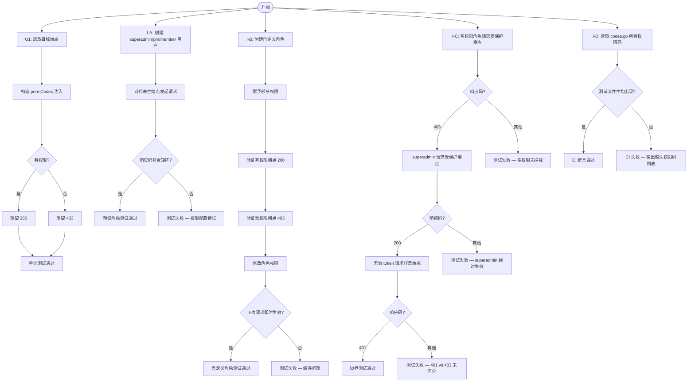

# API Permission Test Coverage — PRD Spec

> PRD Spec: defines WHAT the feature is and why it exists.

## 需求背景

### 为什么做（原因）

RBAC 权限体系已完整实现（中间件、路由绑定、预设角色），但测试覆盖存在结构性空白：

- `permission_test.go` 的 11 个测试均通过 mock context 注入权限码，不经过路由层
- `rbac_test.go` 的 21 个测试覆盖迁移和角色 CRUD，但路由层共有 53 处 `perm()` 绑定，其中任何一处权限码误写均无法被现有测试发现
- 自定义角色（部分权限组合）完全没有测试覆盖

**已发生的盲区**：commit `3200bdc` 新增了 2 个权限码，但没有任何对应的路由层测试覆盖。当前 bizkey-unification 功能正在推进，预计引入更多权限码，若不在此时补全测试框架，每次新增权限都将重复同样的盲区。

### 要做什么（对象）

在两个层面补充测试：

1. **Handler 单元测试**：针对 12 个权限敏感端点，各补充"有权限 → 200、无权限 → 403"的表驱动测试，通过注入 `permCodes` 绕过 DB，专注验证中间件与 handler 的集成边界
2. **集成测试**：使用真实 DB 和完整路由，验证预设角色矩阵、自定义角色权限组合、以及权限边界场景

### 用户是谁（人员）

- **开发者**：后端工程师，负责 RBAC 相关功能迭代；当前依赖人工检查权限码覆盖，commit `3200bdc` 已证明该方式不可靠
- **代码审查者**：PR 审查者，当前无工具辅助验证权限测试完整性，依赖作者自述；commit `3200bdc` 的漏测正是在无工具支撑的审查中被遗漏

## 需求目标

| 目标 | 量化指标 | 说明 |
|------|----------|------|
| 路由层权限绑定覆盖 | 12 个代表性端点 100% 有单元测试 | 覆盖 pm/member 权限差异最大的端点；其余 41 个端点权限差异较小（pm/member 均有或均无），由 I-A 集成矩阵间接覆盖，不单独补充单元测试 |
| 预设角色矩阵验证 | superadmin/pm/member × 5 个代表性端点（覆盖 main_item/team/progress/item_pool/report 各一个）全覆盖 | 集成测试断言响应码符合权限矩阵 |
| 自定义角色验证 | 至少 1 个完整流程（创建→分配→验证→修改→再验证） | 验证权限变更即时生效 |
| 边界场景覆盖 | 空权限/superadmin 绕过/401 vs 403 各有测试 | 区分认证失败与授权失败 |

## Scope

### In Scope

- [x] **U1: Handler 单元测试** — 12 个端点各补充 2 个权限 case（有权限/无权限），共 24 个 case
- [x] **I-A: 预设角色矩阵集成测试** — superadmin/pm/member × 5 个代表性端点（main_item/team/progress/item_pool/report 各一个）
- [x] **I-B: 自定义角色集成测试** — 部分权限组合 + 权限变更即时生效
- [x] **I-C: 权限边界集成测试** — 空权限角色、superadmin 绕过、401 vs 403
- [x] **I-D: 权限码覆盖率 CI 断言** — 验证 `codes.go` 中每个权限码在测试矩阵中均有覆盖

### Out of Scope

- 前端权限渲染测试
- 性能/并发测试
- 数据权限（data scope）测试
- 非权限相关的业务逻辑测试

**预估工作量**：单元测试 ~1 个工作日，集成测试 ~2 个工作日，合计 ~3 个工作日

## 流程说明

### 业务流程说明

测试补全分两条并行路径执行：

**路径 A — Handler 单元测试**：对每个目标端点，构造两个测试 case：一个注入包含所需权限码的 `permCodes`（期望 200），一个注入空 `permCodes`（期望 403）。测试不依赖 DB，通过 httptest 直接调用 handler。

**路径 B — 集成测试**：使用真实 SQLite DB 初始化完整路由，创建不同角色的用户，发起 HTTP 请求，断言响应码。分三个场景组：预设角色矩阵、自定义角色、边界场景。

### 业务流程图

## 功能描述

### U1: Handler 单元测试覆盖端点

每个端点补充 2 个 case（有权限 / 无权限）：

| 端点 | 所需权限 | pm 有 | member 有 | 测试文件 | 测试函数 | Mock 依赖 |
|------|---------|-------|-----------|---------|---------|---------|
| POST /teams/:teamId/main-items | main_item:create | ✓ | ✓ | `middleware/permission_test.go` | `TestPermMiddleware_MainItemCreate` | `MockMainItemService` |
| POST /teams/:teamId/main-items/:id/archive | main_item:archive | ✓ | ✗ | `middleware/permission_test.go` | `TestPermMiddleware_MainItemArchive` | `MockMainItemService` |
| PUT /teams/:teamId/main-items/:id/status | main_item:change_status | ✓ | ✗ | `middleware/permission_test.go` | `TestPermMiddleware_MainItemStatus` | `MockMainItemService` |
| POST /teams/:teamId/members | team:invite | ✓ | ✗ | `middleware/permission_test.go` | `TestPermMiddleware_TeamInvite` | `MockTeamService` |
| DELETE /teams/:teamId/members/:userId | team:remove | ✓ | ✗ | `middleware/permission_test.go` | `TestPermMiddleware_TeamRemove` | `MockTeamService` |
| PUT /teams/:teamId/pm | team:transfer | ✓ | ✗ | `middleware/permission_test.go` | `TestPermMiddleware_TeamTransfer` | `MockTeamService` |
| POST /teams/:teamId/sub-items/:id/progress | progress:create | ✓ | ✓ | `middleware/permission_test.go` | `TestPermMiddleware_ProgressCreate` | `MockProgressService` |
| PATCH /teams/:teamId/progress/:id/completion | progress:update | ✓ | ✗ | `middleware/permission_test.go` | `TestPermMiddleware_ProgressUpdate` | `MockProgressService` |
| POST /teams/:teamId/item-pool | item_pool:submit | ✓ | ✓ | `middleware/permission_test.go` | `TestPermMiddleware_ItemPoolSubmit` | `MockItemPoolService` |
| POST /teams/:teamId/item-pool/:id/assign | item_pool:review | ✓ | ✗ | `middleware/permission_test.go` | `TestPermMiddleware_ItemPoolReview` | `MockItemPoolService` |
| GET /teams/:teamId/views/weekly | view:weekly | ✓ | ✓ | `middleware/permission_test.go` | `TestPermMiddleware_WeeklyView` | `MockViewService` |
| GET /teams/:teamId/reports/weekly/export | report:export | ✓ | ✗ | `middleware/permission_test.go` | `TestPermMiddleware_ReportExport` | `MockReportService` |

**测试机制**：通过 `c.Set("permCodes", []string{...})` 注入权限集合，绕过 DB，专注验证中间件与 handler 的集成边界。无权限 case 注入空 `permCodes`，期望 403。

### I-A: 预设角色矩阵集成测试

创建 3 个用户，分别绑定 superadmin / pm / member 角色，对代表性端点发起请求，断言响应码：

| 角色 | main_item:archive | team:invite | progress:update | item_pool:review | report:export |
|------|------------------|-------------|-----------------|-----------------|---------------|
| superadmin | 200 | 200 | 200 | 200 | 200 |
| pm | 200 | 200 | 200 | 200 | 200 |
| member | 403 | 403 | 403 | 403 | 403 |

> 选取标准：从 U1 的 12 个端点中，选取 pm/member 权限差异最大的端点各一个，覆盖每个权限域（main_item、team、progress、item_pool、report），共 5 个。其余 7 个端点由 U1 单元测试覆盖，不重复纳入集成矩阵。
>
> 注：集成测试中若 superadmin/pm 返回 404 或 500，视为测试 fixture 数据缺失，不算通过。

### I-B: 自定义角色集成测试

完整流程：
1. 创建自定义角色，仅赋予 `main_item:read` + `progress:read`
2. 创建用户并分配该角色
3. 验证：GET /main-items → 200，POST /main-items → 403，POST /archive → 403
4. 修改角色权限，新增 `main_item:create`
5. 验证：POST /main-items → 200（权限变更即时生效，无缓存）

### I-C: 权限边界集成测试

| 场景 | 操作 | 期望结果 |
|------|------|---------|
| 空权限角色 | 调用任意受保护端点 | 403 |
| superadmin | 调用任意受保护端点 | 200（绕过权限检查；404/500 视为 fixture 缺失，不算通过） |
| 无效 token | 调用任意端点 | 401（区别于 403） |

### I-D: 权限码覆盖率 CI 断言

在 CI 流水线中新增一个断言步骤，读取 `backend/internal/rbac/codes.go` 中所有已定义的权限码，与 `middleware/permission_test.go` 和 `tests/integration/rbac_test.go` 中的测试矩阵做交叉比对，若存在未覆盖的权限码则 CI 失败并输出缺失列表。

断言逻辑：
1. 从 `codes.go` 提取所有权限码字符串值（包括 `const` 和 `var` 声明）；注：codes.go 中所有权限码应以 `const` 定义，使用 `var` 或字符串字面量定义的权限码同样会被提取，但视为规范违反
2. 从测试文件中提取所有作为权限码参数传入的字符串（即出现在 `permCodes` 注入或集成测试矩阵中的权限码值，不包括注释或日志中的字符串）
3. 若 `codes.go` 中存在测试文件中未出现的权限码，断言失败，输出：`missing test coverage for: [权限码列表]`

### 关联性需求改动

| 序号 | 涉及项目 | 功能模块 | 关联改动点 | 更改后逻辑说明 |
|------|----------|----------|------------|----------------|
| 1 | backend | middleware/permission_test.go | 新增权限 case | 在现有文件中追加表驱动测试 |
| 2 | backend | tests/integration/rbac_test.go | 新增集成测试组 | 在现有文件中追加 TestRBACPermission* 测试函数 |
| 3 | CI | .github/workflows/test.yml | 在 go test 步骤后新增 permission-coverage 步骤 | 解析 codes.go 与测试文件，缺失覆盖则 CI 失败 |

## 其他说明

### 性能需求

- 单元测试套件执行时间：< 5 秒（无 DB 依赖）
- 集成测试套件执行时间：< 30 秒（共享一次 DB 初始化，各 case 事务回滚隔离）

### 数据需求

- 集成测试使用内存 SQLite，不依赖外部 DB
- 用 `TestMain` 共享一次 RBAC 迁移，各 case 用事务回滚隔离数据

### 监控需求

- 权限码覆盖率 CI 断言由 I-D 实现（见功能描述 § I-D）

### 安全性需求

- 无新生产代码，仅测试代码变更
