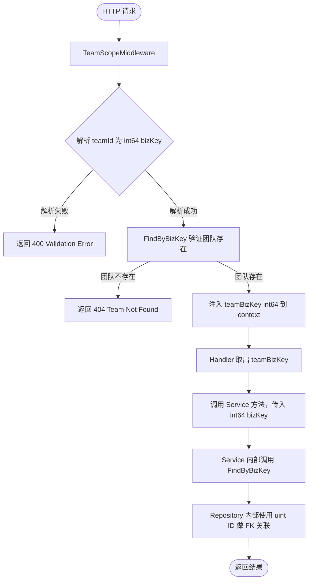

# BizKey Unification — PRD Spec

> PRD Spec: defines WHAT the feature is and why it exists.

## 需求背景

### 为什么做（原因）

系统中存在两种 ID 类型：内部自增 `uint` ID（数据库主键，不对外暴露）和外部雪花算法 `int64` bizKey（对外暴露的业务标识符）。当前 Service 层和 Middleware 层将这两种 ID 混用，导致数据写入错误和权限判断错误，且编译器无法检测此类错误。

### 要做什么（对象）

将 Service 层接口统一为以 `int64` bizKey 作为跨层边界的唯一标识符。凡是来自外部输入（URL 参数、请求体）的 ID，在 Service 接口签名中必须使用 `int64`；内部 FK 关联查询继续在 Repository 层内部使用 `uint`。

### 用户是谁（人员）

- **后端开发者**：修改后的接口签名由编译器强制约束，消除一整类因类型混用导致的 Bug
- **系统用户（间接）**：进度记录的 `team_key` 字段将存储正确的雪花 ID，查询结果不再静默错误

## 需求目标

| 目标 | 量化指标 | 说明 |
|------|----------|------|
| 消除 uint/int64 混用导致的数据错误 | 0 处 `uint(bizKey)` 或 `int64(teamID)` 强制转换存在于 service/handler 层 | 通过 grep 可验证 |
| 修复进度记录数据污染 | `progress_service.go` 中 `TeamKey` 字段赋值来源为 `int64` 雪花 ID，而非 `uint` 内部 ID | 每条进度记录的 team_key 值正确 |
| 防止同类 Bug 再次引入 | Service 接口签名中，所有来自外部输入的 ID 参数类型为 `int64`，编译器可静态检测违规 | 新增功能时类型系统提供约束 |

## Scope

### In Scope

- [ ] `middleware/team_scope.go`：向 Gin context 注入 `teamBizKey int64`，替换原有 `teamID uint`；`GetTeamID()` 重命名为 `GetTeamBizKey() int64`
- [ ] Service 接口（8 个文件）：`item_pool_service.go`、`main_item_service.go`、`progress_service.go`、`report_service.go`、`role_service.go`、`sub_item_service.go`、`team_service.go`、`view_service.go` — 将来自外部输入的 `uint` ID 参数替换为 `int64` bizKey
- [ ] `team_service.go`：修复 `isPMRole` 签名（`uint` → `int64`）、`UpdateMemberRole` roleID 类型、`InviteMember` roleID 强制转换
- [ ] `progress_service.go`：修复 `TeamKey: int64(teamID)` 数据污染 Bug
- [ ] Handler 调用点（7 个文件）：`item_pool_handler.go`、`main_item_handler.go`、`progress_handler.go`、`report_handler.go`、`sub_item_handler.go`、`team_handler.go`、`view_handler.go` — 从 context/请求中传递 bizKey，而非解析后的 uint ID
- [ ] 单元测试和集成测试（约 20 个文件：10 个 handler 测试、7 个 service 测试、`team_scope_test.go`、`views_reports_test.go`、`helpers.go`）

### Out of Scope

- Repository 接口签名（`FindByID`、`FindByBizKey`）保持不变
- 前端变更 — API 的 JSON 字段名不变
- 数据库 Schema — 无 DDL 变更
- 历史数据修复 — 已写入的错误 `team_key` 值不在本次范围内
- 非 team/user/role 实体（main item、sub item）的 uint/int64 混用问题 — 单独处理

## 流程说明

### 业务流程说明

本需求为内部代码质量修复，无用户可见的业务流程变更。核心变更点是：

1. **请求进入**：HTTP 请求携带 bizKey 字符串（如 `/api/v1/teams/123456789012345678/items`）
2. **Middleware 解析**：`TeamScopeMiddleware` 将 URL 中的 bizKey 解析为 `int64`，直接注入 context，不再解析为内部 `uint` ID
3. **Service 调用**：Handler 从 context 取出 `int64` bizKey，直接传入 Service 方法，Service 内部通过 `FindByBizKey` 查询实体
4. **Repository 内部**：Repository 在内部使用 `uint` ID 进行 FK 关联，不暴露给 Service 层

### 业务流程图

## 功能描述

### 5.4 关联性需求改动

| 序号 | 涉及项目 | 功能模块 | 关联改动点 | 更改后逻辑说明 |
|------|----------|----------|------------|----------------|
| 1 | backend | middleware/team_scope | `GetTeamID() uint` → `GetTeamBizKey() int64` | 所有 handler 调用方需同步更新 |
| 2 | backend | service/team_service | `isPMRole(ctx, bizKey uint)` → `isPMRole(ctx, bizKey int64)` | 修复签名与语义不符问题 |
| 3 | backend | service/team_service | `UpdateMemberRole(..., roleID uint)` → `(..., roleBizKey int64)` | roleID 来自外部请求，应为 int64 |
| 4 | backend | service/team_service | `InviteMember` 中 `uint(roleID)` 强制转换 | 移除强制转换，直接使用 int64 |
| 5 | backend | service/progress_service | `TeamKey: int64(teamID)` → `TeamKey: teamBizKey` | 修复进度记录 team_key 数据污染 |
| 6 | backend | service/progress_service | `Append(..., teamID uint, ...)` → `(..., teamBizKey int64, ...)` | 参数类型与语义对齐 |
| 7 | backend | service/progress_service | `CorrectCompletion(..., teamID uint, ...)` → `(..., teamBizKey int64, ...)` | 同上 |
| 8 | backend | service/progress_service | `List(..., teamID uint, ...)` → `(..., teamBizKey int64, ...)` | 同上 |

## 其他说明

### 性能需求

- 无额外性能影响：`FindByBizKey` 已有索引，Middleware 不再需要额外的 `FindByBizKey` 查询（原本已有此查询）
- 并发量：与现有系统相同，无变化

### 数据需求

- 数据迁移：不在本次范围内（历史错误数据需单独评估）
- 数据初始化：无

### 监控需求

- 无新增监控需求；现有接口错误率监控可检测回归

### 安全性需求

- 无变化：bizKey 已对外暴露，内部 uint ID 继续隐藏

---

## 质量检查

- [x] 需求标题是否概括准确
- [x] 需求背景是否包含原因、对象、人员三要素
- [x] 需求目标是否量化
- [x] 流程说明是否完整
- [x] 业务流程图是否包含（Mermaid 格式）
- [x] 关联性需求是否全面分析
- [x] 非功能性需求（性能/数据/监控/安全）是否考虑
- [x] 所有表格是否填写完整
- [x] 是否可执行、可验收
