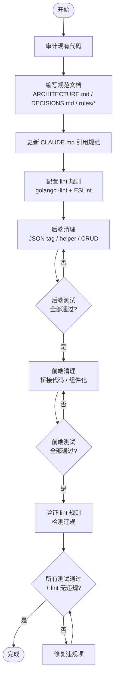

# Code Conventions & Code Cleanup — PRD Spec

> PRD Spec: defines WHAT the feature is and why it exists.

## 需求背景

### 为什么做（原因）

项目由 AI 辅助开发，当前存在两个结构性问题：

1. **编码规范缺失**：CLAUDE.md 只有通用行为准则（"简洁优先""手术式修改"），没有项目级编码规范。AI 每次会话无法获得一致的风格指引，导致同一项目内出现混合风格（如 model 层 snake_case 与 VO 层 camelCase 混用）。
2. **已有代码质量低**：AI 生成的代码满足功能但存在大量重复和不一致：
   - 后端 Handler/Service/Repo 三层有大量重复样板代码（25+ 个 nil-service 检查、4 个 mapNotFound 副本、重复的分页和日期解析逻辑）
   - 前端页面组件缺少复用，相似 UI 模式在每个页面中重复实现
   - 前端 API 层存在手动 snake_case 桥接代码
   - UI 风格不统一：20+ 处硬编码颜色绕过主题 token、无 Textarea 组件（样式复制 14 次）、优先级 Select 重复 7 次、按钮有 10 种未归类的组合: 项目功能开发进入稳定期（RBAC 基本完成），是沉淀规范、提升代码质量的合适时机。

### 要做什么（对象）

1. 建立完整的项目级编码规范：架构说明写入 `docs/ARCHITECTURE.md`、`docs/DECISIONS.md`（面向人类）；编码规则写入 `.claude/rules/*.md`（面向 AI，会话启动时自动加载，支持路径限定）。
2. 清理现有代码，消除命名不一致和重复代码，使其符合规范。
3. 配置自动化 lint 规则，作为持续验证手段。

### 用户是谁（人员）

| 角色 | 说明 | 核心诉求 |
|------|------|---------|
| AI 编码助手（Claude） | 主要代码生成者 | 每次会话获得明确、一致的编码规则，减少猜测 |
| 开发者（faner） | 项目负责人、代码审查者 | 减少代码审查中的风格问题返工，提升代码可维护性 |

## 需求目标

| 目标 | 量化指标 | 说明 |
|------|----------|------|
| AI 编码一致性 | 新代码 100% 符合规范 | 每次会话自动加载规范，无需人工提示 |
| 消除命名不一致 | 0 个 snake_case JSON tag | 后端所有 model/VO/DTO JSON tag 统一 camelCase |
| 消除重复代码 | 重复代码副本数减少 50%+ | mapNotFound/pagination/dateParse 从 N 份降至 1 份 |
| 前端组件复用 | 至少 3 个可复用 UI 组件 | 从现有页面中抽取共享组件 |
| UI 风格统一 | 0 处硬编码颜色 | 所有颜色使用主题 token，消除 emerald-*/red-*/amber-* 等硬编码 |
| 规范可机器验证 | lint 规则覆盖命名和模式违规 | golangci-lint + ESLint 配置完成 |

## Scope

### In Scope

**Phase 1：规范文档与 Lint 配置**
- [ ] 编写 `docs/ARCHITECTURE.md`（分层架构说明，面向人类）
- [ ] 编写 `docs/DECISIONS.md`（技术决策记录，面向人类）
- [ ] 编写 `.claude/rules/naming.md`（命名规范，面向 AI，自动加载）
- [ ] 编写 `.claude/rules/patterns.md`（后端分层模式，路径限定 `backend/**/*.go`）
- [ ] 编写 `.claude/rules/frontend.md`（前端组件化规范，路径限定 `frontend/src/**/*.{ts,tsx}`）
- [ ] 编写 `.claude/rules/testing.md`（测试规范 + TDD 流程，面向 AI，自动加载）
- [ ] 配置 golangci-lint 规则
- [ ] 配置 ESLint 规则

> **Phase 1 完成标准**：6 个规范/lint 文件全部创建，golangci-lint 检测到至少 4 个 model 文件存在 snake_case JSON tag 违规，ESLint 检测到至少 15 处硬编码颜色违规。

**Phase 2：后端清理**
- [ ] 后端：统一 model JSON tag 为 camelCase
- [ ] 后端：消除 nil-service 重复检查（改为 Handler 构造函数校验）
- [ ] 后端：抽取公共 helper（mapNotFound、pagination、dateParse）
- [ ] 后端：统一 repo CRUD 模式

> **Phase 2 完成标准**：0 个 snake_case JSON tag，每种 helper 只存在 1 份，nil-service 检查从 25+ 降至 0，全部后端测试通过。

**Phase 3：前端清理**
- [ ] 前端：去除 snake_case 手动桥接代码
- [ ] 前端：抽取可复用 UI 组件（Textarea、PrioritySelect 等）
- [ ] 前端：统一颜色使用主题 token，消除硬编码 Tailwind 颜色
- [ ] 前端：规范化按钮使用，消除临时 className 覆盖

> **Phase 3 完成标准**：0 处硬编码颜色，至少 3 个可复用组件，0 个临时 className 覆盖，全部前端测试通过。

### Out of Scope

- 数据库列命名（保持 snake_case，由 ORM 自动映射）
- 业务逻辑变更
- 性能优化
- 新功能开发
- 修改 zcode 插件本身

## 流程说明

### 业务流程说明

**规范建立流程**：

1. 审计现有代码，识别所有不一致和重复模式
2. 编写规范文档，包含正面示例和反面示例
3. 规则文件放入 `.claude/rules/`，AI 会话自动加载
4. 配置 lint 规则匹配规范

**代码清理流程**：

1. 按后端→前端顺序分批清理
2. 每批清理后运行完整测试套件验证无回归
3. 每批独立提交

**开发流程规范（适用于后续所有 feature）**：

1. 每个 feature 先写 PRD → 设计 → 任务分解
2. 每个任务遵循 TDD：先写测试 → 实现 → 测试通过
3. 所有任务完成后，执行 feature 级 e2e 测试

### 业务流程图



### 数据流说明

单系统内部重构，不涉及跨系统数据流。

## 功能描述

### 5.1 规范文档体系

建立两层规范文档结构：

**面向人类**（`docs/`）：

| 文档 | 定位 | 内容 |
|------|------|------|
| `docs/ARCHITECTURE.md` | 架构说明 | 分层架构（Model → DTO/VO → Service → Handler → Router），每层职责、模板代码、禁止事项 |
| `docs/DECISIONS.md` | 决策记录 | 技术决策及原因（为什么 camelCase、为什么分层、为什么用 VO） |

**面向 AI**（`.claude/rules/`，会话启动时自动加载）：

| 文档 | 路径限定 | 内容 |
|------|----------|------|
| `.claude/rules/naming.md` | 无（全局） | JSON tag、变量、函数、文件命名规范，含正反面示例 |
| `.claude/rules/patterns.md` | `backend/**/*.go` | Handler/Service/Repo CRUD 模板，helper 提取规则，错误处理模式 |
| `.claude/rules/frontend.md` | `frontend/src/**/*.{ts,tsx}` | API 层规范、组件提取规则、状态管理规范 |
| `.claude/rules/testing.md` | 无（全局） | TDD 流程、单元测试/集成测试/e2e 测试的组织和命名 |

**关键要求**：
- 每条规则必须包含正面示例和反面示例
- 规范文件总数控制在 6 个以内
- 单个规范文件不超过 200 行

### 5.2 命名规范统一

**现状问题**：

| 层 | 当前 | 目标 |
|----|------|------|
| 后端 Model JSON tag | snake_case (`team_id`, `created_at`) | camelCase (`teamId`, `createdAt`) |
| 后端 VO/DTO JSON tag | camelCase（已正确） | 保持不变 |
| 前端 TypeScript 类型 | camelCase（已正确） | 保持不变 |
| 前端 API 层 | 手动 snake_case 桥接 | 直接传 camelCase |
| 数据库列名 | snake_case | 保持不变（ORM 映射） |

### 5.3 后端去重

**重复模式清单**：

| 重复项 | 当前副本数 | 目标 |
|--------|-----------|------|
| nil-service 检查 | 25+ | 提取为 Handler 初始化校验（构造函数中 panic），移除每个方法中的重复检查 |
| mapNotFound helper | 4 | 统一为 1 个泛型函数 |
| 分页默认值设置 | 4+ | 统一为 1 个 helper 函数 |
| 日期解析逻辑 | 6+ | 统一为 1 个 helper 函数 |
| Repo CRUD 方法 | 3 套 | 提取通用模式 |

### 5.4 前端组件化与 UI 风格统一

**需抽取的 UI 组件**：

| 组件 | 当前问题 | 目标 |
|------|---------|------|
| Textarea | 无组件，textarea 样式复制粘贴 14 次，min-h 不统一 | 创建 Textarea 组件，统一样式 |
| PrioritySelect | 优先级下拉在 7 个表单中重复 | 抽取为 PrioritySelect 组件 |
| 按钮变体 | 10 种组合，ghost 按钮有临时 className 覆盖 | 规范化：禁止 className 覆盖，需新增变体则修改 Button 组件 |

**颜色统一**：

| 问题 | 当前数量 | 目标 |
|------|---------|------|
| 硬编码 Tailwind 颜色（emerald-*、red-*、amber-*、slate-*） | 20+ 处 | 全部替换为主题 token（text-success、text-error、text-warning 等） |
| 任意值 / hex 值 | 3 处 | 替换为对应 CSS 变量 |

**表格/对话框规范**：
- 表格行背景色改用主题 token
- Badge 统一使用组件，禁止内联重复样式

### 5.5 Lint 规则配置

**后端（golangci-lint）**：

| 规则 | 目的 |
|------|------|
| `tagliatelle`（`json: camel`） | 强制 JSON tag 使用 camelCase |
| `govet`（内置） | 检查结构体 tag 格式错误 |
| `revive`（`unused-parameter`） | 检测重构后残留的未使用参数 |
| `dupl`（阈值 50） | 检测重复代码块 |

**前端（ESLint）**：

| 规则 | 目的 |
|------|------|
| `no-restricted-syntax`（禁止 Tailwind 硬编码颜色类） | 强制使用主题 token |
| `no-restricted-imports`（禁止直接使用 `textarea`） | 强制使用 Textarea 组件 |
| `@typescript-eslint/naming-convention` | 检查 TypeScript 变量/接口命名 |

### 5.6 开发流程规范

适用于后续所有 feature 开发：

1. **TDD 流程**：每个任务先写测试 → 实现 → 测试通过
2. **Feature 级 e2e 测试**：所有任务完成后执行端到端测试

**Feature 开发 Checklist**：

```
□ PRD 完成 + 通过 /eval-prd
□ 技术设计完成 + 通过 /eval-design
□ 任务分解完成
□ 每个 task 遵循 TDD：
    □ 先写失败测试
    □ 实现最小代码使测试通过
    □ 重构（如需要）
    □ 单元测试 + 集成测试通过
□ 所有 task 完成后：
    □ Feature 级 e2e 测试通过
    □ Lint 无违规
    □ 提交代码
```

## 关联性需求改动

| 序号 | 涉及项目 | 功能模块 | 关联改动点 | 更改后逻辑说明 |
|------|----------|----------|------------|----------------|
| 1 | 后端 | Model 层 | 所有 model struct 的 JSON tag | snake_case → camelCase |
| 2 | 后端 | Handler 层 | nil-service 检查 | 移除重复，改为构造函数校验 |
| 3 | 后端 | Service 层 | mapNotFound/pagination/dateParse | 提取为共享 helper |
| 4 | 后端 | Repository 层 | CRUD 方法 | 统一模式 |
| 5 | 前端 | API 层 | snake_case 桥接代码 | 移除，直接用 camelCase |
| 6 | 前端 | 页面组件 | 重复 UI 模式 | 抽取为共享组件 |
| 7 | 前端 | 页面组件 | 硬编码颜色 | 替换为主题 token |
| 8 | 前端 | Button/Select | 样式覆盖/重复 | 规范化变体、抽取 PrioritySelect |
| 9 | 项目根 | `.claude/rules/` | 创建 4 个规则文件 | AI 会话自动加载，无需手动引用 |

## 其他说明

### 性能需求
- `.claude/rules/` 文件在会话启动时自动加载，无需手动引用
- 带 `paths` 限定符的规则只在编辑匹配文件时激活，减少无关上下文占用
- Lint 检查在 CI 中运行，不影响本地开发体验

### 数据需求
- 无数据迁移
- 数据库列名不变，仅 JSON 序列化 tag 变更

### 监控需求
- 无额外监控需求

### 安全性需求
- 无安全性变更

---

## 质量检查

- [x] 需求标题是否概括准确
- [x] 需求背景是否包含原因、对象、人员三要素
- [x] 需求目标是否量化
- [x] 流程说明是否完整
- [x] 业务流程图是否包含（Mermaid 格式）
- [x] 功能描述是否完整
- [x] 关联性需求是否全面分析
- [x] 非功能性需求（性能/数据/监控/安全）是否考虑
- [x] 所有表格是否填写完整
- [x] 是否可执行、可验收
