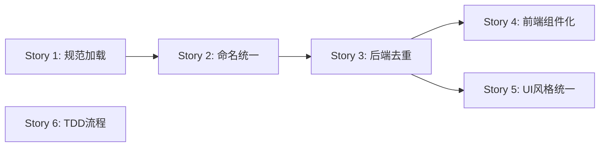

# User Stories: Code Conventions & Code Cleanup

## Dependencies

> Story 6 独立，不阻塞其他 Story。

---

## Story 1: AI 获取一致的编码规范

**As a** AI 编码助手（Claude）
**I want to** 每次会话启动时自动加载完整的项目编码规范
**So that** 生成的代码风格一致，无需开发者反复纠正同样的风格问题

**Acceptance Criteria:**
- Given `.claude/rules/` 目录下存在 `naming.md`、`patterns.md`、`frontend.md`、`testing.md` 规则文件
- When AI 开始新的编码会话
- Then 规则自动加载到 AI 上下文中，AI 按照规范生成代码，无需开发者手动提示

---

## Story 2: 统一 JSON 命名风格

**As a** 开发者
**I want to** 后端所有层的 JSON tag 统一使用 camelCase
**So that** 前后端 API 交互不需要手动字段映射，减少 bug 和维护成本

**Acceptance Criteria:**
- Given 后端 model 层当前存在 snake_case JSON tag
- When 完成命名规范统一清理
- Then 所有 model/VO/DTO 的 JSON tag 为 camelCase，前端无 snake_case 桥接代码，全部现有测试通过

---

## Story 3: 消除后端重复代码

**As a** 开发者
**I want to** 后端 Handler/Service/Repo 层消除重复样板代码
**So that** 新增功能模块时只需关注业务逻辑，不重复编写分页、错误映射、日期解析等通用代码

**Acceptance Criteria:**
- Given mapNotFound 有 4 个副本、分页默认值有 4+ 个副本、日期解析有 6+ 个副本
- When 完成公共 helper 提取
- Then 每种 helper 只存在 1 份，全部现有测试通过

---

## Story 4: 前端组件复用

**As a** 开发者
**I want to** 前端页面中重复的 UI 模式被抽取为共享组件
**So that** 新页面开发可以直接复用已有组件，减少代码量和风格不一致

**Acceptance Criteria:**
- Given Textarea 样式复制 14 次、PrioritySelect 重复 7 次、按钮有 10 种未归类组合
- When 完成组件抽取和规范化
- Then 至少有 3 个可复用 UI 组件被抽取（Textarea、PrioritySelect 等），全部现有测试通过

---

## Story 5: UI 风格统一

**As a** 开发者
**I want to** 前端所有颜色使用主题 token，UI 元素风格一致
**So that** 修改主题时一处改动全局生效，不同页面的视觉风格统一

**Acceptance Criteria:**
- Given 当前有 20+ 处硬编码 Tailwind 颜色（emerald-*、red-*、amber-*、slate-*）
- When 完成颜色 token 替换
- Then 0 处硬编码颜色，所有颜色通过主题 token 引用，全部现有测试通过

---

## Story 6: TDD 开发流程可执行

**As a** 开发者（或 AI）
**I want to** 有明确的 TDD 和 e2e 测试流程规范
**So that** 每个 feature 的开发过程有质量保障，不遗漏测试覆盖

**Acceptance Criteria:**
- Given `.claude/rules/testing.md` 中定义了 TDD 流程和 e2e 测试要求
- When 开始开发新 feature
- Then 遵循先写测试→实现→通过的流程，feature 所有任务完成后执行 e2e 测试
