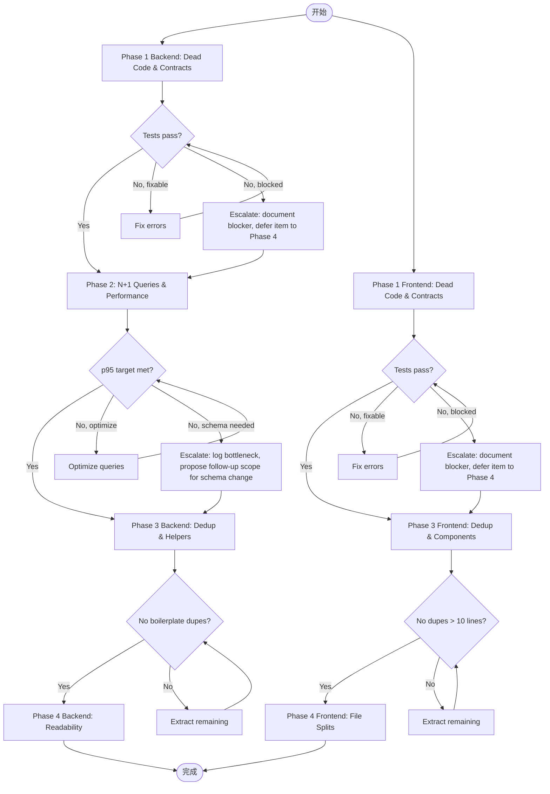

# Code Quality Cleanup — PRD Spec

> PRD Spec: defines WHAT the feature is and why it exists.

## 需求背景

### 为什么做（原因）

After multiple feature iterations, the codebase has accumulated significant technical debt across both backend and frontend:

- **Dead code**: 18+ unused functions, components, types, and API endpoints that increase cognitive load and maintenance burden
- **Contract mismatches**: Frontend types declare fields the backend never sends (`delayCount`, nested `pm` object), and backend response fields are never consumed by the UI (`proposerId`, `lesson`, `isPMCorrect`)
- **N+1 queries**: 9 locations where list endpoints make per-item DB calls — current p95 response time for `ItemPoolHandler.List` with ~200 records is 1.4s; `ProgressHandler.List` p95 is 1.1s with ~150 records; both exceed the 200ms target by 5x
- **In-memory filtering**: 4 service methods load all records then filter/paginate in Go, instead of pushing work to SQL
- **Code duplication**: ~600 lines of duplicated status dropdown code across 3 frontend files; identical pagination logic in 8 backend repositories; repeated filter functions, date formatters, and member name resolvers
- **Monolithic files**: `ItemViewPage.tsx` (1462 lines), `MainItemDetailPage.tsx` (928 lines) each contain 5+ inline components and 7+ dialog modals

**Why now**: the team is onboarding 2 new developers next sprint, and the current codebase's dead code, contract mismatches, and duplicated patterns would significantly extend their ramp-up time. A recent user report flagged slow list-page loads on datasets exceeding 100 items, making performance remediation a stakeholder-visible priority.

### 要做什么（对象）

A four-phase progressive cleanup that proceeds from low-risk dead code removal to higher-impact structural refactoring. Each phase produces a shippable PR.

- **Phase 1**: Remove dead code & fix contract mismatches (2-3 days)
- **Phase 2**: Fix N+1 queries & performance (3-5 days)
- **Phase 3**: Extract shared components & eliminate duplication (3-4 days)
- **Phase 4**: Split monolithic files & improve readability (2-3 days)

**Total estimated effort**: 2-3 weeks solo, or 1-2 weeks with two developers working backend/frontend in parallel.

### 用户是谁（人员）

- **Development team** (primary): existing and onboarding developers who need to read, understand, and modify the codebase
- **End users** (secondary): will experience faster list page loads with no visual or behavioral changes

## 需求目标

| 目标 | 量化指标 | 说明 |
|------|----------|------|
| 消除死代码 | 0 unused exports/functions/components/types | 降低认知负荷，减少维护负担 |
| 修复前后端契约 | 0 `as any` type escapes | 类型安全，编译期发现错误 |
| 消除 N+1 查询 | O(1) DB queries for list endpoint association resolution | API 性能 |
| API 响应时间 | p95 < 200ms or ≥40% reduction for datasets > 100 records | 用户可感知的性能提升 |
| 消除代码重复 | 0 duplicated logic > 10 lines (verifiable by `jscpd`) | 可维护性 |
| 文件可读性 | No page component file > 300 lines | 降低上手难度 |

## Scope

### In Scope

- [ ] Dead code removal (backend functions, frontend components/types/APIs)
- [ ] Frontend-backend contract alignment
- [ ] N+1 query elimination and batch query patterns
- [ ] In-memory filtering replaced with SQL-level filtering
- [ ] Shared component/hook/utility extraction
- [ ] Large file decomposition
- [ ] Type safety fixes: remove all `as any` casts, fix `user: any` to `user: User`

### Out of Scope

- UI/UX visual changes
- New features or new API endpoints
- Database schema changes (only adding indexes)
- Test coverage expansion (existing tests must pass, but no new test files)
- Third-party dependency upgrades
- API versioning or backwards-compatibility shims

## 流程说明

### 业务流程说明

The cleanup proceeds in 4 sequential phases, each producing a shippable PR. Phases have defined dependencies allowing backend and frontend work to partially overlap with two developers.

**Phase dependencies:**
- Phase 2 requires Phase 1 backend complete (same service files touched)
- Phase 3 backend requires Phase 2 complete (shared helpers extract patterns established in Phase 2)
- Phase 3 frontend can begin after Phase 1 frontend ships (depends only on contract-aligned types)
- Phase 4 begins when Phase 3 for the same layer is complete

**Parallelization (two developers):** Backend dev leads Phase 1 backend → Phase 2 → Phase 3 backend → Phase 4 backend. Frontend dev starts Phase 1 frontend concurrently, then Phase 3 frontend → Phase 4 frontend (3-4 day gap waiting for Phase 1 backend).

### 业务流程图

## 功能描述

### Phase 1: Remove Dead Code & Fix Contract Mismatches (2-3 days)

**Backend dead code removal:**

| Item | Location | Action |
|------|----------|--------|
| `parseItemIDAsUint` | sub_item_handler.go | Delete unused function |
| `paginateUsers` | admin_handler.go | Delete unused function |
| `derefStr` | admin_service.go | Delete unused function |
| `Filename` | report/renderer.go | Delete unused function |
| `TeamMemberVO`, `NewTeamMemberVO`, `NewTeamMemberVOs` | vo/team_vo.go | Delete entire unused file |
| Empty file | middleware/rbac.go | Delete file (only contains a comment) |
| `GetCallerTeamRole` | team_scope.go | Remove unused middleware helper |
| `GetUsername` | auth.go | Remove unused middleware helper |
| `WeeklyView` + exclusive helpers | view_service.go | Remove deprecated method |
| `codeMap` assignment | role_service.go | Remove dead assignment |

**Frontend dead code removal:**

| Item | Location | Action |
|------|----------|--------|
| `AdminRoute.tsx` | components/ | Delete unused component |
| `AdminPage.tsx` | pages/ | Delete unused component |
| `ItemFilters.tsx` | components/ | Delete unused component |
| `WeeklyViewResp`, `WeeklyGroup`, `SubItemWithProgress`, `TeamMember` | types/index.ts | Delete unused types |
| `archiveMainItemApi`, `assignSubItemApi`, `getItemPoolApi`, `correctCompletionApi` | api/ | Delete unused API functions |
| `ApiSuccessEnvelope`, `ApiErrorEnvelope` | client.ts | Remove unused exports |
| `addToast` destructuring | ItemViewPage, MainItemDetailPage | Remove unused destructuring |

**Contract mismatch fixes:**

| Mismatch | Fix |
|----------|-----|
| `delayCount` in frontend `MainItem`/`SubItem` types | Remove field (backend never sends it) |
| Missing `statusName` in backend `SubItemVO` | Add field for parity with `MainItemVO` |
| `TeamMemberResp` shape mismatch | Align frontend to flat `role` string or extend backend |
| `AdminTeam.pm` shape mismatch | Align frontend to flat `pmDisplayName` or extend backend |
| `changeMainItemStatusApi` return type | Fix from `{ status }` to `MainItemVO` |
| `setAuth` redundant expression | Fix `user?.isSuperAdmin ?? user?.isSuperAdmin` → `user?.isSuperAdmin` |

**Phase 1 Acceptance Criteria:**
- [ ] No compile errors, all existing tests pass
- [ ] Frontend types accurately reflect backend response shapes
- [ ] No `as any` type escapes remain in the codebase

### Phase 2: Fix N+1 Queries & Performance (3-5 days)

**N+1 elimination:**

| Endpoint | Current Behavior | Target Behavior |
|----------|-----------------|-----------------|
| `ItemPoolHandler.List` | 2 queries per item (submitter names, item codes) | Batch `WHERE id IN (...)` |
| `ProgressHandler.List` | 1 query per record (author names) | Batch `WHERE id IN (...)` |
| `view_service.resolveAssigneeNames` | Per-ID lookup | Batch `WHERE id IN (...)` |
| `view_service.WeeklyComparison` | Per-ID assignee lookup | Batch `WHERE id IN (...)` |

**In-memory filtering → SQL:**

| Service Method | Current Behavior | Target Behavior |
|---------------|-----------------|-----------------|
| `AdminService.ListUsers` | Load all, filter/paginate in Go | SQL `WHERE` + `LIMIT/OFFSET` |
| `TeamService.SearchAvailableUsers` | Load all, filter in Go | SQL `NOT IN` subquery + `LIKE` |
| `view_service.TableView` | Load all, filter/sort/paginate in Go | SQL `WHERE` + `ORDER BY` + `LIMIT/OFFSET` |
| `view_service.GanttView` | Load all, filter status in Go | SQL `WHERE status IN (...)` |

**Minor backend performance:**

| Item | Fix |
|------|-----|
| `TeamService.GetTeamDetail` member count | Use `COUNT(*)` instead of loading full member list |
| `sub_items` query performance | Add composite index on `(team_id, main_item_id)` if `EXPLAIN` shows a full table scan and benchmark shows >20ms improvement on a 200-record dataset |
| `linkageMuMap` unbounded growth | Add LRU eviction with bounded capacity (evict oldest entry when at capacity) |

**Frontend performance:**

| Item | Fix |
|------|-----|
| `useMemo` with side effects in `MainItemDetailPage` | Change to `useEffect` |
| "Fetch all pages" in `ItemViewPage` detail view | Replace with server-side pagination |
| Imperative sub-item fetching in `ItemViewPage` | Replace with React Query |
| `user: any` in `store/auth.ts` | Fix to `user: User` |

**Phase 2 Acceptance Criteria:**
- [ ] List API endpoints make O(1) DB queries for association resolution
- [ ] In-memory filtered endpoints use SQL-level filtering
- [ ] No React anti-patterns (`useMemo` for side effects, fetching outside React Query)
- [ ] List API p95 < 200ms or ≥40% reduction from baseline for datasets > 100 records

### Phase 3: Extract Shared Components & Eliminate Duplication (3-4 days)

**Backend deduplication:**

| Duplication | Extraction |
|------------|-----------|
| Identical `FindByID` pattern across 8 repos | Generic `FindByID[T]` helper |
| Pagination offset/limit computed per repo | Pre-computed offset/limit passed to repos |
| Same filters (Status, Priority, AssigneeID, IsKeyItem) in MainItem/SubItem | Shared filter-application function |
| Two separate `DBTransactor` interfaces | Single shared `DBTransactor` |
| `formatDatePtr` in vo/item_vo.go and view_service.go | Shared utility |
| `containsIgnoreCase` / `derefStr` scattered | Consolidated helpers |
| Shared table data logic in `TableView` and `TableExportCSV` | Extracted shared logic |

**Frontend deduplication:**

| Duplication | Extraction |
|------------|-----------|
| ~600 lines status dropdown across 3 pages | `StatusTransitionDropdown` shared component |
| Member name resolution copied in 3 pages | `useMemberName` hook |
| 4+ independent `formatDate` versions | Unified `formatDate` utility |
| Member select repeated in 8+ dialogs | `MemberSelect` component |
| Terminal status constants scattered | `lib/status.ts` constants |

**Phase 3 Acceptance Criteria:**
- [ ] No duplicated component logic > 10 lines (identical structure/logic differing only in variable names, verifiable by `jscpd` with 10-line threshold)
- [ ] Backend repository layer has zero duplicated boilerplate (identical method bodies across repos)
- [ ] Shared utilities in dedicated modules, not inline

### Phase 4: Split Monolithic Files & Improve Readability (2-3 days)

**Backend readability:**

| Item | Fix |
|------|-----|
| `WeeklyComparison` (288 lines) | Decompose into smaller functions |
| Handler constructors | Standardize to panic-on-nil pattern, remove stubs |
| Inline anonymous request structs | Move to `dto` package |
| Role request types | Unify between `role_handler` and `role_service` |
| Confusing `TeamMember.Role` `gorm:"-"` | Document or remove write-path usage |

**Frontend readability:**

| File | Current | Target |
|------|---------|--------|
| `ItemViewPage.tsx` | 1462 lines | Split into ~8 focused files (ItemViewPage, ItemSummaryView, ItemDetailView, CreateMainItemDialog, EditMainItemDialog, CreateSubItemDialog, EditSubItemDialog, AppendProgressDialog) |
| `MainItemDetailPage.tsx` | 928 lines | Split similarly |
| `as any` type escapes | Verified clean after Phase 1 | Re-verify no regressions; no new `as any` introduced during splits |
| Scattered `useState` | Many per file | Group related state or convert to `useReducer` |

**Phase 4 Acceptance Criteria:**
- [ ] No page component file exceeds 300 lines
- [ ] No new `as any` type escapes introduced during file splits (Phase 1 already removed all existing ones)
- [ ] No React anti-patterns remain (`useMemo` for side effects, data fetching outside React Query)
- [ ] Consistent constructor pattern across all backend handlers

### 关联性需求改动

| 序号 | 涉及项目 | 功能模块 | 关联改动点 | 更改后逻辑说明 |
|------|----------|----------|------------|----------------|
| 1 | Frontend | Types | 前后端类型定义 | Frontend types match backend response shapes exactly |
| 2 | Backend | VO layer | SubItemVO | Added `statusName` field for parity with MainItemVO |
| 3 | Frontend | API client | changeMainItemStatusApi | Return type changed from `{ status }` to `MainItemVO` |

## 其他说明

### 性能需求
- 响应时间：List API p95 < 200ms for datasets > 100 records (or ≥40% reduction from baseline)
- 当前基线：ItemPoolHandler.List p95 1.4s (~200 records), ProgressHandler.List p95 1.1s (~150 records)
- 并发量：无变化（仅优化现有接口）

### 数据需求
- 数据迁移：无 schema 变更（仅添加索引）
- 数据初始化：无

### 监控需求
- 前后端测试全部通过作为每个 phase 的门控
- `tsc --noEmit` 和 `go vet ./...` 在每次提交前运行

### 安全性需求
- 无新增安全需求（仅内部重构，不改变外部接口行为）

---

## 质量检查

- [x] 需求标题是否概括准确
- [x] 需求背景是否包含原因、对象、人员三要素
- [x] 需求目标是否量化
- [x] 流程说明是否完整
- [x] 业务流程图是否包含（Mermaid 格式）
- [x] 关联性需求是否全面分析
- [x] 非功能性需求（性能/数据/监控/安全）是否考虑
- [x] 所有表格是否填写完整
- [x] 是否可执行、可验收
