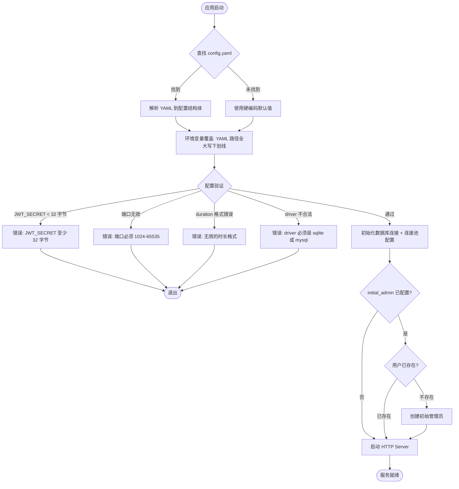

# config-yaml — PRD Spec

> PRD Spec: defines WHAT the feature is and why it exists.

## 需求背景

### 为什么做（原因）
当前后端配置全部通过环境变量管理（7个扁平字段），存在以下问题：
- 配置项无分组结构，难以理解配置之间的关系
- 新增配置类别（如日志、连接池、认证策略）只能不断添加环境变量
- 敏感值与普通配置混在一起，无法清晰区分
- 开发者必须阅读 `.env.example` 并手动设置每个变量

### 要做什么（对象）
引入结构化的 `config.yaml` 作为主要配置来源，按功能域分组管理所有后端配置项，同时支持环境变量覆盖。

### 用户是谁（人员）
- **开发者**：本地开发时通过 YAML 文件管理配置
- **运维/部署人员**：生产环境通过环境变量覆盖敏感值

## 需求目标

| 目标 | 量化指标 | 说明 |
|------|----------|------|
| 配置结构化 | 5个功能域分组 | 按 server/database/auth/cors/logging 分组 |
| 新增配置能力 | 4 个新配置类别 | HTTP 超时、连接池、JWT 过期+初始管理员、日志 |
| 配置验证 | 100% 启动时校验 | 所有配置在启动时验证，不合法则拒绝启动 |
| 环境变量覆盖 | 统一命名规则 | YAML 路径全大写下划线，如 `AUTH_JWT_SECRET` |

## Scope

### In Scope
- [ ] 结构化 YAML 配置加载与解析（按功能域分组）
- [ ] 环境变量覆盖（统一用 YAML 路径全大写下划线，如 `AUTH_JWT_SECRET`）
- [ ] 新增配置类别：HTTP 超时、连接池、JWT 过期时间、初始管理员账号、日志
- [ ] 配置验证（启动时校验所有字段）
- [ ] 数据库连接池配置接入 `InitDB()`
- [ ] 初始管理员账号首次启动自动创建

### Out of Scope
- 前端配置（保持 Vite `.env`）
- 多环境 Profile 层叠
- 热配置重载
- 配置文件加密
- 运行时配置 API
- 向后兼容旧环境变量名

## 流程说明

### 业务流程说明

**启动时配置加载流程：**

1. 应用启动，尝试查找 `config.yaml` 文件
2. 若找到，解析 YAML 内容到结构化配置
3. 若未找到，使用硬编码默认值
4. 遍历所有配置字段，检查是否有对应环境变量（全大写下划线格式），有则覆盖
5. 执行配置验证（JWT secret 长度、端口范围、duration 格式等）
6. 验证失败 → 输出错误信息并退出
7. 验证通过 → 使用配置初始化数据库、HTTP server 等组件
8. 若配置了 `initial_admin`，检查数据库是否存在该用户，不存在则自动创建

### 业务流程图

## 功能描述

### 配置域与字段

**Server 域**

| 字段 | 类型 | 默认值 | 说明 |
|------|------|--------|------|
| port | string | "8080" | 服务监听端口 |
| gin_mode | string | "" | 空=debug, "release"=生产 |
| read_timeout | duration | 30s | HTTP 读超时 |
| write_timeout | duration | 30s | HTTP 写超时 |
| max_body_size | int | 10485760 | 最大请求体（字节） |

**Database 域**

| 字段 | 类型 | 默认值 | 说明 |
|------|------|--------|------|
| driver | string | "sqlite" | 数据库驱动，sqlite 或 mysql |
| path | string | "./data/dev.db" | SQLite 文件路径 |
| url | string | "" | MySQL 连接串 |
| max_open_conns | int | 10 | 最大打开连接数 |
| max_idle_conns | int | 5 | 最大空闲连接数 |
| conn_max_lifetime | duration | 1h | 连接最大存活时间 |

**Auth 域**

| 字段 | 类型 | 默认值 | 说明 |
|------|------|--------|------|
| jwt_secret | string | "" | 必填，最少 32 字节 |
| jwt_expiry | duration | 24h | JWT 过期时间 |
| initial_admin.username | string | "" | 初始管理员用户名，空则跳过 |
| initial_admin.password | string | "" | 初始管理员密码 |

**CORS 域**

| 字段 | 类型 | 默认值 | 说明 |
|------|------|--------|------|
| origins | []string | [] | 允许的跨域来源列表 |

**Logging 域**

| 字段 | 类型 | 默认值 | 说明 |
|------|------|--------|------|
| level | string | "info" | debug/info/warn/error |
| format | string | "json" | json 或 text |

### 环境变量覆盖规则

- 环境变量名 = YAML 路径全大写 + 下划线连接
- 嵌套字段用下划线连接：`auth.initial_admin.username` → `AUTH_INITIAL_ADMIN_USERNAME`
- 数组字段用逗号分隔：`CORS_ORIGINS=http://a.com,http://b.com`
- 配置优先级：环境变量 > config.yaml > 硬编码默认值

### 验证规则

| 字段 | 规则 | 错误信息 |
|------|------|----------|
| auth.jwt_secret | >= 32 字节 | "auth.jwt_secret must be at least 32 bytes" |
| server.port | 1024-65535 | "server.port must be between 1024 and 65535" |
| database.driver | "sqlite" 或 "mysql" | "database.driver must be sqlite or mysql" |
| logging.level | debug/info/warn/error | "logging.level must be one of: debug, info, warn, error" |
| logging.format | json 或 text | "logging.format must be json or text" |
| duration 字段 | Go duration 格式 | "invalid duration format for {field}" |

## 其他说明

### 性能需求
- 配置加载在应用启动时一次性完成，不影响运行时性能
- 数据库连接池配置直接影响数据库并发性能

### 数据需求
- 初始管理员账号在首次启动时自动创建（幂等，已存在则跳过）
- 密码需哈希存储，不得明文保存

### 安全性需求
- `auth.jwt_secret` 和 `auth.initial_admin.password` 建议通过环境变量设置，避免写入版本控制
- `config.yaml` 应加入 `.gitignore`，仅提供 `config.yaml.example` 作为模板
