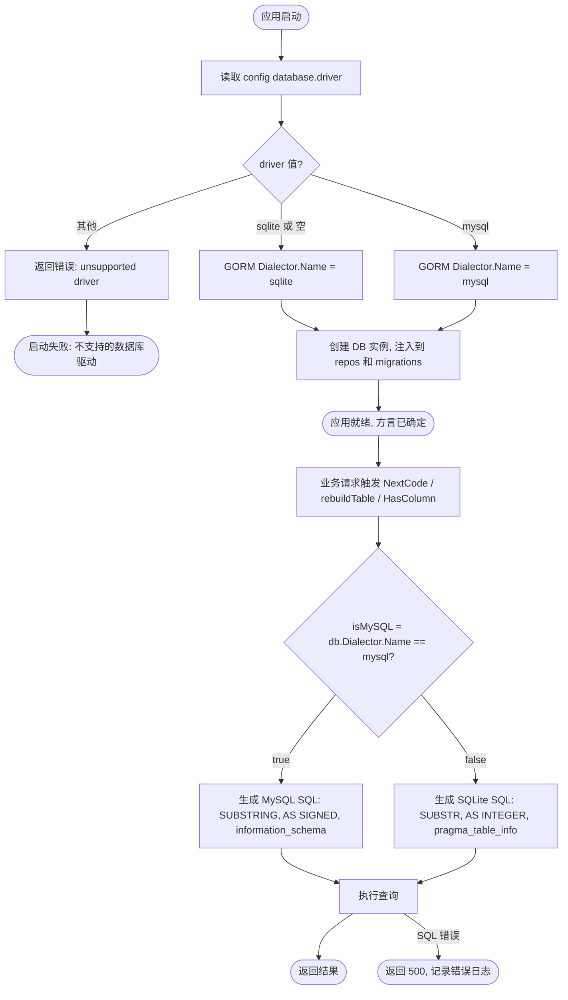

# 数据库方言兼容性 — PRD Spec

> PRD Spec: defines WHAT the feature is and why it exists.

## 需求背景

### 为什么做（原因）

项目长期同时支持 SQLite（开发/测试）和 MySQL（生产）两种数据库。当前代码中存在 4 处硬编码的 SQLite 专属 SQL，在 MySQL 下会导致运行时语法错误。这些问题来源于：P1/P2 由生产事故发现（"需求池转主事项"接口返回 500），P3/P4 由后续代码审查发现。虽然紧急修复（commit `86fd7c7`）解决了建表和迁移阶段的兼容性问题，但 repo 层的 P1/P2 尚未修复，导致部分业务功能在 MySQL 下仍然 500。

### 要做什么（对象）

1. 系统性修复全部 4 处已知的 SQLite/MySQL 不兼容点
2. 引入方言抽象层，将兼容性逻辑收敛到单一模块
3. 建立防复发机制（代码规范 + 自动化检查）

### 用户是谁（人员）

- **开发者**：需要同时维护 SQLite 和 MySQL 两种环境的代码
- **运维人员**：需要部署 MySQL 生产环境，验证端到端可用性

## 需求目标

| 目标 | 量化指标 | 说明 |
|------|----------|------|
| 修复 MySQL 业务功能 | 4/4 不兼容点全部修复 | P1-P4 在 MySQL 下不再报语法错误 |
| MySQL 部署可行性验证 | 核心业务操作 100% 通过 | 本地 MySQL 环境端到端验证 |
| 防复发 | 自动化 lint 检出已知 SQLite 关键字 | repo 层出现 SUBSTR/CAST/datetime/pragma_ 硬编码时拦截提交 |

## Scope

### In Scope
- [x] 修复 P1: `CAST(SUBSTR(... AS INTEGER)` — 主事项编号生成
- [x] 修复 P2: `CAST(SUBSTR(... AS INTEGER)` — 子事项编号生成
- [x] 修复 P3: `INTEGER PRIMARY KEY AUTOINCREMENT` — RBAC 迁移 DDL
- [x] 修复 P4: `pragma_table_info` — HasColumn 导出函数
- [x] 引入方言辅助模块，集中管理方言差异
- [x] 更新代码规范（rules 文件 + 经验教训文档）
- [x] 新增自动化 lint 检查，检测 repo 层 SQLite 专属关键字

### Out of Scope
- 现有测试文件中的 SQLite 语法（测试用 SQLite 内存库，无需改）
- `SQLite-schema.sql` / `MySql-schema.sql`（已各自正确）
- GORM ORM 调用（自动适配，无问题）

### 范围项与验证方式映射

| In-Scope 项 | 对应 User Story | 验证方式 |
|-------------|----------------|---------|
| P1: 主事项编号生成 CAST/SUBSTR | Story 1 | 成功标准 1：MySQL 端到端集成测试，连续调用 NextCode 验证编号递增 |
| P2: 子事项编号生成 CAST/SUBSTR | Story 1 | 成功标准 1：同上，NextSubCode 验证子编号递增 |
| P3: RBAC 迁移 DDL AUTOINCREMENT | Story 2 | 成功标准 2：MySQL 空库启动应用，验证 roles 表含 3 条预设角色 |
| P4: HasColumn pragma_table_info | Story 4 | 成功标准 3：MySQL 下 HasColumn 对存在的列返回 true、不存在的列返回 false |
| 方言辅助模块 | Story 1/4 | 成功标准 4-5：单元测试覆盖 CastInt/Substr/Now/IsMySQL 在两种方言下的输出 |
| 代码规范 + 经验教训文档 | Story 3 | 人工审查：rules 文件和 lessons 文档存在且内容正确 |
| 自动化 lint 检查 | Story 3 | 成功标准 6：repo 层写入硬编码 SQLite 关键字时提交被拦截；使用 dialect 包时提交通过 |

## 流程说明

### 业务流程说明

当前问题：开发者在 SQLite 下编写原始 SQL → 部署到 MySQL → 运行时语法错误 → 500。

修复后运行时流程：应用启动时根据 `config.database.driver` 创建对应 GORM Dialector → repos 和 migrations 通过 `isMySQL(db)` 判断方言 → 生成正确的 SQL 片段 → 两种数据库均正常运行。若 driver 值不在支持范围内，启动阶段即报错终止。

### 业务流程图



## 功能描述

### 5.1–5.3 不适用说明

本特性为纯后端基础设施改造，无 UI 变更。模板中 5.1（列表页）、5.2（按钮）、5.3（表单）均不涉及，直接从 5.4 系统行为规格开始。

### 5.4 系统行为规格

本节描述方言兼容性改造完成后各层的系统行为。所有改动集中在 backend 基础设施层。

#### 5.4.1 Dialect 模块 API

新增 `backend/internal/pkg/dialect` 包，提供以下公共函数：

| 函数 | 输入 | 输出 | 行为说明 | 输入约束 |
|------|------|------|----------|----------|
| `IsMySQL(db *gorm.DB) bool` | GORM DB 实例 | `bool` | 读取 `db.Dialector.Name()`，返回 `"mysql" == true`，否则 `false`。此为所有其他函数的方言判断基础。 | `db` 非 nil 且 `Dialector` 已初始化，否则 panic |
| `CastInt(expr string, db *gorm.DB) string` | SQL 表达式字符串, GORM DB 实例 | SQL 片段字符串 | SQLite 返回 `CAST(expr AS INTEGER)`；MySQL 返回 `CAST(expr AS SIGNED)`。用于编号序列解析。 | `expr` 为非空字符串；`db` 同上 |
| `Substr(str string, start int, db *gorm.DB) string` | 字符串表达式, 起始位置, GORM DB 实例 | SQL 片段字符串 | SQLite 返回 `SUBSTR(str, start)`；MySQL 返回 `SUBSTRING(str, start)`。起始位置从 1 开始（两种数据库一致，1-indexed）。用于截取编号前缀后的数字部分。 | `str` 为非空字符串；`start >= 1`；`db` 同上 |
| `Now(db *gorm.DB) string` | GORM DB 实例 | SQL 表达式字符串 | SQLite 返回 `datetime('now')`；MySQL 返回 `CURRENT_TIMESTAMP`。返回服务器本地时区时间，精度为秒（无毫秒/微秒）。用于 DDL 默认值。 | `db` 同上 |

**受影响的 HTTP 端点映射**：

| Dialect 函数 | 受影响 HTTP 端点 | 影响 Repo 方法 | 业务场景 |
|-------------|-----------------|---------------|---------|
| `CastInt` + `Substr` | `POST /api/v1/teams/:id/item-pool/:id/convert-to-main` | `mainItemRepo.NextCode` | 需求池转主事项时生成主事项编号 |
| `CastInt` + `Substr` | `POST /api/v1/teams/:id/main-items`（创建子事项） | `subItemRepo.NextSubCode` | 创建子事项时生成子事项编号 |
| `Now` | 无直接 HTTP 端点（应用启动时触发） | `rebuildTeamMembersTable` | RBAC 迁移中重建 team_members 表 DDL 默认值 |
| `IsMySQL` | 无直接 HTTP 端点（应用启动时触发） | `rebuildTeamMembersTable` + `HasColumn` | 方言判断基础，被所有其他函数依赖 |

**错误处理**：若 `db` 为 nil 或 `Dialector` 未初始化，函数 panic（与项目 handler/service 构造器 panic-on-nil 模式一致）。方言名称非 `"mysql"` 且非 `"sqlite"` 时，按 SQLite 逻辑处理（向后兼容）。

#### 5.4.2 Repo 层行为变更 — NextCode 查询生成

**受影响方法**：`mainItemRepo.NextCode` 和 `subItemRepo.NextSubCode`。

**变更前**：硬编码 `CAST(SUBSTR(code, ?) AS INTEGER)`，在 MySQL 下抛出语法错误。

**变更后行为**：

```
输入: teamID uint（或 mainItemID uint）
触发: 调用 NextCode / NextSubCode 时
处理:
  1. 在事务内执行 UPDATE 递增序列计数器
  2. 读取当前 team/mainItem 获取 code 前缀
  3. 调用 MAX(CAST(SUBSTR/SUBSTRING(code, offset) AS INTEGER/SIGNED)) 查询已有最大编号
     - 通过 dialect.CastInt(dialect.Substr(...), db) 生成方言安全的 SQL 片段
  4. 取 seq = max(计数器值, 最大编号+1)
  5. 格式化输出 "{teamCode}-{seq:05d}" 或 "{mainCode}-{seq:02d}"
输出: 格式化编号字符串（如 "TEAM-00042" 或 "TEAM-00001-03"）
异常: 事务失败时返回 error，调用方返回 500
```

**可验证条件**：对同一 teamID 连续调用 NextCode，在 SQLite 和 MySQL 下均产生严格递增且无间隔的编号序列。

#### 5.4.3 Migration 层行为变更

**受影响函数**：`rebuildTeamMembersTable` 和 `HasColumn`。

**rebuildTeamMembersTable 变更后行为**：

```
触发: 应用首次启动且检测到旧 team_members 表时
分支逻辑:
  - 旧表不存在且新表不存在（全新安装）→ 创建 pmw_team_members 表
    - SQLite: 使用 AUTOINCREMENT 语法，datetime('now') 默认值
    - MySQL: 使用 AUTO_INCREMENT 语法，CURRENT_TIMESTAMP 默认值
  - 新表已存在 → 跳过（幂等）
  - 旧表存在 → 创建新表 + INSERT INTO ... SELECT 迁移数据 + DROP 旧表
输出: 无返回值；失败时返回 error 并回滚事务
```

**HasColumn 变更后行为**：

```
输入: db *gorm.DB, table string, column string
输出: bool
分支逻辑:
  - MySQL: SELECT count(*) FROM information_schema.columns
           WHERE table_schema = DATABASE() AND table_name = ? AND column_name = ?
  - SQLite: SELECT count(*) FROM pragma_table_info(?) WHERE name = ?
返回: count > 0 为 true
```

**其他分支函数**（`rbacTableDDL`、`ensureSchemaMigrationsTable`、`tableExists`）遵循相同模式：通过 `isMySQL(db)` 判断方言后生成对应的 DDL/查询语句。

## 其他说明

### 兼容性需求
- 必须同时兼容 SQLite 3.x 和 MySQL 8.0
- 现有 SQLite 环境下所有测试必须继续通过
- 方言判断必须在应用启动时自动完成，无需手动配置

### 测试环境前置条件

**成功标准 1-3（MySQL 集成测试）：**
- 本地 MySQL 8.0 实例
- 已通过 `mysql -u root < backend/migrations/MySql-schema.sql` 导入 schema
- 验证导入成功：`mysql -u root -e 'SHOW TABLES' pm_work_tracker | grep pmw_users` 应返回表名
- 应用配置 `database.driver: mysql`、`database.url` 指向该实例、`auto_schema: false`

**成功标准 4-6（单元测试）：**
- `go test` 即可验证

---

## 质量检查

- [x] 需求标题是否概括准确
- [x] 需求背景是否包含原因、对象、人员三要素
- [x] 需求目标是否量化
- [x] 流程说明是否完整
- [x] 业务流程图是否包含（Mermaid 格式）
- [x] 关联性需求是否全面分析
- [x] 非功能性需求（兼容性）是否考虑
- [x] 是否可执行、可验收
