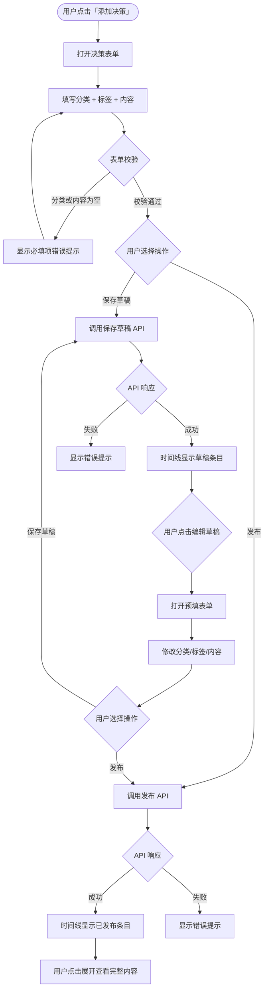
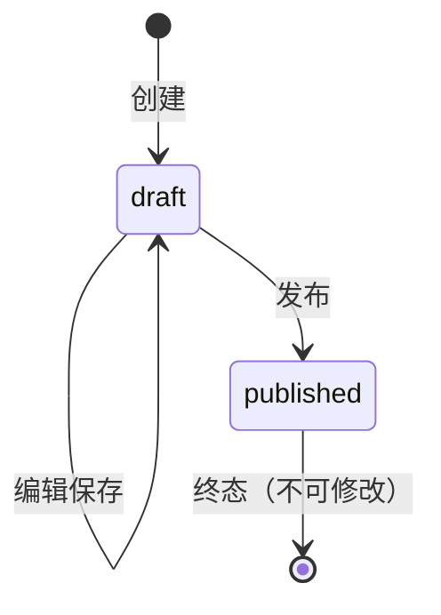

# 决策日志 — PRD Spec

> PRD Spec: defines WHAT the feature is and why it exists.

## 需求背景

### 为什么做（原因）

项目主事项在推进过程中产生大量决策（技术选型、资源调整、需求变更、进度计划调整等），但这些决策没有系统化的记录方式，散落在聊天记录、邮件、会议纪要中。具体表现为：

1. **追溯困难**：新成员 onboarding 期间平均花费 2-3 天反复询问历史决策背景，占用老成员每人约 4 小时。
2. **重复讨论**：近一季度发现至少 4 次跨会议重复讨论同一技术选型，每次约 30 分钟，累计浪费约 2 小时团队会议时间。
3. **上下文缺失**：状态变更记录（StatusHistory）仅有 Remark 文本，无法追溯决策分类和关联标签。

团队计划 Q3 扩招 2-3 人，决策日志缺失问题随团队规模线性增长。

### 要做什么（对象）

为主事项增加**决策日志**功能，支持草稿→发布的生命周期管理，以 Timeline 形式展示在主事项详情页。

### 用户是谁（人员）

- **主要用户**：PM / 技术负责人 — 日常录入和查阅决策记录
- **次要用户**：新成员 / 其他团队成员 — 查阅历史决策了解上下文

## 需求目标

| 目标 | 量化指标 | 说明 |
|------|----------|------|
| 决策可追溯 | 100% 的决策有分类和标签 | 每条决策必须有预定义分类 + 可选自由标签 |
| 减少 onboarding 成本 | 新成员了解决策背景时间从 2-3 天降至 < 1 天 | 通过结构化决策日志自助查阅 |
| 减少重复讨论 | 重复讨论同一决策点次数降低 50% | 有记录可查询，避免口头反复确认 |

## Scope

### In Scope
- [x] 新增 DecisionLog 数据模型（含 BizKey、status 字段区分草稿/已发布）
- [x] 后端 API：创建决策 + 保存草稿 + 发布草稿 + 编辑草稿 + 查询列表
- [x] 预定义分类（6 类）+ 自由标签
- [x] 主事项详情页 Timeline 展示（草稿 + 已发布）
- [x] 添加/编辑决策表单与交互（保存草稿 / 发布）

### Out of Scope
- 编辑/删除已发布决策记录
- 子事项的决策日志
- 跨事项的决策搜索/筛选
- 新决策通知机制
- 决策导出功能
- 孤立草稿管理界面

## 流程说明

### 业务流程说明

1. 用户在主事项详情页点击「添加决策」按钮，弹出决策表单
2. 用户填写分类（必选）、自由标签（可选）、内容（必填）
3. 用户选择「保存草稿」或「发布」：
   - **保存草稿**：决策以草稿状态保存，可在时间线中看到「草稿」标记，可反复编辑
   - **发布**：决策立即发布为已发布状态，发布后不可修改
4. 时间线按时间倒序展示所有已发布决策 + 当前用户的草稿
5. 草稿仅录入人可见，其他团队成员无法看到

### 业务流程图

### 状态机

## 功能描述

### 5.1 列表页（决策 Timeline）

**数据来源**：主事项关联的 DecisionLog 记录，通过 API 查询。

**显示范围**：
- 已发布决策：所有团队成员可见
- 草稿：仅录入人可见

**数据权限**：草稿按 `CreatedBy` 过滤，仅返回当前用户的草稿。

**排序方式**：按创建时间倒序（最新在前）。

**翻页设置**：每页 20 条，滚动加载（懒加载）。

**页面类型**：详情页内嵌区域。

**搜索条件**：本期不提供单独的搜索/筛选功能。决策记录通过滚动加载浏览，发布后迭代中根据使用反馈评估是否增加分类筛选。

**示例数据**：

| 分类 | 自由标签 | 内容摘要 | 录入人 | 时间 | 状态 |
|------|----------|----------|--------|------|------|
| technical | 缓存策略, 性能优化 | 决定采用 Redis 缓存热点数据... | 张三 | 2026-04-27 14:30 | 已发布 |
| resource | — | 后端开发李四从下周起投入该事项... | 王五 | 2026-04-26 10:00 | 已发布 |
| schedule | 里程碑 | 预计延期一周，原因... | 张三 | 2026-04-25 16:00 | 草稿 |

**状态说明**：

| 状态值 | 显示文本 | 业务含义 |
|--------|----------|----------|
| draft | 草稿（黄色标签） | 草稿状态，仅录入人可见，可编辑 |
| published | 已发布（无特殊标签） | 已发布，所有团队成员可见，不可修改 |

**列表字段**：

| 字段名称 | 类型 | 说明 |
|---------|------|------|
| category | string | 预定义分类标签（technical/resource/requirement/schedule/risk/other） |
| tags | string[] | 自由标签列表，以 Badge 形式展示 |
| content | text | 内容摘要（截取前 80 字符 + "..."），点击展开显示完整内容 |
| createdBy | string | 录入人姓名 |
| createTime | datetime | 创建时间 |
| status | string | 草稿/已发布标记（仅草稿显示） |

### 5.2 按钮操作

**权限控制**：需要 `main_item:update` 权限。

**按钮列表**：

| 按钮 | 位置 | 功能 | 状态条件 |
|------|------|------|----------|
| 添加决策 | 决策记录区域右上角 | 打开空白决策表单 | 主事项为终态时禁用 |
| 编辑 | 草稿条目上 | 打开预填表单编辑草稿 | 仅草稿状态且为录入人时显示 |
| 保存草稿 | 决策表单内 | 保存为草稿 | 表单校验通过后启用 |
| 发布 | 决策表单内 | 发布决策 | 表单校验通过后启用 |

**校验规则**：

| 序号 | 按钮名称 | 校验条件 | 错误提示 | 提示方式及位置 |
|------|----------|----------|----------|----------------|
| 1 | 保存草稿/发布 | 分类未选择 | 「请选择分类」 | 分类字段下方 |
| 2 | 保存草稿/发布 | 内容为空 | 「请输入决策内容」 | 内容字段下方 |
| 3 | 编辑 | 决策已发布 | 不显示编辑按钮 | — |
| 4 | 编辑 | 非录入人 | 不显示编辑按钮 | — |

**数据处理逻辑**：

| 序号 | 按钮名称 | 提交后的数据处理详细描述 |
|------|----------|------------------------|
| 1 | 保存草稿 | 调用创建/更新草稿 API（status=draft），成功后刷新决策列表 |
| 2 | 发布 | 调用发布 API（status=published），成功后刷新决策列表，该条目变为不可编辑 |
| 3 | 编辑 | 调用更新草稿 API，仅草稿状态可调用，成功后刷新决策列表 |

### 5.3 新增/编辑表单

**表单字段**：

| 字段名称 | 控件类型 | 必填 | 字符长度 | 规则说明 |
|---------|----------|------|----------|----------|
| 分类 | 下拉单选 | 是 | — | 6 个预定义选项（technical/resource/requirement/schedule/risk/other），不可自定义 |
| 自由标签 | 输入框（多值） | 否 | 单标签 ≤ 20 字符 | 回车或逗号分隔添加；输入时显示已有标签提示（recent tags dropdown） |
| 决策内容 | 多行文本框 | 是 | ≤ 2000 字符 | 支持换行 |

**校验规则**：

| 序号 | 校验条件 | 触发节点 | 提示语 | 提示方式及位置 |
|------|----------|----------|--------|----------------|
| 1 | 分类为空 | 提交 | 「请选择分类」 | 分类字段下方 |
| 2 | 内容为空 | 提交 | 「请输入决策内容」 | 内容字段下方 |
| 3 | 内容超过 2000 字符 | 输入 | 「内容不能超过 2000 字符」 | 内容字段下方 |
| 4 | 单标签超过 20 字符 | 输入 | 「标签不能超过 20 字符」 | 标签字段下方 |

### 5.4 关联性需求改动

| 序号 | 涉及项目 | 功能模块 | 关联改动点 | 更改后逻辑说明 |
|------|----------|----------|------------|----------------|
| 1 | 后端 | 路由注册 | 新增决策日志路由组 | 在 main-items 路由组下嵌套 decisions 资源路由 |
| 2 | 后端 | 权限 | 复用 main_item:update 权限码 | 决策日志的添加/编辑复用主事项编辑权限 |
| 3 | 前端 | 主事项详情页 | 新增决策记录区域 | 在子事项表格上方插入 DecisionTimeline 组件 |
| 4 | 数据库 | 迁移 | 新增 pmw_decision_logs 表 | SQLite 和 MySQL schema 同步更新 |

## 其他说明

### 性能需求
- 响应时间：决策列表 API 响应时间 < 200ms（100 条记录以内）
- 并发量：支持 50 QPS（单事项并发读写场景）
- 数据存储量：单个主事项决策记录预计 < 200 条，不做总量限制
- 兼容性：Chrome 90+、Firefox 90+、Edge 90+；分辨率 ≥ 1280×720

### 数据需求
- 数据埋点：本期不做
- 数据初始化：无历史数据迁移，新表为空
- 数据迁移：新增表，无需迁移

### 监控需求
- 复用现有 API 监控，不额外添加

### 安全性需求
- 传输加密：复用现有 HTTPS
- 存储加密：无敏感数据，不做额外加密
- 显示加密：不适用
- 接口限制：草稿 API 按 CreatedBy 校验归属；已发布决策编辑接口返回 403

---

## 质量检查

- [x] 需求标题是否概括准确
- [x] 需求背景是否包含原因、对象、人员三要素
- [x] 需求目标是否量化
- [x] 流程说明是否完整
- [x] 业务流程图是否包含（Mermaid 格式）
- [x] 列表页描述是否完整（数据来源/显示范围/权限/排序/翻页/字段/搜索）
- [x] 按钮描述是否完整（权限/状态/校验/数据逻辑）
- [x] 表单描述是否完整（字段/校验规则）
- [x] 关联性需求是否全面分析
- [x] 非功能性需求（性能/数据/监控/安全）是否考虑
- [x] 所有表格是否填写完整
- [x] 是否有歧义或模糊表述
- [x] 是否可执行、可验收
