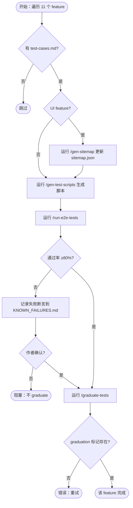

# E2E Test Scripts Rebuild & Graduation — PRD Spec

> PRD Spec: defines WHAT the feature is and why it exists.

## 需求背景

### 为什么做（原因）

项目中 11 个 feature 已完成 `test-cases.md` 编写，但对应的 e2e 测试脚本仍停留在各 feature 工作区的 `testing/scripts/` 目录，未 graduate 到 `tests/e2e/` 回归套件。其中 7 个 feature 的脚本使用了已废弃的数字 `.id` 模式（`bizkey-unification` 已将所有 API 响应改为 `.bizKey`），直接运行会立即失败。这些脚本既不在回归套件中，也已对当前 API 失效，覆盖缺口持续扩大。

### 要做什么（对象）

对 11 个有 `test-cases.md` 但未 graduate 的 feature，重新生成符合 forge 规范的 e2e 测试脚本，并将其 graduate 到 `tests/e2e/` 回归套件，使其成为持续运行的回归保护。

### 用户是谁（人员）

- **开发者**：在本地或 CI 中运行 `npm test`，需要回归套件覆盖所有已完成 feature
- **维护者**：负责 graduate 流程，确保脚本质量和合规性

## 需求目标

| 目标 | 量化指标 | 说明 |
|------|----------|------|
| 消除回归覆盖缺口 | 11 个 feature 全部 graduate | 当前 0/11 已 graduate |
| 脚本合规率 | 100% 脚本符合 forge 规范 | node:test + node:assert，无外部测试框架 |
| 脚本通过率 | ≥80% graduated 脚本在当前环境通过 | 不通过的需记录在 KNOWN_FAILURES.md |
| 修复已知失效 | 7 个使用 stale `.id` 模式的脚本全部修复 | 重新生成即可修复 |

## Scope

### In Scope

- [ ] 为 11 个 feature 重新生成 e2e 测试脚本（`/gen-test-scripts`）
- [ ] 将生成的脚本 graduate 到 `tests/e2e/`（`/graduate-tests`）
- [ ] 在 `tests/e2e/.graduated/<slug>` 创建 graduation 标记
- [ ] graduate 前运行 `/run-e2e-tests`，要求 ≥80% 通过率
- [ ] 不通过的断言记录到 `KNOWN_FAILURES.md`
- [ ] graduate 前更新 `sitemap.json`（如已过期）
- [ ] 更新 `tests/e2e/package.json` 以包含新 graduated 脚本

### Out of Scope

- 无 `test-cases.md` 的 feature（code-conventions、code-quality-cleanup、decision-log 等 10 个）
- 修改 `test-cases.md` 内容（以现有内容为准）
- CI pipeline 集成
- 已 graduated 的 feature（integration-test-coverage、pm-work-tracker）

## 流程说明

### 业务流程说明

对每个 feature 按顺序执行：
1. 检查 `test-cases.md` 是否存在，不存在则跳过
2. 检查 `sitemap.json` 是否需要更新（UI 类 feature）
3. 运行 `/gen-test-scripts` 生成脚本到 `testing/scripts/`
4. 运行 `/run-e2e-tests` 验证脚本，要求 ≥80% 通过
5. 不通过的断言记录到 `KNOWN_FAILURES.md`，由作者确认
6. 运行 `/graduate-tests` 将脚本移入 `tests/e2e/`
7. 验证 graduation 标记已创建

### 业务流程图

## 功能描述

### 5.1 脚本生成规范

每个 feature 生成的脚本必须满足：

| 规范项 | 要求 |
|--------|------|
| 测试框架 | 仅使用 `node:test` + `node:assert`，禁止 `describe`/`it` 等外部框架 |
| UI 测试 | 使用 Playwright，locator 来自 `sitemap.json` |
| API 测试 | 使用 `fetch`，不使用 HTTP 客户端库 |
| CLI 测试 | 使用 `child_process` |
| 脚本位置 | 生成到 `docs/features/<slug>/testing/scripts/` |

### 5.2 Graduate 规范

| 规范项 | 要求 |
|--------|------|
| 目标目录 | `tests/e2e/api/`、`tests/e2e/ui/`、`tests/e2e/cli/` 按类型分类 |
| 标记文件 | `tests/e2e/.graduated/<slug>` 包含 graduation 时间戳 |
| 去重 | `/graduate-tests` 自动处理与已有脚本的重复覆盖 |
| 导入路径 | graduated 脚本不得从 `testing/scripts/` 路径导入 |

### 5.3 已知失败处理

| 字段 | 说明 |
|------|------|
| 文件位置 | `tests/e2e/KNOWN_FAILURES.md` |
| 记录内容 | feature slug、失败断言描述、失败原因、负责人 |
| 前置条件 | 作者确认后方可 graduate |

### 5.4 关联性需求改动

| 序号 | 涉及项目 | 功能模块 | 关联改动点 | 更改后逻辑说明 |
|------|----------|----------|------------|----------------|
| 1 | tests/e2e | package.json | 新增 graduated spec 文件引用 | `npm test` 可执行所有 graduated 脚本 |
| 2 | docs/features/*/testing/scripts/ | 各 feature 脚本 | 重新生成，替换旧脚本 | 使用当前 API 模式（bizKey 替代 id） |

## 其他说明

### 性能需求

- 单个 feature 脚本生成时间：< 5 分钟
- 全套 graduated 脚本运行时间：< 10 分钟（并行执行）

### 数据需求

- 数据埋点：无
- 数据初始化：无
- 数据迁移：无

### 监控需求

- 无额外监控需求；`npm test` 退出码即为健康指标

### 安全性需求

- 无敏感数据；测试脚本不包含凭证

---

## 质量检查

- [x] 需求标题是否概括准确
- [x] 需求背景是否包含原因、对象、人员三要素
- [x] 需求目标是否量化
- [x] 流程说明是否完整
- [x] 业务流程图是否包含（Mermaid 格式）
- [x] 关联性需求是否全面分析
- [x] 非功能性需求（性能/数据/监控/安全）是否考虑
- [x] 所有表格是否填写完整
- [x] 是否可执行、可验收
