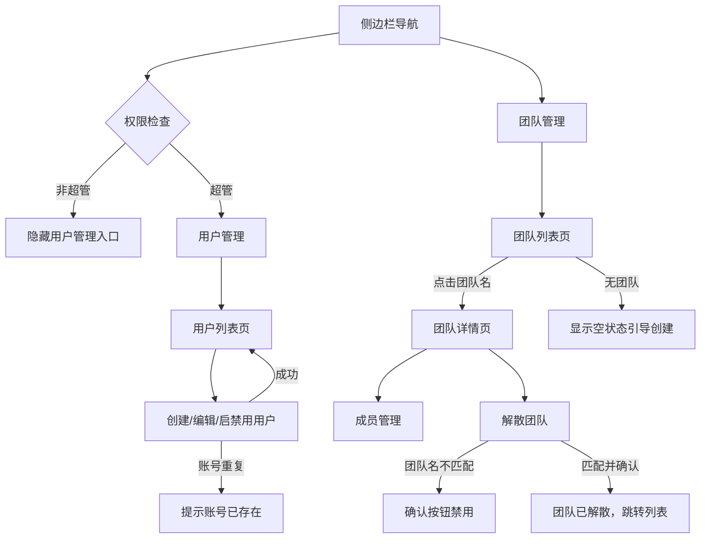
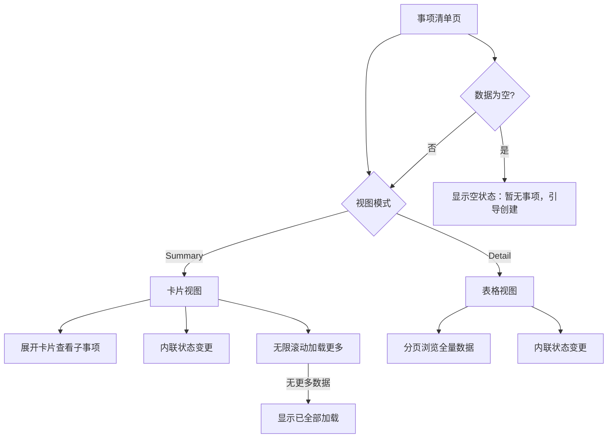
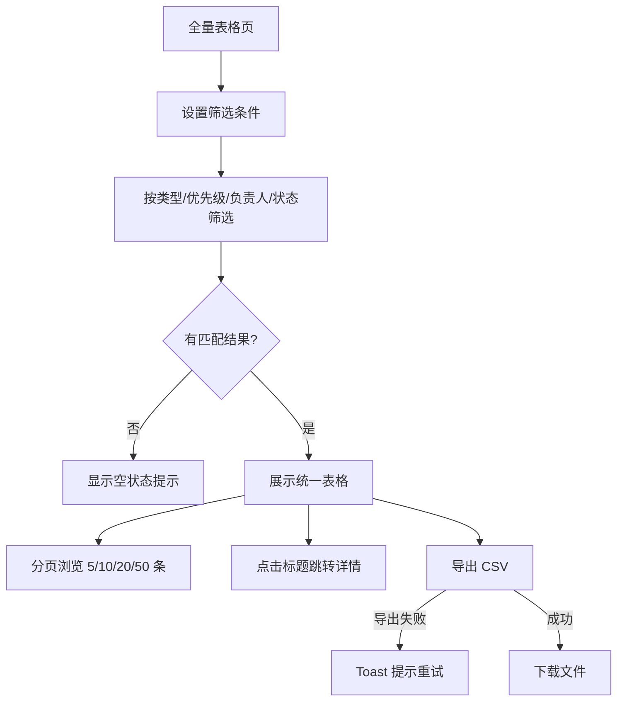

# Improve UI — PRD Spec

> PRD Spec: PM Tracker 全面 UI 重做的需求定义。业务逻辑不变，聚焦视觉风格、交互结构和设计系统的变更。

## 需求背景

### 为什么做（原因）

现有 PM Tracker 已完成初步实现（11 页面，基于 Ant Design）。经过实际使用，存在以下问题：

1. **视觉风格偏重**：Ant Design 默认样式对项目管理工具而言显得臃肿，操作效率低
2. **页面结构不合理**：超级管理员页面将用户管理和团队列表塞在同一页面的两个 Tab 中，信息密度高但操作分散；团队详情缺乏独立路由，只能从超级管理员入口进入
3. **事项清单交互单一**：仅有 Collapse 展开模式，无法在表格视图下快速浏览全量数据
4. **组件风格不一致**：不同页面中按钮、表单、卡片等基础组件样式不统一，影响专业感

### 要做什么（对象）

以已完成的 13 页 HTML 原型为精确蓝图，对 PM Tracker 进行全面的 UI 重做：
- 替换视觉风格（轻量、现代风格）
- 重构 5 个页面的交互结构
- 建立统一的设计系统
- 后端 API 增量适配

### 用户是谁（人员）

| 角色 | 变化说明 |
|------|---------|
| 超级管理员 | 原超级管理员页面拆分为独立的用户管理 + 团队详情页，操作更清晰 |
| 项目经理（PM） | 事项清单新增 Summary/Detail 视图切换，全量表格独立为专门页面 |
| 团队成员 | 视觉体验改善，交互不变 |

## 需求目标

| 目标 | 量化指标 | 说明 |
|------|----------|------|
| 视觉一致性 | 0 处组件风格不一致 | 建立统一设计系统，消除原型中按钮等元素的风格差异 |
| 页面覆盖 | 13/13 页面完成 | 所有原型页面完整实现 |
| 操作效率提升 | 事项清单表格视图可在一屏内浏览 ≥15 条事项（原 Collapse 视图一屏约 6-8 条） | Detail 视图以紧凑行高展示更多事项，减少滚动 |
| 后端兼容 | 0 个回归 bug | 现有业务逻辑和 API 语义不变 |

## Scope

### In Scope
- [x] 13 个页面的前端重做（以原型为精确蓝图）
- [x] 设计系统统一化（按钮、表单、卡片、徽章、进度条等）
- [x] 超级管理员页面拆分（user-management + team-detail）
- [x] 事项清单 Summary/Detail 视图切换
- [x] 全量表格独立页面（table-view）
- [x] 团队详情独立路由页（team-detail）
- [x] 后端 API 增量适配
- [x] 登录页面视觉重做

### Out of Scope
- 新增业务功能（不超出原型定义的范围）
- 移动端适配（纯桌面端，≥1280px 分辨率）
- 国际化（i18n）
- 数据库 Schema 变更
- 性能专项优化（保持原性能指标）
- 文件附件、通知、外部集成等原 PRD 已排除的功能

## 流程说明

### 变更的交互流程

以下仅描述相比原设计发生变化的流程。未提及的流程保持不变。

#### 4.1 超级管理员 → 用户管理 + 团队详情拆分

**原流程**：超级管理员入口 → 单页面双 Tab（用户管理 / 团队列表）→ 团队列表点击团队名 → 内嵌只读视图

**新流程**：

**变化点**：
- 用户管理从超级管理员页面的 Tab 变为独立导航入口
- 团队详情从超级管理员页面内嵌的只读视图变为独立路由页，支持完整成员管理（添加成员、设置 PM、移除成员）

#### 4.2 事项清单视图切换

**原流程**：事项清单页 → Collapse 面板展开查看子事项

**新流程**：

**变化点**：
- 新增 Summary（卡片列表）/ Detail（全量表格）视图切换
- Summary 视图：卡片式展示，可展开查看子事项，支持无限滚动加载
- Detail 视图：表格展示所有字段，支持分页

#### 4.3 全量表格独立页面

**原流程**：无独立页面，事项清单的 Collapse 展开即是全部数据展示

**新流程**：

## 功能描述

### 5.1 变更页面：用户管理（user-management）

**数据来源**：全局用户数据
**显示范围**：所有用户（超级管理员可见）
**数据权限**：仅超级管理员
**排序方式**：按创建时间倒序
**翻页设置**：分页，默认 10 条/页

**页面类型**：列表页 + 表单页（含弹窗）

**列表字段**：

| 字段名称 | 类型 | 说明 |
|---------|------|------|
| 姓名 | string | 含头像 |
| 账号 | string | 等宽字体显示 |
| 邮箱 | string | - |
| 所属团队 | string[] | 徽章展示，可多团队 |
| 创建团队权限 | boolean | 开关控件 |
| 账号状态 | string | 已启用/已禁用徽章 |
| 操作 | - | 编辑、变更状态 |

**搜索条件**：

| 序号 | 搜索项 | 控件类型 | 说明 |
|------|--------|----------|------|
| 1 | 用户名/账号 | 输入框 | 模糊搜索 |
| 2 | 创建团队权限 | 下拉单选 | 全部/有权限/无权限 |

**弹窗操作**：

| 弹窗 | 字段 | 校验规则 |
|------|------|----------|
| 创建用户 | 姓名、账号、邮箱、团队、创建团队权限 | 账号唯一，邮箱格式 |
| 编辑用户 | 同创建 | 同创建 |
| 变更状态 | 当前状态、目标状态（启用/禁用） | 禁用需二次确认 |

### 5.2 变更页面：团队详情（team-detail）

**数据来源**：指定团队数据
**显示范围**：单个团队及其成员
**数据权限**：PM 可管理本团队，超级管理员可见所有团队
**页面类型**：详情页

**面包屑**：团队管理 > [团队名]

**信息展示**：

| 字段名称 | 类型 | 说明 |
|---------|------|------|
| 团队名称 | string | - |
| PM | string | 含头像 |
| 成员数 | number | - |
| 创建日期 | date | - |
| 描述 | string | - |

**成员列表**：

| 字段名称 | 类型 | 说明 |
|---------|------|------|
| 姓名 | string | 含头像 |
| 角色 | string | PM/成员 徽章 |
| 加入日期 | date | - |
| 操作 | - | 设为 PM、移除（PM 行无操作） |

**危险操作**：解散团队（需输入团队名确认）

### 5.3 变更页面：事项清单（main-items）

**数据来源**：当前团队的主事项及子事项
**显示范围**：当前团队所有活跃事项
**数据权限**：团队内可见
**排序方式**：优先级正序（P1 → P3），同优先级按截止日期正序
**翻页设置**：Summary 视图无限滚动（每次 5 条），Detail 视图分页（默认 20 条/页）

**页面类型**：列表页

**新增功能 — 视图切换**：

| 视图 | 布局 | 特性 |
|------|------|------|
| Summary | 卡片列表 | 展开查看子事项，内联状态变更，无限滚动 |
| Detail | 数据表格 | 完整字段列，分页浏览，内联状态变更 |

**搜索条件（两种视图共用）**：

| 序号 | 搜索项 | 控件类型 | 说明 |
|------|--------|----------|------|
| 1 | 标题/ID | 输入框 | 模糊搜索 |
| 2 | 状态 | 下拉多选 | 7 种状态 |
| 3 | 负责人 | 下拉单选 | 团队成员列表 |

**弹窗操作**：

| 弹窗 | 字段 | 校验规则 |
|------|------|----------|
| 创建主事项 | 标题、优先级、负责人、起止日期、描述 | 标题必填，截止日期 ≥ 开始日期 |
| 创建子事项 | 标题、优先级、负责人、预期完成日期、描述 | 标题必填 |
| 追加进度 | 完成百分比、成果、卡点 | 百分比 ≥ 上次记录值 |

### 5.4 变更页面：全量表格（table-view）

**数据来源**：当前团队所有主事项和子事项的统一视图
**显示范围**：当前团队全部事项（含已归档）
**数据权限**：团队内可见
**排序方式**：按优先级正序，同优先级按截止日期正序
**翻页设置**：分页，可选 5/10/20/50 条/页

**页面类型**：列表页

**列表字段**：

| 字段名称 | 类型 | 说明 |
|---------|------|------|
| 类型 | string | main/sub 徽章 |
| ID | string | 等宽字体 |
| 标题 | string | 可点击跳转详情 |
| 优先级 | string | P1/P2/P3 徽章 |
| 负责人 | string | 含头像 |
| 进度 | number | 百分比 |
| 状态 | string | 状态徽章 |
| 开始日期 | date | - |
| 预期完成 | date | 逾期标红 |
| 实际完成 | date | - |

**搜索条件**：

| 序号 | 搜索项 | 控件类型 | 说明 |
|------|--------|----------|------|
| 1 | 标题 | 输入框 | 模糊搜索 |
| 2 | 类型 | 下拉单选 | 全部/主事项/子事项 |
| 3 | 优先级 | 下拉单选 | P1/P2/P3 |
| 4 | 负责人 | 下拉单选 | 团队成员列表 |
| 5 | 状态 | 下拉多选 | 7 种状态 |

**按钮操作**：导出 CSV

### 5.5 变更页面：每周进展（weekly-view）⭐ 重点变更

**数据来源**：当前团队主事项及子事项的周进度数据
**显示范围**：所选周次有活跃子事项的主事项
**数据权限**：团队内可见
**排序方式**：按主事项优先级正序

**页面类型**：仪表盘

**核心交互 — 双列周对比**：

| 区域 | 内容 |
|------|------|
| 顶部统计 | 活跃子事项数、本周新完成（绿色）、进行中（蓝色）、阻塞中（红色） |
| 左列 | 上周子事项状态（状态徽章、优先级、标题、日期、进度描述） |
| 右列 | 本周子事项状态 + 进度增量标记 |
| 卡片头部 | 主事项标题（可点击）、优先级、计划日期、子事项数、整体进度条 |

**进度增量标记**：

| 标记 | 颜色 | 含义 |
|------|------|------|
| +N% | 绿色 | 本周进度增长 N% |
| 已完成 | 绿色 | 本周新完成 |
| NEW | 琥珀色 | 本周新增的子事项 |

**折叠行为**：已完成且本周无变化的子事项默认折叠，可展开查看。

### 5.6 设计系统统一化

**目标**：建立统一的组件样式规范，消除原型中的不一致。

需统一的组件类别：

| 组件 | 变体 | 规范要点 |
|------|------|----------|
| 按钮 | primary / secondary / warning / danger / ghost / small / icon | 颜色、圆角、悬停态、禁用态 |
| 输入框 | 默认 / 聚焦 / 错误 / 禁用 | 边框颜色、聚焦环、内边距 |
| 下拉框 | 同输入框 + 展开面板 | 下拉箭头、选项高亮 |
| 日期选择器 | 同输入框 | 日历面板样式 |
| 卡片 | 默认 | 间距、圆角、阴影、边框 |
| 徽章 | 8 种状态色 | 颜色语义、文字色、圆角 |
| 进度条 | 线性 / 圆形 | 填充色、背景色、动画 |
| 头像 | 多色 | 尺寸、圆形、初始字 |
| 表格 | 默认 | 表头背景、行悬停、斑马纹 |
| 分页 | 默认 | 按钮样式、页码、页大小选择器 |
| 弹窗 | sm / md / lg | 尺寸、遮罩层、关闭按钮 |
| 面包屑 | 默认 | 分隔符、链接色 |
| 侧边栏 | 展开 / 折叠 | 宽度、导航项高亮、用户信息区 |

### 5.7 关联性需求改动

| 序号 | 涉及项目 | 功能模块 | 关联改动点 | 更改后逻辑说明 |
|------|----------|----------|------------|----------------|
| 1 | 后端 | 团队详情 | 新增独立路由 | team-detail 从超级管理员内嵌视图变为独立 API 端点，需支持完整成员 CRUD |
| 2 | 后端 | 用户管理 | 独立化 API | 用户管理 API 需支持独立页面所需的全量操作（原嵌在超级管理员下） |
| 3 | 后端 | 事项清单 | 视图切换数据 | Summary 和 Detail 视图共用同一数据源，无需新接口；Detail 视图可能需要分页参数 |
| 4 | 后端 | 全量表格 | 聚合查询 | 跨主/子事项的统一列表需新接口或调整现有接口，支持 type 字段筛选 |
| 5 | 前端 | 所有页面 | 组件库替换 | 全局组件样式替换，不涉及逻辑变更 |

## 其他说明

### 性能需求
- 响应时间：与原系统一致（列表加载 <2s，导出 <5s）
- 并发量：与原系统一致
- 兼容性：桌面浏览器，≥1280px 分辨率（Chrome / Edge / Firefox 最新版）

### 数据需求
- 数据迁移：无（数据库 Schema 不变）
- 数据初始化：无

### 安全性需求
- 与原系统一致：RBAC 权限、团队数据隔离
- 拆分后的用户管理和团队详情页保持与原超级管理员相同的权限控制

---

## 质量检查

- [x] 需求标题是否概括准确
- [x] 需求背景是否包含原因、对象、人员三要素
- [x] 需求目标是否量化
- [x] 流程说明是否完整
- [x] 业务流程图是否包含（Mermaid 格式）
- [x] 列表页描述是否完整（数据来源/显示范围/权限/排序/翻页/字段/搜索）
- [x] 按钮描述是否完整（权限/状态/校验/数据逻辑）
- [x] 表单描述是否完整（字段/校验规则）
- [x] 关联性需求是否全面分析
- [x] 非功能性需求（性能/数据/监控/安全）是否考虑
- [x] 所有表格是否填写完整
- [x] 是否有歧义或模糊表述
- [x] 是否可执行、可验收
