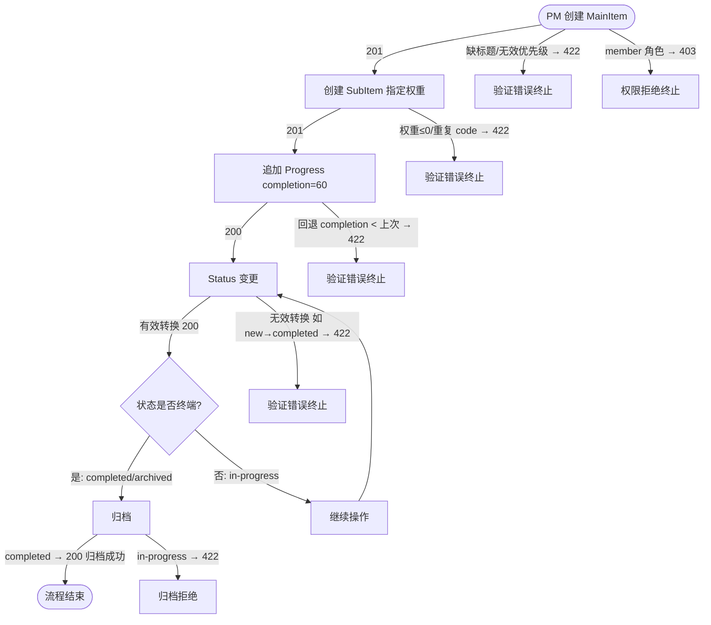
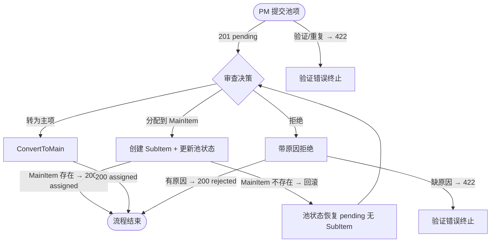
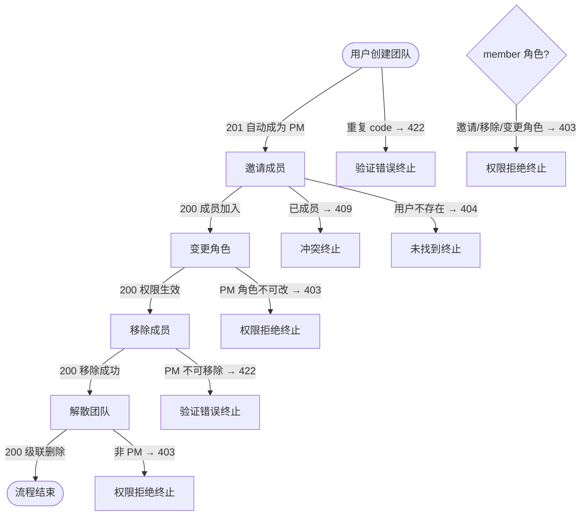
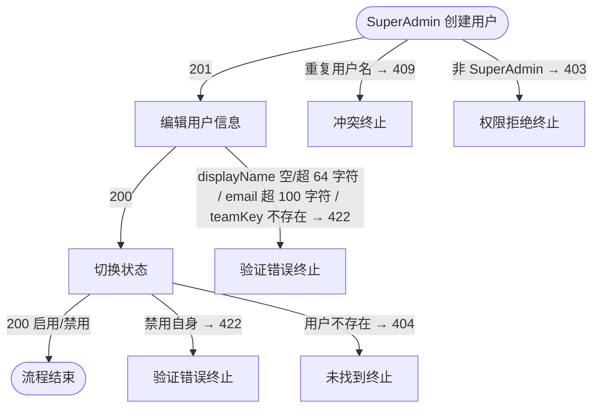
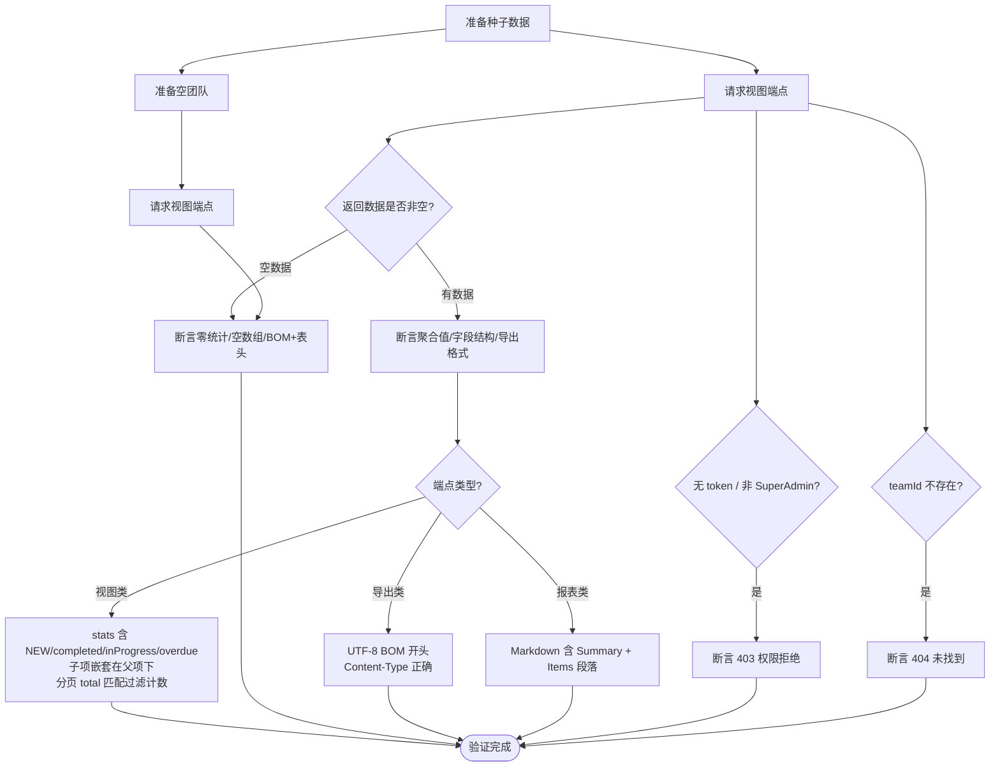
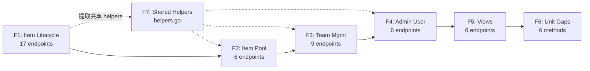

# Integration Test Coverage — PRD Spec

> PRD Spec: defines WHAT the feature is and why it exists.

## 需求背景

### 为什么做（原因）

系统有 54 个 API 端点，但只有 18 个（33%）有集成测试，36 个端点完全无测试覆盖。未覆盖的端点横跨所有核心业务域：项目管理、团队管理、后台管理、视图和报表。同时存在若干单元测试缺口（`permission_handler.go` 完全无测试、`ConvertToMain`/`UpdateTeam`/`GetByBizKey` 方法缺少覆盖）。

近期实例：Views 域在 commit `1883499`（周视图重构）引入了时区 bug（`view_handler.go` 拒绝合法的周起始日期）和过滤逻辑 bug（`view_service.go` 所有周返回相同数据），两个 bug 均因无集成测试而逃逸到手工测试阶段（记录于 `docs/lessons/weekly-view-bug-fixes.md` Bug 2 & Bug 3）。

### 要做什么（对象）

为 36 个未测试端点编写端到端集成测试，按用户流程组织（而非按端点隔离）。同时补全 6 个单元测试缺口。目标是将端点集成测试覆盖率从 33% 提升到 100%。

### 用户是谁（人员）

- **开发者**：编写和运行测试、在 CI 中获得回归保护
- **代码审查者**：通过 PR 级别的增量提交审查测试代码

## 需求目标

| 目标 | 量化指标 | 说明 |
|------|----------|------|
| 端点集成测试覆盖率 | 从 33% 提升至 100% | 所有 54 个端点至少有一个集成测试 |
| 测试用例数量 | ≥ 150 个新测试用例 | 覆盖 happy path、验证错误、权限拒绝、未找到、级联效应 |
| 单元测试缺口 | 6 个缺口全部关闭 | permission_handler、ConvertToMain、UpdateTeam、3x GetByBizKey |
| 测试套件执行时间 | < 150 秒 | 5 个流程文件 x 30 秒目标 |
| PR 可审查性 | 6 个测试 PR + 1 个 helpers PR，每个 ≤ 500 行 | F1-F6 各一个测试 PR，F7 为 helpers 基础设施 PR（非测试代码），测试按流程组织、函数名含场景描述 |

## Scope

### In Scope
- [x] F1: Item Lifecycle — 17 个端点（MainItem CRUD → SubItem → Progress → Status → Archive）
- [x] F2: Item Pool Flow — 6 个端点（Submit → Assign/Convert/Reject）
- [x] F3: Team Management — 9 个端点（CRUD + 成员管理 + 角色变更）
- [x] F4: Admin User Management — 6 个端点（用户 CRUD + 状态切换 + 团队列表）
- [x] F5: Views & Reports — 6 个端点（Weekly/Gantt/Table/CSV/Report Preview/Export）
- [x] F6: Unit Test Gaps — 6 个缺口（permission_handler、ConvertToMain、UpdateTeam、3x GetByBizKey）
- [x] F7: Shared Test Helpers — 从现有集成测试中提取复用（见 F7 规格表）

### Out of Scope
- 前端测试变更（前端测试套件已覆盖组件和 E2E 流程）
- 性能/负载测试
- E2E 浏览器测试（独立工作流）
- 新功能或 bug 修复 — 本需求纯粹是测试覆盖

**预估工作量：** ~40 开发工时

**推荐执行顺序：** F1 → F7 → F2 → F3 → F4 → F5 → F6

- F1（item lifecycle）优先：覆盖面最大（17 端点），编写过程中提取辅助函数到 helpers.go
- F7（shared helpers）紧随 F1：从 F1 中提取并整合现有辅助函数为独立 helpers PR（基础设施，非测试代码），供 F2-F5 复用
- F2-F4 独立流程，复杂度相近
- F5（views/reports）依赖 F1-F4 的测试数据
- F6（unit gaps）独立于集成测试基础设施，可并行或穿插执行

## 流程说明

### 业务流程说明

集成测试按用户流程组织，每个流程文件模拟真实用户的操作序列：

1. **Item Lifecycle（F1）**：创建主项 → 创建子项 → 追加进度 → 状态变更 → 归档。验证完成度级联计算、状态机转换、终端状态副作用。
2. **Item Pool（F2）**：提交池项 → 审查（分配/转为子项/拒绝）。验证事务回滚、状态互斥。
3. **Team Management（F3）**：创建团队 → 邀请成员 → 变更角色 → 移除成员 → 解散团队。验证权限隔离、PM 专属操作保护。
4. **Admin User（F4）**：创建用户 → 编辑信息 → 切换状态。验证重复用户名、禁止禁用自身。
5. **Views & Reports（F5）**：基于种子数据验证聚合统计、导出格式、空数据处理。

### 业务流程图

#### F1: Item Lifecycle — 测试业务逻辑流

#### F2: Item Pool — 状态互斥与事务回滚流

#### F3: Team Management — 成员生命周期与权限保护流

#### F4: Admin User Management — 用户管理与自身保护流

#### F5: Views & Reports — 查询验证与数据状态分支流

#### 项目执行顺序与共享依赖

## 功能描述

### F1: Item Lifecycle — 端点测试矩阵

| 端点 | Happy Path | 验证错误 | 权限拒绝 | 未找到 | 级联效应 |
|------|-----------|---------|---------|-------|---------|
| `POST /teams/:id/main-items` | 创建返回 201 | 缺标题/无效优先级/无效日期 → 422 | member 角色 → 403 | — | — |
| `GET /teams/:id/main-items` | 分页列表 200 | — | — | — | — |
| `GET /teams/:id/main-items/:itemId` | 详情 200 | — | 非本团队成员 → 403 | 404 | — |
| `PUT /teams/:id/main-items/:itemId` | 更新 200 | 终端状态项不可编辑 → 422；`assigneeKey` 非数字 → 422 | member 角色 → 403 | 404 | — |
| `PUT /teams/:id/main-items/:itemId/status` | 有效转换 200 | 状态机不允许的转换，如 new→completed、completed→in-progress（完整定义见 `status/transition.go`）→ 422 | member 角色 → 403 | 404 | 终端状态级联：子项自动完成 |
| `GET /teams/:id/main-items/:itemId/available-transitions` | 返回转换列表 | — | — | — | 终端状态返回空 |
| `POST /teams/:id/main-items/:itemId/archive` | 已完成项归档 200 | 进行中项归档 → 422 | — | 404 | — |
| `POST /teams/:id/main-items/:itemId/sub-items` | 创建子项 201 | 权重/重复 code → 422 | member 无 `sub_item:create` 权限 → 403 | 主项 404 | — |
| `GET /teams/:id/main-items/:itemId/sub-items` | 子项列表 200 | — | — | — | — |
| `GET /teams/:id/sub-items/:subId` | 详情 200 | — | 非本团队成员 → 403 | 404 | — |
| `PUT /teams/:id/sub-items/:subId` | 更新 200 | `assigneeKey` 无法解析为有效 bizKey → 422 | — | 404 | — |
| `PUT /teams/:id/sub-items/:subId/status` | 有效转换 200 | 状态机不允许的转换，如 new→completed、completed→in-progress（完整定义见 `status/transition.go`）→ 422 | — | 404 | 终端状态级联：主项完成度重算 |
| `GET /teams/:id/sub-items/:subId/available-transitions` | 转换列表 200 | — | — | — | 终端返回空 |
| `PUT /teams/:id/sub-items/:subId/assignee` | 分配 200 | — | 非成员 → 403 | — | 清空负责人 |
| `POST /teams/:id/sub-items/:subId/progress` | 追加 200 | 回退 completion < 上次 → 422 | — | — | 100% 自动状态转换；完成度上卷主项 |
| `GET /teams/:id/sub-items/:subId/progress` | 逆序列表 200 | — | — | — | — |
| `PATCH /teams/:id/progress/:recordId/completion` | 修正最新 → 同步子项 | — | — | 404 | 修正非最新 → 不级联 |

### F2: Item Pool — 端点测试矩阵

| 端点 | Happy Path | 验证错误 | 权限拒绝 | 未找到 | 级联效应 |
|------|-----------|---------|---------|-------|---------|
| `POST /teams/:id/item-pool` | 提交 201 | 缺 title / title 超 100 字符 → 422 | member 角色 → 403 | — | — |
| `GET /teams/:id/item-pool` | 带状态过滤列表 200 | — | — | — | — |
| `GET /teams/:id/item-pool/:poolId` | 详情 200 | — | — | 404 | — |
| `POST /teams/:id/item-pool/:poolId/assign` | 分配：创建子项+更新池状态 200 | 无效主项 → 回滚 | member 角色 → 403 | — | 已处理 → 409 |
| `POST /teams/:id/item-pool/:poolId/convert-to-main` | 转为主项 200 | — | member 角色 → 403 | — | 已处理 → 409 |
| `POST /teams/:id/item-pool/:poolId/reject` | 带原因拒绝 200 | 缺原因 → 422 | member 角色 → 403 | — | 已处理 → 409 |

### F3: Team Management — 端点测试矩阵

| 端点 | Happy Path | 验证错误 | 权限拒绝 | 未找到 | 级联效应 |
|------|-----------|---------|---------|-------|---------|
| `POST /teams` | 创建 201，自动加入为 PM | 重复 code → 422 | — | — | — |
| `GET /teams` | 用户团队列表 200 | — | — | — | 新用户返回空 |
| `GET /teams/:id` | 详情 200 | — | 非成员 → 403 | 404 | — |
| `PUT /teams/:id` | 更新 200 | 缺 name / name 超 100 字符 / description 超 500 字符 → 422 | 非 PM → 403 | — | — |
| `DELETE /teams/:id` | 解散 200 | — | 非 PM → 403 | 404 | 级联删除项目 |
| `GET /teams/:id/search-users` | 搜索 200 | — | member 角色 → 403 | — | 空结果 |
| `POST /teams/:id/members` | 邀请 200 | 已成员 → 409 | member 角色 → 403 | 用户 404 | — |
| `DELETE /teams/:id/members/:userId` | 移除 200 | PM 不可移除 → 422 | member 角色 → 403 | 404 | — |
| `PUT /teams/:id/members/:userId/role` | 变更 200 | PM 角色不可改 → 403 | member 角色 → 403 | 404 | — |

### F4: Admin User Management — 端点测试矩阵

| 端点 | Happy Path | 验证错误 | 权限拒绝 | 未找到 | 级联效应 |
|------|-----------|---------|---------|-------|---------|
| `GET /admin/users` | 分页+搜索 200 | — | 非 SuperAdmin → 403 | — | — |
| `POST /admin/users` | 创建 201 | 重复用户名 → 409 | 非 SuperAdmin → 403 | — | — |
| `GET /admin/users/:userId` | 详情 200 | — | — | 404 | — |
| `PUT /admin/users/:userId` | 更新 200 | displayName 空 / 超 64 字符 / email 超 100 字符 / teamKey 指向不存在的团队 → 422 | — | 404 | — |
| `PUT /admin/users/:userId/status` | 启用/禁用 200 | 禁用自身 → 422 | — | 404 | — |
| `GET /admin/teams` | 团队列表含成员数 200 | — | — | — | — |

### F5: Views & Reports — 端点测试矩阵

| 端点 | Happy Path | 空数据 | 格式验证 |
|------|-----------|-------|---------|
| `GET /teams/:id/views/weekly` | 3 项（其中 1 项 completed、2 项 in-progress）：`stats: {NEW:0, completed:1, inProgress:2, overdue:0}` | 全零统计 | 前周对比 delta `+3` |
| `GET /teams/:id/views/gantt` | 2 项含正确 `startDate`/`endDate`，子项嵌套在父项下 | 空数组 | `status` 映射颜色键 |
| `GET /teams/:id/views/table` | `?status=completed` 仅返回已完成项；`?overdue=true` 返回过期未完成项 | `{items:[], total:0}` | 分页 `total` 匹配过滤计数 |
| `GET /teams/:id/views/table/export` | BOM + 表头 + 数据行 | BOM + 表头无数据行 | UTF-8 BOM `\xEF\xBB\xBF` |
| `GET /teams/:id/reports/weekly/preview` | Markdown 含 `## Summary` + `## Items` | "no activity this week" | — |
| `GET /teams/:id/reports/weekly/export` | 完整 Markdown 含所有段落 | — | `Content-Type: text/markdown` |

### F6: Unit Test Gaps

| 文件 | 缺口 | 补充内容 |
|------|------|---------|
| `permission_handler.go` | 整文件无测试 | `GetPermissions`、`GetPermissionCodes` handler 测试 |
| `item_pool_service_test.go` | ConvertToMain 无测试 | 事务性测试：创建主项 + 更新池状态 |
| `team_service_test.go` | UpdateTeam 无测试 | PM 权限检查 + 字段更新 |
| `item_pool_service_test.go` | GetByBizKey 无测试 | 存在/不存在场景 |
| `progress_service_test.go` | GetByBizKey 无测试 | 存在/不存在场景 |
| `sub_item_service_test.go` | GetByBizKey 无测试 | 存在/不存在场景 |

### F7: Shared Test Helpers — 辅助函数规格

从现有 `backend/tests/integration/` 中提取复用，避免各流程文件重复编写基础设施工具。

| 辅助函数 | 来源文件 | 签名 | 用途 |
|---------|---------|------|------|
| `setupTestDB` | `auth_isolation_test.go` | `func setupTestDB(t *testing.T) (*gorm.DB, *seedData)` | 创建内存 SQLite、运行迁移、种子用户/团队/角色/权限 |
| `setupTestRouter` | `auth_isolation_test.go` | `func setupTestRouter(t *testing.T) (*gin.Engine, *seedData)` | 基于 setupTestDB 创建完整 DI 路由 |
| `loginAs` | `auth_isolation_test.go` | `func loginAs(t *testing.T, r *gin.Engine, username, password string) string` | 登录并返回 JWT token |
| `signTokenWithClaims` | `auth_isolation_test.go` | `func signTokenWithClaims(t *testing.T, claims *appjwt.Claims) string` | 直接签发 token（绕过登录） |
| `seedProgressData` | `progress_completion_test.go` | `func seedProgressData(t *testing.T, db *gorm.DB, teamID, userID uint) (...)` | 创建 MainItem + 2 个 SubItem，返回 ID 和 BizKey |
| `appendProgress` | `progress_completion_test.go` | `func appendProgress(t *testing.T, r *gin.Engine, token string, teamBizKey, subBizKey int64, completion float64) *httptest.ResponseRecorder` | 通过 HTTP 追加进度记录 |
| `seedPoolData` | `progress_completion_test.go` | `func seedPoolData(t *testing.T, db *gorm.DB, teamID, userID uint) (...)` | 创建 pending 池项 + MainItem，返回 ID 和 BizKey |
| `seedReportData` | `progress_completion_test.go` | `func seedReportData(t *testing.T, db *gorm.DB, teamID, userID uint, weekStart time.Time) string` | 创建本周有进度的测试数据 |
| `createTeamWithMembers` | 待提取 | `func createTeamWithMembers(t *testing.T, db *gorm.DB, pmID uint, memberCount int) uint` | 创建团队并加入指定数量 member（F3 复用） |
| `createMainItem` | 待提取 | `func createMainItem(t *testing.T, r *gin.Engine, token string, teamBizKey int64, req dto.MainItemCreateReq) int64` | 通过 HTTP 创建 MainItem，返回 BizKey（F1/F5 复用） |

**提取原则：** 现有辅助函数从各测试文件复制到 `backend/tests/integration/helpers.go`，保持签名不变。新辅助函数（`createTeamWithMembers`、`createMainItem`）从 F1 测试编写时提取，供后续 F3-F5 复用。

## 其他说明

### 性能需求
- 集成测试套件总执行时间 < 150 秒（5 个流程文件 x 30 秒/文件）
- 各流程文件独立，可并行执行

### 数据需求
- 每个流程使用隔离的团队/用户数据
- 使用事务回滚（`tx.Begin()` + `t.Cleanup(tx.Rollback)`）保证无持久化残留

### 安全性需求
- 测试不得修改生产数据库
- 测试用户凭证仅在测试生命周期内存在

### 测试维护原则
- 断言结构性字段（状态码、顶层键、业务字段），不断言字段顺序或错误消息文本
- API 合法变更导致测试失败时更新测试，不压制失败
- bug 严重性阈值：数据丢失/错误业务状态/auth 绕过 → 立即修复；其他 → 提 bug 不阻塞

---

## 质量检查

- [x] 需求标题是否概括准确
- [x] 需求背景是否包含原因、对象、人员三要素
- [x] 需求目标是否量化（5 个量化指标）
- [x] 流程说明是否完整（5 个流程 + 执行顺序）
- [x] 业务流程图是否包含（Mermaid 格式，F1-F5 共 5 个流程图 + 执行顺序图）
- [x] 所有端点测试矩阵是否填写完整（36 端点 + 6 unit gaps + F7 helpers）
- [x] 非功能性需求（性能/数据/安全/维护）是否考虑
- [x] 是否可执行、可验收（150+ 测试用例目标、端点覆盖率 100%）
