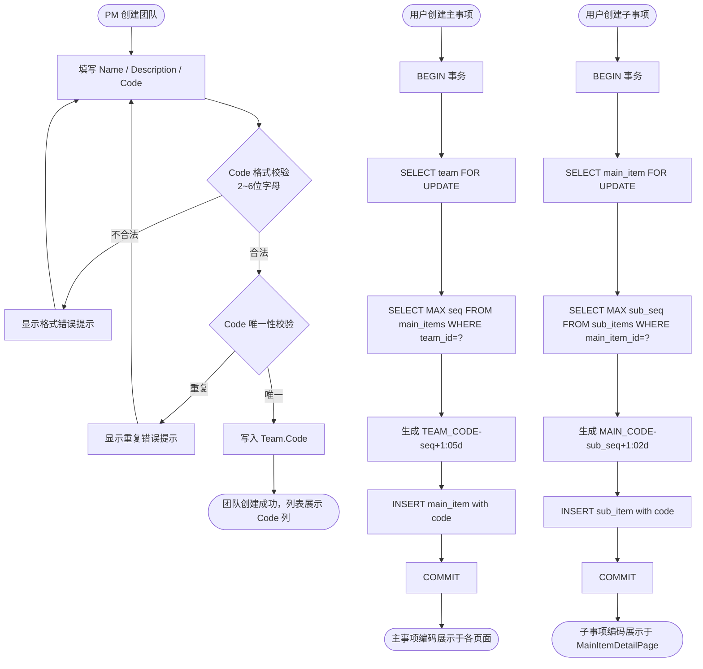

# 事项编码体系重新设计 — PRD Spec

> PRD Spec: defines WHAT the feature is and why it exists.

## 需求背景

### 为什么做（原因）

系统即将从单团队内测过渡到多团队使用。当前主事项编码格式 `MI-NNNN` 所有团队共享同一前缀，多团队场景下口头沟通时无法从编码本身判断事项所属团队，每次引用都需额外说明团队归属，辨识成本随事项数量增加而上升。

同时，子事项目前没有持久编码字段，前端在两处页面（MainItemDetailPage、SubItemDetailPage）运行时拼接临时标识符 `SI-${itemId}-${subId}`，该标识符依赖数据库 ID、不稳定，无法在周报或进度追踪中作为稳定引用。

### 要做什么（对象）

引入团队缩写（Team Code）作为编码前缀，重新设计主事项和子事项的编码体系：

- Team 模型新增 `Code` 字段（2~6 位字母，全局唯一）
- 主事项编码格式改为 `{TEAM_CODE}-NNNNN`（如 `FEAT-00001`）
- 子事项新增 `Code` 字段，格式为 `{TEAM_CODE}-NNNNN-NN`（如 `FEAT-00001-01`）
- 对现有数据执行一次性迁移，重写所有旧编码

### 用户是谁（人员）

- **PM（项目经理）**：创建团队时设置 Team Code；在各视图页面查看、搜索事项
- **团队成员**：在日常沟通、周报、进度追踪中引用事项编码

## 需求目标

| 目标 | 量化指标 | 说明 |
|------|----------|------|
| 多团队场景下编码可识别团队归属 | 从编码前缀即可判断所属团队，口头沟通无需额外说明 | 多团队上线前完成，作为前置合并 |
| 子事项获得稳定持久编码 | 前端 0 处运行时拼接临时标识符（当前 2 处） | 迁移后 `SELECT COUNT(*) FROM sub_items WHERE code IS NULL OR code = ''` 返回 0 |
| 编码不可变 | 更新 team code 后，已有事项编码不变 | 单元测试验证 |

## Scope

### In Scope

- [x] Team 模型新增 `Code` 字段（varchar(6)，全局唯一索引，2~6 位字母，必填）
- [x] 主事项编码格式改为 `{TEAM_CODE}-NNNNN`，`NextCode()` 采用 SELECT FOR UPDATE 悲观锁
- [x] 子事项新增 `Code` 字段（varchar(15)），`NextSubCode()` 采用相同锁机制
- [x] TeamManagementPage 创建团队对话框新增 Code 输入框（含格式校验 + 唯一性校验）
- [x] 团队列表页新增 Code 列
- [x] 5 个页面编码展示更新（ItemViewPage、TableViewPage、WeeklyViewPage、MainItemDetailPage、ItemPoolPage）
- [x] MainItemDetailPage 子事项表格从运行时拼接改为读取 SubItem.Code 字段
- [x] 数据迁移：重写现有 `MI-XXXX` 编码；为所有 SubItem 生成 Code

### Out of Scope

- 编码的自定义前缀或可配置格式
- 编码的批量重命名
- 已删除事项编码的回收复用
- 编码的跨团队唯一性（编码仅在团队内唯一）
- Team Code 创建后的修改（一经创建不支持编辑）
- 旧 `MI-XXXX` 编码的重定向或兼容（直接切换，接受内测阶段旧引用失效）

## 流程说明

### 业务流程说明

**创建团队流程**：PM 在创建团队对话框中填写 Name、Description、Code 三个字段。Code 须为 2~6 位英文字母，全局唯一。提交后后端校验并写入数据库，团队列表页刷新并展示新 Code 列。

**创建主事项流程**：用户在任意入口创建主事项时，后端在事务内锁定团队行（SELECT FOR UPDATE），读取该团队当前最大序号，生成 `{TEAM_CODE}-{seq:05d}` 格式编码，写入 MainItem.Code。编码生成后不再变更。

**创建子事项流程**：用户在 MainItemDetailPage 创建子事项时，后端在事务内锁定主事项行（SELECT FOR UPDATE），读取该主事项下当前最大子序号，生成 `{MAIN_ITEM_CODE}-{sub_seq:02d}` 格式编码，写入 SubItem.Code。

### 业务流程图

## 功能描述

### 5.1 团队列表页

**数据来源**：现有团队列表接口，新增 `code` 字段返回

**显示范围**：当前用户所在的所有团队

**数据权限**：与现有权限逻辑一致

**排序方式**：与现有排序一致

**列表字段**：

| 字段名称 | 类型 | 说明 |
|---------|------|------|
| 编码（Code） | string | 新增列，展示 Team.Code，如 `FEAT` |
| 名称 | string | 现有字段 |
| 描述 | string | 现有字段 |
| 创建时间 | datetime | 现有字段 |

### 5.2 按钮操作

**创建团队按钮**：

**校验规则**：

| 序号 | 字段 | 校验条件 | 错误提示 | 提示方式及位置 |
|------|------|----------|----------|----------------|
| 1 | Code | 为空 | 团队编码为必填项 | 输入框下方红色文字 |
| 2 | Code | 长度 < 2 或 > 6 | 编码须为 2~6 位英文字母 | 输入框下方红色文字 |
| 3 | Code | 包含非字母字符 | 编码须为 2~6 位英文字母 | 输入框下方红色文字 |
| 4 | Code | 与已有 Code 重复 | 该编码已被使用 | 输入框下方红色文字 |

**数据处理逻辑**：

| 序号 | 按钮名称 | 提交后的数据处理详细描述 |
|------|----------|------------------------|
| 1 | 创建团队 | 后端校验 Code 格式（正则 `^[A-Za-z]{2,6}$`）+ 全局唯一；校验通过后写入 teams 表，返回含 code 字段的团队对象；前端刷新团队列表 |

### 5.3 创建团队表单

**表单字段**：

| 字段名称 | 控件类型 | 必填 | 字符长度 | 规则说明 |
|---------|----------|------|----------|----------|
| 团队名称 | 单行文本 | 是 | max 100 | 现有字段 |
| 描述 | 多行文本 | 否 | max 500 | 现有字段 |
| 团队编码 | 单行文本 | 是 | 2~6 | 新增字段；仅允许英文字母；全大写展示建议但不强制；全局唯一 |

**校验规则**：

| 序号 | 校验条件 | 触发节点 | 提示语 | 提示方式及位置 |
|------|----------|----------|--------|----------------|
| 1 | Code 为空 | 提交 | 团队编码为必填项 | 输入框下方 |
| 2 | Code 格式不合法 | 失焦 / 提交 | 编码须为 2~6 位英文字母 | 输入框下方 |
| 3 | Code 已存在 | 提交（后端返回） | 该编码已被使用 | 输入框下方 |

### 5.4 关联性需求改动

| 序号 | 涉及项目 | 功能模块 | 关联改动点 | 更改后逻辑说明 |
|------|----------|----------|------------|----------------|
| 1 | 前端 | ItemViewPage | 主事项 Badge 编码展示 | 值从 `MI-0001` 变为 `FEAT-00001`，组件不变 |
| 2 | 前端 | TableViewPage | 主事项行内编码展示 | 同上 |
| 3 | 前端 | WeeklyViewPage | 行首 `{code} {title}` | 编码值变更，格式不变 |
| 4 | 前端 | MainItemDetailPage | 标题旁 Badge + 子事项表格编码 | 主事项 Badge 值变更；子事项从运行时拼接改为读取 SubItem.Code 字段 |
| 5 | 前端 | ItemPoolPage | 关联主事项 `{mi.code} {mi.title}` | 编码值变更，格式不变 |
| 6 | 前端 | SubItemDetailPage | 子事项编码展示 | 从运行时拼接改为读取 SubItem.Code 字段 |
| 7 | 后端 | MainItemRepo.NextCode() | 编码生成逻辑 | 改为 SELECT FOR UPDATE + team code 前缀 + 5 位序号 |
| 8 | 后端 | SubItemRepo | 新增 NextSubCode() | SELECT FOR UPDATE + 主事项编码 + 2 位子序号 |
| 9 | 数据库 | teams 表 | 新增 code 列 | varchar(6)，NOT NULL，全局唯一索引，CHECK 约束 |
| 10 | 数据库 | main_items 表 | code 列扩展 | varchar(10) → varchar(12) |
| 11 | 数据库 | sub_items 表 | 新增 code 列 | varchar(15)，per-main-item 唯一索引 |
| 12 | 数据迁移 | main_items | 重写所有 MI-XXXX 编码 | 按 team_id 分组，组内按 id 排序，分配 {TEAM_CODE}-NNNNN |
| 13 | 数据迁移 | sub_items | 为所有 SubItem 生成 code | 按 main_item_id 分组，组内按 id 排序，拼接 -NN 后缀 |

## 其他说明

### 性能需求

- 响应时间：创建主事项 / 子事项接口 P99 < 500ms（含事务锁等待）
- 并发量：同一团队下并发创建请求串行化（per-team 锁），不同团队无竞争
- 数据存储量：内测阶段，单团队事项数 < 1000，迁移数据量极小
- 兼容性：与现有浏览器兼容性要求一致

### 数据需求

- 数据埋点：无新增埋点需求
- 数据初始化：无
- 数据迁移：一次性迁移脚本，包裹在事务内；迁移前全量备份；提供回滚脚本

### 监控需求

- 迁移执行期间监控 `main_items.code LIKE 'MI-%'` 计数，迁移后应为 0
- 迁移后监控 `sub_items WHERE code IS NULL OR code = ''` 计数，应为 0

### 安全性需求

- 传输加密：与现有 HTTPS 要求一致
- 存储加密：无特殊要求
- 显示加密：无
- 接口限制：Team Code 唯一性校验在后端执行，数据库层加唯一索引作为双重保障

---

## 质量检查

- [x] 需求标题是否概括准确
- [x] 需求背景是否包含原因、对象、人员三要素
- [x] 需求目标是否量化
- [x] 流程说明是否完整
- [x] 业务流程图是否包含（Mermaid 格式）
- [x] 列表页描述是否完整
- [x] 按钮描述是否完整（权限/状态/校验/数据逻辑）
- [x] 表单描述是否完整（字段/校验规则）
- [x] 关联性需求是否全面分析
- [x] 非功能性需求（性能/数据/监控/安全）是否考虑
- [x] 所有表格是否填写完整
- [x] 是否有歧义或模糊表述
- [x] 是否可执行、可验收
