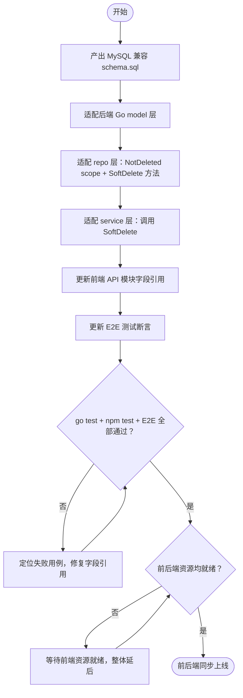

# Schema 对齐嘉立创数据库开发规范（MySQL 兼容）— PRD Spec

> PRD Spec: defines WHAT the feature is and why it exists.

## 需求背景

### 为什么做（原因）

项目当前使用 SQLite 作为开发数据库，`backend/migrations/schema.sql` 基于 SQLite 语法编写。随着项目准备迁移至 MySQL 生产环境，当前 schema 存在以下硬性阻塞：

1. SQLite 专属语法（`AUTOINCREMENT`、`REAL`、`BOOLEAN`）在 MySQL 8.0 上直接报错（`ERROR 1064`），无法执行
2. 字段命名不符合公司强制规范 JLCZD-03-016：软删用 `deleted_at`（应为 `deleted_flag + deleted_time`），更新时间用 `updated_at`（应为 `db_update_time`），缺少业务唯一键 `biz_key`
3. 7 个 TEXT 字段无长度约束，在 MySQL 中导致行存储膨胀
4. `status` 字段名与 MySQL 8.0 关键字冲突，存在语法风险
5. `completion REAL` 浮点精度不足，应使用 `DECIMAL`

每推迟一个迭代，新增的表和字段都会在迁移时产生额外的命名转换工作量。

### 要做什么（对象）

重新设计 `backend/migrations/schema.sql`，使其完整对齐 JLC 数据库开发规范，可在 MySQL 8.0 直接执行；同步适配后端 Go 代码（model / repo / service 层）和前端字段引用，作为 MySQL 生产部署的基准。

### 用户是谁（人员）

- **后端开发工程师**：负责执行 schema 变更、适配 Go 代码
- **前端开发工程师**：负责更新 API 字段引用（breaking change 同步部署）
- **DBA / 运维**：负责在 MySQL 环境执行 schema，验证可用性

## 需求目标

| 目标 | 量化指标 | 说明 |
|------|----------|------|
| schema 可在 MySQL 8.0 执行 | 0 个语法错误 | 当前直接执行报 ERROR 1064 |
| 字段命名 100% 符合 JLC 规范 | 0 个不合规字段 | 覆盖 6 张业务表的通用字段 |
| 消除 TEXT 字段 | 0 个 TEXT 字段 | 7 个 TEXT 字段全部替换为 VARCHAR |
| 后端测试全部通过 | `go test ./...` 0 失败 | 字段重命名后 model/repo/service 适配 |
| 前端测试全部通过 | `npm test` 0 失败 | JSON key 变更后前端同步更新 |

## Scope

### In Scope

- [ ] `schema.sql` MySQL 化：表级字符集声明、主键类型、BOOLEAN/REAL 类型修正
- [ ] 通用字段重命名：`created_at` → `create_time`，`updated_at` → `db_update_time`，`deleted_at` → `deleted_flag + deleted_time`，新增 `biz_key`
- [ ] `status` 关键字重命名：`user_status`、`item_status`、`pool_status`
- [ ] 7 个 TEXT 字段替换为 VARCHAR（含超限策略）
- [ ] 软删唯一键调整（3 张表）
- [ ] 后端 Go model / repo / service 层适配（约 15~20 个文件）
- [ ] GORM 软删机制替换：`NotDeleted()` scope + repo 封闭 `SoftDelete()` 方法
- [ ] 前端 API 模块及组件字段引用更新（breaking change 同步部署）
- [ ] E2E 测试中涉及上述字段的断言更新

### Out of Scope

- 数据迁移脚本（SQLite → MySQL 数据导出，独立任务）
- API 合同文档（OpenAPI/Swagger）更新（当前项目无正式 API 文档）
- MySQL 服务器部署与配置
- 回滚方案（schema 变更失败的恢复脚本，独立运维任务，不在本次开发范围）
- CI/CD 流水线适配（当前项目无 CI/CD，数据库切换不涉及流水线变更）
- 监控查询适配（当前无监控系统，`deleted_flag` 替换后无现有告警查询需要更新）
- 性能基准测试（当前数据量不足以产生有意义的基准，延后至生产数据导入后执行）

## 流程说明

### 业务流程说明

本次变更是一次协调性技术迁移，涉及 schema、后端、前端三层同步变更。核心约束：**前端与后端必须在同一次发布中同时上线**，不存在向后兼容窗口。

主要流程：
1. 产出 MySQL 兼容的新 `schema.sql`
2. 适配后端 Go 代码（model → repo → service 层依次修改）
3. 同步更新前端 API 模块和组件字段引用
4. 更新 E2E 测试断言
5. 联调验证：`go test ./...` + `npm test` + E2E 全部通过
6. 协调部署：前后端同一发布上线

### 业务流程图



### 数据流说明

| 数据流编号 | 源 | 目标 | 数据内容 | 说明 |
|-----------|-----|------|----------|------|
| DF001 | 后端 API | 前端组件 | JSON 响应体字段名变更 | breaking change，需同步部署 |

## 功能描述

### 5.1 Schema 变更（核心）

**变更类型**：DDL 重写，无 UI 表面

**全局变更**：

| 变更项 | 当前 | 变更后 |
|--------|------|--------|
| 表级声明 | 无字符集 | `ENGINE=InnoDB DEFAULT CHARSET=utf8mb4 COLLATE=utf8mb4_unicode_ci COMMENT='...'` |
| 主键类型 | `INTEGER PRIMARY KEY AUTOINCREMENT` | `BIGINT UNSIGNED NOT NULL AUTO_INCREMENT` |
| 软删字段 | `deleted_at DATETIME` | `deleted_flag TINYINT(1) NOT NULL DEFAULT 0` + `deleted_time DATETIME NOT NULL DEFAULT '1970-01-01 08:00:00'` |
| 创建时间 | `created_at DATETIME` | `create_time DATETIME NOT NULL DEFAULT CURRENT_TIMESTAMP` |
| 更新时间 | `updated_at DATETIME` | `db_update_time DATETIME NOT NULL DEFAULT CURRENT_TIMESTAMP ON UPDATE CURRENT_TIMESTAMP` |
| 业务键 | 无 | `biz_key BIGINT NOT NULL`（service 层 Create 时由雪花算法赋值；JSON tag `-` 不对外暴露，不出现在响应体；每张业务表新增 `UNIQUE KEY uk_biz_key(biz_key)`） |
| 布尔类型 | `BOOLEAN` | `TINYINT(1) NOT NULL DEFAULT 0` |
| 完成度类型 | `completion REAL` | `completion DECIMAL(5,2) NOT NULL DEFAULT 0.00` |

**字段重命名**：

| 表 | 当前字段 | 新字段名 |
|----|---------|---------|
| `users` | `status` | `user_status` |
| `main_items` | `status` | `item_status` |
| `sub_items` | `status` | `item_status` |
| `item_pools` | `status` | `pool_status` |

**状态字段枚举值**（应用层校验，不使用 MySQL ENUM 类型，符合 JLC 规范）：

| 字段 | 允许值 | 含义 |
|------|--------|------|
| `user_status` | `enabled` | 用户正常可用 |
| `user_status` | `disabled` | 用户已禁用，禁止登录 |
| `item_status` | `待开始` | 任务已创建，尚未开始 |
| `item_status` | `进行中` | 任务执行中 |
| `item_status` | `已完成` | 任务已完成 |
| `item_status` | `已暂停` | 任务暂停，待恢复 |
| `item_status` | `已取消` | 任务取消，不再执行 |
| `pool_status` | `待分配` | 需求池条目尚未分配给任何 PM |
| `pool_status` | `已分配` | 已分配给 PM，进入执行流程 |
| `pool_status` | `已拒绝` | PM 拒绝接收，退回需求池 |

枚举校验在 service 层入参校验时执行；数据库列类型为 `VARCHAR(20) NOT NULL`，不使用 MySQL ENUM。

**TEXT → VARCHAR**：

| 表 | 字段 | 新类型 |
|----|------|--------|
| `main_items` | `description` | `VARCHAR(2000)` |
| `sub_items` | `description` | `VARCHAR(2000)` |
| `item_pools` | `background` | `VARCHAR(2000)` |
| `item_pools` | `expected_output` | `VARCHAR(1000)` |
| `progress_records` | `achievement` | `VARCHAR(1000)` |
| `progress_records` | `blocker` | `VARCHAR(1000)` |
| `progress_records` | `lesson` | `VARCHAR(1000)` |

超限策略：若测试环境导入真实数据后任一字段超出上限，将该字段升级为 TEXT 并移入独立 detail 表。

### 5.2 后端 Go 代码适配

**model 层**：

| 变更 | 说明 |
|------|------|
| `model/base.go` 移除 `gorm.Model` 嵌入 | 改为手动声明 `CreateTime`、`DbUpdateTime`、`DeletedFlag`、`DeletedTime`、`BizKey` |
| `BizKey` JSON tag | `json:"-"`，不对外暴露，不出现在任何响应体中 |
| 各 model 文件 `Status` 字段重命名 | 对应 `UserStatus`、`ItemStatus`、`PoolStatus` |
| `Completion` 类型 | 保持 `float64`，JSON tag 不变 |

**repo 层**：

| 变更 | 说明 |
|------|------|
| 新增 `NotDeleted()` scope | 替代 GORM 内置 `deleted_at IS NULL` 过滤 |
| 所有查询加 `NotDeleted()` | `Find`/`First`/`Count` 全部覆盖 |
| 每个 repo 接口封闭 `SoftDelete(ctx, id)` | 内部执行 `UPDATE ... SET deleted_flag=1, deleted_time=NOW()` |
| 禁止 `db.Delete()` 在 repo 外部调用 | 从接口层面杜绝硬删除 |

**service 层**：`Delete` 方法统一调用 repo 的 `SoftDelete(ctx, id)`。

### 5.3 前端字段引用更新

**Observable Impact（API breaking change）**：

| 当前 JSON key | 变更后 JSON key | 涉及接口 |
|--------------|----------------|---------|
| `status` (users) | `userStatus` | `/api/v1/users/*` |
| `status` (main_items/sub_items) | `itemStatus` | `/api/v1/teams/:id/main-items/*`、`sub-items/*` |
| `status` (item_pools) | `poolStatus` | `/api/v1/teams/:id/item-pools/*` |
| `createdAt` | `createTime` | 所有资源接口 |
| `updatedAt` | `dbUpdateTime` | 所有资源接口 |
| `deletedAt` | 字段消失（不对外暴露） | 所有资源接口 |

前端需更新：API 模块（`frontend/src/api/`）、消费上述字段的组件、E2E 测试断言。

### 5.4 关联性需求改动

| 序号 | 涉及项目 | 功能模块 | 关联改动点 | 更改后逻辑说明 |
|------|----------|----------|------------|----------------|
| 1 | 前端 | 所有资源列表/详情页 | `status` → `userStatus`/`itemStatus`/`poolStatus` | 字段名同步更新，显示逻辑不变 |
| 2 | 前端 | 所有资源接口模块 | `createdAt`/`updatedAt` → `createTime`/`dbUpdateTime` | 时间显示逻辑不变，仅字段名变更 |
| 3 | E2E 测试 | 所有涉及上述字段的断言 | 字段名同步更新 | 测试逻辑不变 |

## 其他说明

### 性能需求

- schema 变更本身无运行时性能影响
- `NotDeleted()` scope 等价于原 GORM 软删过滤，无额外开销
- `DECIMAL(5,2)` 替代 `REAL`，精度提升，计算开销可忽略

### 数据需求

- 数据迁移：不在本次范围，独立任务处理
- 脏数据检测（迁移前执行）：
  ```sql
  SELECT username, COUNT(*) FROM users WHERE deleted_flag = 0 GROUP BY username HAVING COUNT(*) > 1;
  SELECT code, COUNT(*) FROM teams WHERE deleted_flag = 0 GROUP BY code HAVING COUNT(*) > 1;
  SELECT team_id, code, COUNT(*) FROM main_items WHERE deleted_flag = 0 GROUP BY team_id, code HAVING COUNT(*) > 1;
  ```

### 安全性需求

- `status` 关键字重命名消除 SQL 注入风险
- repo 层封闭 `SoftDelete()` 方法，禁止硬删除，防止数据误删

---

## 质量检查

- [x] 需求标题是否概括准确
- [x] 需求背景是否包含原因、对象、人员三要素
- [x] 需求目标是否量化
- [x] 流程说明是否完整
- [x] 业务流程图是否包含（Mermaid 格式）
- [x] 关联性需求是否全面分析
- [x] 非功能性需求（性能/数据/安全）是否考虑
- [x] 所有表格是否填写完整
- [x] 是否可执行、可验收
