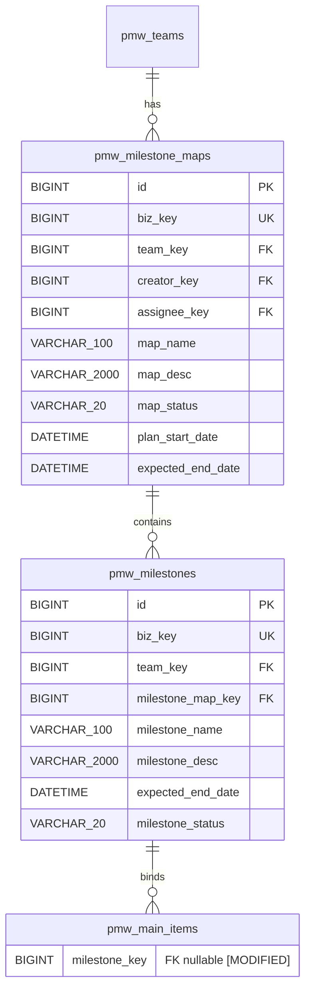

# ER Diagram: 里程碑图

## Entity Relationships

## Entity Details

### pmw_milestone_maps [NEW]

| Column | Type | Constraints | Description |
|--------|------|-------------|-------------|
| id | BIGINT UNSIGNED | PK, AUTO_INCREMENT | 自增主键 |
| biz_key | BIGINT | NOT NULL, UNIQUE | 业务唯一键（snowflake） |
| create_time | DATETIME | NOT NULL, DEFAULT CURRENT_TIMESTAMP | 创建时间 |
| db_update_time | DATETIME | NOT NULL, DEFAULT CURRENT_TIMESTAMP ON UPDATE | 数据库更新时间 |
| deleted_flag | TINYINT(1) | NOT NULL, DEFAULT 0 | 软删标志：0=正常，1=已删除 |
| deleted_time | DATETIME | NOT NULL, DEFAULT '1970-01-01 08:00:00' | 软删时间 |
| team_key | BIGINT | NOT NULL | 所属团队 biz_key |
| creator_key | BIGINT | NOT NULL | 创建者 biz_key |
| assignee_key | BIGINT | NOT NULL | 负责人 biz_key |
| map_name | VARCHAR(100) | NOT NULL | 里程碑图名称 |
| map_desc | VARCHAR(2000) | NOT NULL, DEFAULT '' | 里程碑图描述 |
| map_status | VARCHAR(20) | NOT NULL, DEFAULT 'planning' | 状态：planning/reviewed/ready/executing/completed |
| plan_start_date | DATETIME | | 计划开始时间 |
| expected_end_date | DATETIME | | 计划完成时间 |

### pmw_milestones [NEW]

| Column | Type | Constraints | Description |
|--------|------|-------------|-------------|
| id | BIGINT UNSIGNED | PK, AUTO_INCREMENT | 自增主键 |
| biz_key | BIGINT | NOT NULL, UNIQUE | 业务唯一键（snowflake） |
| create_time | DATETIME | NOT NULL, DEFAULT CURRENT_TIMESTAMP | 创建时间 |
| db_update_time | DATETIME | NOT NULL, DEFAULT CURRENT_TIMESTAMP ON UPDATE | 数据库更新时间 |
| deleted_flag | TINYINT(1) | NOT NULL, DEFAULT 0 | 软删标志：0=正常，1=已删除 |
| deleted_time | DATETIME | NOT NULL, DEFAULT '1970-01-01 08:00:00' | 软删时间 |
| team_key | BIGINT | NOT NULL | 所属团队 biz_key（冗余，继承自 milestone_map） |
| milestone_map_key | BIGINT | NOT NULL | 所属里程碑图 biz_key |
| milestone_name | VARCHAR(100) | NOT NULL | 里程碑名称 |
| milestone_desc | VARCHAR(2000) | NOT NULL, DEFAULT '' | 里程碑描述 |
| expected_end_date | DATETIME | | 计划完成时间 |
| milestone_status | VARCHAR(20) | NOT NULL, DEFAULT 'not_started' | 状态：not_started/in_progress/completed/cancelled |

### pmw_main_items [MODIFIED]

| Column | Type | Constraints | Description |
|--------|------|-------------|-------------|
| milestone_key | BIGINT | DEFAULT NULL | 所属里程碑 biz_key，NULL 表示未分配 |

## Index Design

### pmw_milestone_maps

| Index Name | Columns | Type | Description |
|------------|---------|------|-------------|
| uk_biz_key | biz_key | UNIQUE | 业务键唯一查找 |
| uk_milestone_maps_team_name_deleted | team_key, map_name, deleted_flag, deleted_time | UNIQUE | 团队内名称唯一（支持重复软删） |
| idx_milestone_maps_team_status | team_key, map_status | B-tree | 按团队+状态筛选 |

### pmw_milestones

| Index Name | Columns | Type | Description |
|------------|---------|------|-------------|
| uk_biz_key | biz_key | UNIQUE | 业务键唯一查找 |
| uk_milestones_map_name_deleted | milestone_map_key, milestone_name, deleted_flag, deleted_time | UNIQUE | 图内名称唯一（支持重复软删） |
| idx_milestones_team_status | team_key, milestone_status | B-tree | 按团队+状态筛选 |

### pmw_main_items (additions)

| Index Name | Columns | Type | Description |
|------------|---------|------|-------------|
| idx_main_items_milestone_key | milestone_key | B-tree | 按里程碑查找关联事项 |

## Relationships

| From | To | Cardinality | Business Meaning |
|------|----|-------------|------------------|
| pmw_teams | pmw_milestone_maps | one-to-many | 团队拥有多个里程碑图 |
| pmw_milestone_maps | pmw_milestones | one-to-many | 里程碑图包含多个里程碑 |
| pmw_milestones | pmw_main_items | one-to-many | 里程碑绑定多个主事项（通过 milestone_key） |

## Change Impact Analysis

| Changed Table | Change Type | Affected Columns | Data Migration Needed | Backward Compatible |
|---------------|-------------|------------------|-----------------------|---------------------|
| pmw_main_items | ADD COLUMN | milestone_key (BIGINT, nullable) | No — default NULL | Yes |
