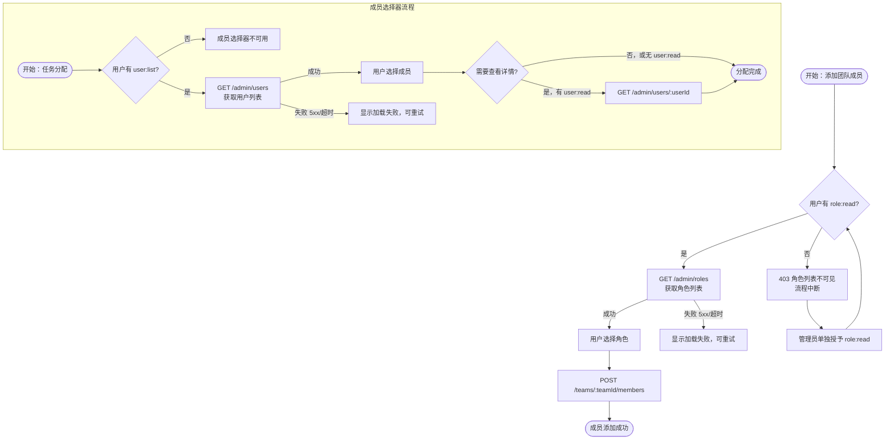
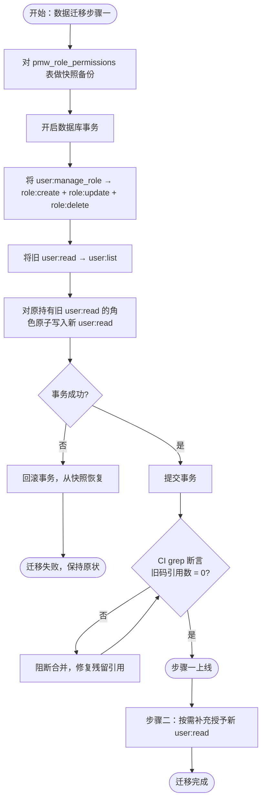

# 细化 user / role 权限粒度 — PRD Spec

> PRD Spec: defines WHAT the feature is and why it exists.

## 需求背景

### 为什么做（原因）

当前 RBAC 权限码在 `user` 和角色管理两个维度上粒度过粗，导致两类实际问题：

1. **`user:manage_role` 捆绑了"查看角色列表"和"管理角色定义"两种操作。** 在团队管理页面添加成员时，需要查询角色列表（下拉选择），但该操作不应要求用户拥有创建/编辑/删除角色的权限。目前无法给 `member` 角色授予"只读角色列表"的权限，实际绕过方式是将 `user:manage_role` 临时授予 `member`，这同时开放了角色定义的增删改权限——远超实际需要。

2. **`user:read` 捆绑了"列出用户"和"查看用户详情"两种操作。** 持有自定义 `project_manager` 角色的用户需要在任务分配时使用成员选择器（调用 `GET /admin/users`），但该角色不应能访问用户详情接口（`GET /admin/users/:userId` 返回邮箱、手机号等敏感字段）。目前无法区分这两种访问：授予 `user:read` 则同时开放了用户详情接口；不授予则成员选择器不可用。实际绕过方式是授予 `user:read` 并在前端隐藏用户管理页入口，但后端接口仍可直接访问，权限控制形同虚设。

### 要做什么（对象）

将 `user` 资源的权限码拆分为更细粒度的 4 个码，并将角色管理操作从 `user` 资源中独立出来，新增 `role` 资源（4 个码）。同步更新路由中间件绑定、预置角色权限、数据迁移脚本和前端权限判断逻辑。

### 用户是谁（人员）

| 用户角色 | 说明 |
|---------|------|
| superadmin | 系统超级管理员，绕过所有权限检查，不受本次变更影响 |
| pm | 项目经理，需要完整的用户查询和角色管理能力 |
| member | 团队成员，需要在团队管理页查询角色列表，但不应有用户管理或角色管理权限 |
| 自定义角色用户 | 如 `project_manager`，需要成员选择器（列出用户），但不应访问用户详情 |
| 系统管理员（运维） | 执行数据迁移，确保存量角色权限码正确转换 |

## 需求目标

| 目标 | 量化指标 | 说明 |
|------|----------|------|
| 消除过度授权 | 0 个角色因功能需要而被迫持有超出实际需要的权限码 | 当前 member 角色需持有 user:manage_role 才能查角色列表 |
| 后端接口权限精确覆盖 | 14 条受影响路由全部绑定新权限码，0 条残留旧码 | 见路由映射表 §5.2 |
| 前端权限守卫准确率 | 前端所有权限判断点 100% 使用新权限码，0 处残留旧码引用 | CI grep 断言验证 |
| 测试覆盖 | 新增至少 4 个针对 role:* 权限码的路由中间件测试 | 覆盖 read/create/update/delete，验证 403 |

## Scope

### In Scope

- [x] `permissions/codes.go` 权限码注册表：更新 `user` 资源（4 个码），新增 `role` 资源（4 个码）
- [x] `migration/rbac.go` 预置角色权限码同步：pm 角色新增 user:list/user:read/user:assign_role/role:*，member 角色不变
- [x] 路由中间件权限码绑定更新：10 条受影响路由重新绑定（见功能描述）
- [x] 数据迁移脚本：存量角色中 `user:manage_role` → `role:create+update+delete`，`user:read` → `user:list`（两步上线）
- [x] 前端权限判断逻辑更新：团队管理页（`AddMemberDialog` 角色下拉选择器）、用户管理页导航入口、角色管理页（创建/编辑/删除按钮）的权限码替换为新码；详见 [prd-ui-functions.md](./prd-ui-functions.md)
- [x] CI grep 断言：在现有 CI 流水线中新增断言步骤，确认 `user:manage_role` 和旧语义 `user:read` 引用数为零
- [x] 内部文档更新：`docs/features/permission-granularity/`、`docs/ARCHITECTURE.md`、`docs/DECISIONS.md` 中所有列出权限码的文档同步替换为新权限码

### Out of Scope

- 用户管理页面 UI 改版
- 角色管理页面 UI 改版
- 新增权限管理相关的 API 接口（现有 6 个接口已覆盖全部 role:* 操作）
- 审计日志
- 权限缓存层（本次变更维持现有行为：每次请求从 DB 实时加载权限码，不引入缓存）
- 权限变更通知（存量用户权限码被迁移脚本修改后，系统不向受影响用户发送任何通知）

## 流程说明

### 业务流程说明

本次变更涉及三条主要业务流程：

**流程 A：团队管理页添加成员（member 角色）**
1. 用户进入团队管理页，点击"添加成员"
2. 系统调用 `GET /admin/roles` 获取角色列表，填充角色下拉选择器
3. 用户选择角色后提交，系统调用 `POST /teams/:teamId/members`
4. 变更前：步骤 2 需要 `user:manage_role`，member 角色无此权限，角色列表不可见，流程中断
5. 变更后：步骤 2 需要 `role:read`，可单独授予 member 角色，流程正常

**流程 B：自定义角色用户使用成员选择器**
1. 用户在任务分配时打开成员选择器
2. 系统调用 `GET /admin/users` 获取用户列表
3. 变更前：需要 `user:read`，同时开放了 `GET /admin/users/:userId` 用户详情接口
4. 变更后：`GET /admin/users` 需要 `user:list`，`GET /admin/users/:userId` 需要 `user:read`，两者独立控制

**流程 C：数据迁移（两步上线）**
1. 步骤一：将所有存量 `user:read` 授权转换为 `user:list`；同时对原持有 `user:read` 的角色原子性写入新 `user:read`（避免用户详情页访问空窗）；将 `user:manage_role` 转换为 `role:create+update+delete`
2. CI grep 断言：确认零残留旧语义引用后，步骤一上线
3. 步骤二：按需为需要访问用户详情的角色授予新 `user:read`（已在步骤一原子授予，此步骤为补充授权）

### 业务流程图

### 数据流说明

| 数据流编号 | 源系统 | 目标系统 | 数据内容 | 传输方式 | 频率 | 格式 |
|-----------|--------|----------|----------|----------|------|------|
| DF001 | 前端权限守卫 | 后端路由中间件 | 用户权限码列表 | JWT + DB 实时查询 | 每次请求 | JSON |
| DF002 | 数据迁移脚本 | pmw_role_permissions 表 | 权限码替换映射 | 数据库事务 | 一次性 | SQL |

## 功能描述

### 5.1 权限码注册表变更

**user 资源（拆分 + 重命名）：**

| 旧权限码 | 新权限码 | 说明 |
|---------|---------|------|
| `user:read` | `user:list` | 列出用户（成员选择器、用户列表页） |
| — | `user:read` | 查看用户详情（含敏感字段，用户管理页） |
| `user:update` | `user:update` | 编辑用户信息（不变） |
| `user:manage_role` | `user:assign_role` | 给用户分配角色 |

> **`user:read` 是硬重命名，不是复用。** 旧 `user:read`（列出用户）和新 `user:read`（查看用户详情）是不同语义，必须采用两步上线，不得直接替换。

**新增 role 资源：**

| 权限码 | 说明 |
|-------|------|
| `role:read` | 查看角色列表和详情（独立权限，不代表可访问用户管理页） |
| `role:create` | 创建新角色 |
| `role:update` | 编辑角色名称、描述、权限码 |
| `role:delete` | 删除自定义角色 |

### 5.2 路由中间件权限码绑定

| 路由 | 旧权限码 | 新权限码 | 备注 |
|------|---------|---------|------|
| `GET /admin/users` | `user:read` | `user:list` | |
| `GET /admin/users/:userId` | `user:read` | `user:read`（新语义） | |
| `POST /admin/users` | `user:manage_role` | `user:assign_role` | 此路由在现有实现中用于给用户分配角色（非创建用户），创建用户由独立注册接口处理；权限码语义与路由行为一致 |
| `PUT /admin/users/:userId` | `user:update` | `user:update`（不变） | |
| `PUT /admin/users/:userId/status` | `user:update` | `user:update`（不变） | |
| `PUT /admin/users/:userId/password` | `user:update` | `user:update`（不变） | |
| `DELETE /admin/users/:userId` | `user:update` | `user:update`（不变） | 软删除（status 置为 disabled），属于用户状态变更操作，语义上归属 `user:update`；不使用 `user:delete` 是因为系统不支持物理删除用户 |
| `GET /admin/teams` | `user:read` | `user:list` | |
| `GET /admin/roles` | `user:manage_role` | `role:read` | |
| `GET /admin/roles/:id` | `user:manage_role` | `role:read` | |
| `POST /admin/roles` | `user:manage_role` | `role:create` | |
| `PUT /admin/roles/:id` | `user:manage_role` | `role:update` | |
| `DELETE /admin/roles/:id` | `user:manage_role` | `role:delete` | |
| `GET /admin/permissions` | `user:manage_role` | `role:read` | |

### 5.3 预置角色权限调整

**pm 角色新增权限码：**

| 新增权限码 | 说明 |
|-----------|------|
| `user:list` | 列出用户 |
| `user:read` | 查看用户详情 |
| `user:assign_role` | 给用户分配角色（替换 user:manage_role） |
| `role:read` | 查看角色列表 |
| `role:create` | 创建角色 |
| `role:update` | 编辑角色 |
| `role:delete` | 删除角色 |

**pm 角色移除权限码：** `user:manage_role`（由上述 7 个码替代）

**member 角色：** 默认不含 user/role 权限。管理员可按需单独授予 `role:read`。

### 5.4 数据迁移（两步上线）

**步骤一（迁移脚本，事务执行）：**

| 操作 | 说明 |
|------|------|
| `user:manage_role` → `role:create` + `role:update` + `role:delete` | 原语义包含增删改，全部转换 |
| `user:read` → `user:list` | 旧语义为列出用户，转换为新码 |
| 对原持有 `user:read` 的角色同步写入新 `user:read` | 原子授予，避免用户详情页访问空窗 |

**步骤二（CI 验证通过后）：**
- CI grep 断言确认零残留旧语义引用
- 按需为需要访问用户详情的角色补充授予新 `user:read`

**迁移前置操作：**
- 对 `pmw_role_permissions` 表做快照备份
- 提供回滚脚本（从快照恢复原始权限码行）

### 5.5 关联性需求改动

| 序号 | 涉及项目 | 功能模块 | 关联改动点 | 更改后逻辑说明 |
|------|----------|----------|------------|----------------|
| 1 | 前端 | 团队管理页 | 角色下拉选择器权限检查 | 由 `user:manage_role` 改为 `role:read` |
| 2 | 前端 | 用户管理页 | 页面入口权限检查 | 由 `user:read` 改为 `user:list` |
| 3 | 前端 | 角色管理页 | 创建/编辑/删除按钮权限检查 | 由 `user:manage_role` 改为对应 `role:create/update/delete` |
| 4 | 后端 | `VerifyPresetRoleCodes` 测试 | 期望权限码列表 | 同步更新为新权限码 |
| 5 | 文档 | docs/ 权限码说明 | 所有列出权限码的文档 | 同步替换为新权限码 |

## 其他说明

### 性能需求
- 响应时间：权限检查在每次请求时从 DB 实时加载，无缓存层，P99 < 50ms（与现有行为一致）
- 并发量：与现有系统一致，无额外要求
- 兼容性：无新增浏览器/设备要求

### 数据需求
- 数据迁移：`pmw_role_permissions` 表中的权限码替换，在事务中执行，迁移前备份
- 数据初始化：`seedPresetRoles` 同步更新，每次启动时幂等执行

### 安全性需求
- 接口限制：后端路由中间件是安全防线，前端权限隐藏仅为 UX 优化
- 权限码变更不影响 JWT token 结构（当前 JWT 仅含 userID/username，权限从 DB 实时加载）
- CI 中加 grep 断言：`user:manage_role` 和旧语义 `user:read` 引用数为零时才允许合并

---

## 质量检查

- [x] 需求标题是否概括准确
- [x] 需求背景是否包含原因、对象、人员三要素
- [x] 需求目标是否量化
- [x] 流程说明是否完整
- [x] 业务流程图是否包含（Mermaid 格式）
- [x] 列表页描述是否完整
- [x] 按钮描述是否完整
- [x] 关联性需求是否全面分析
- [x] 非功能性需求（性能/数据/监控/安全）是否考虑
- [x] 所有表格是否填写完整
- [x] 是否有歧义或模糊表述
- [x] 是否可执行、可验收
