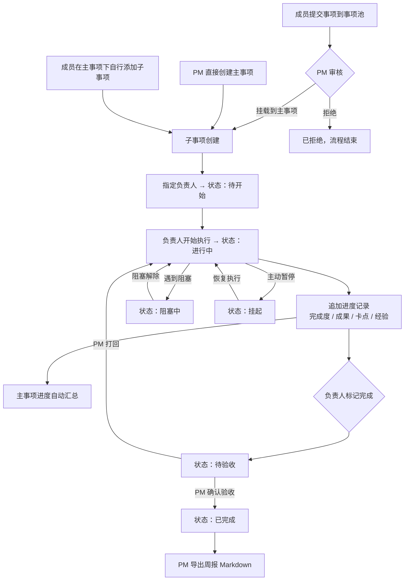
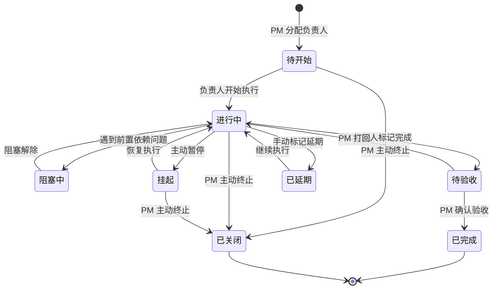
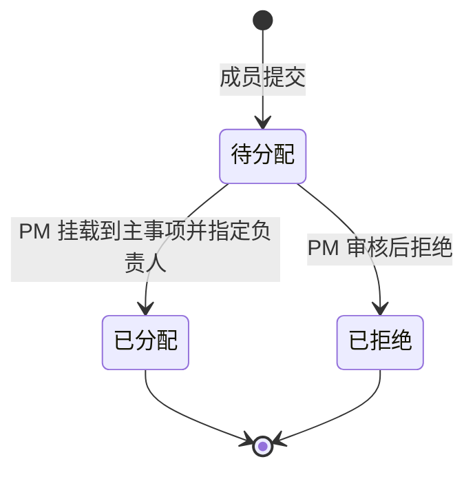
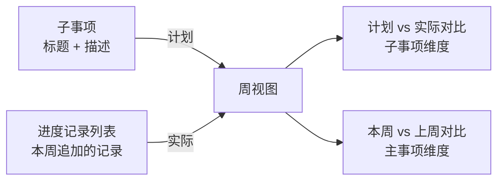

# PM 工作事项追踪系统 — PRD Spec

> PRD Spec: defines WHAT the feature is and why it exists.

## 需求背景

### 为什么做（原因）

项目经理在日常工作中承接上级分配的工作事项，需要将其拆解为子事项分配给团队成员，并按周追踪计划与实际的差异。当前团队使用 Ones Wiki 的 CSV 表格做事项追踪，存在以下痛点：

- 进度信息只有"完成度百分比"，缺乏成果、卡点、经验等丰富上下文
- 计划（子事项）与实际（进度记录）分散在不同文档，对比困难
- 主事项进度需手动汇总，容易遗漏
- 周报需手动整理，耗时且格式不统一
- 无法直观呈现事项时间分布（甘特图）

### 要做什么（对象）

构建一个 Web 端 PM 工作事项追踪系统，以"主事项 → 子事项"为核心数据结构，叠加周视图、甘特图、事项池和周报导出能力，实现从事项登记到报告生成的完整闭环。新系统与 Ones Wiki 独立并行，Ones Wiki 继续用于文档沉淀，新系统专注于事项追踪与进度管理。

### 用户是谁（人员）

| 角色 | 说明 | 核心诉求 |
|------|------|---------|
| 超级管理员 | 系统唯一最高权限角色，全局可见所有团队数据 | 管理团队与用户权限，全局监控 |
| PM（团队负责人） | 创建团队后自动成为该团队 PM | 登记主事项、拆解子事项、查看整体进度、导出周报 |
| 团队成员 | 在所属团队内操作事项，可同时加入多个团队 | 提交事项到事项池、更新子事项进度、填写成果与卡点 |

## 需求目标

| 目标 | 量化指标 | 说明 |
|------|----------|------|
| 减少周报整理时间 | 节省 80% 时间 | 从手动整理 → 系统一键导出 Markdown |
| 进度可见性 | 实时自动汇总 | 主事项完成度无需 PM 手动计算 |
| 计划 vs 实际对比 | 无需跨文档比对 | 周视图直接呈现子事项（计划）与进度记录（实际） |
| 事项闭环率 | 每个事项有责任人、截止时间、结果反馈 | 通过状态流转和事项池审核机制保障 |
| 多团队隔离 | 跨团队数据不可见 | 支持多团队独立运营 |

## Scope

### In Scope

- [x] 用户认证与鉴权（多用户登录，基于角色的权限控制）
- [x] 团队管理（创建、邀请成员、角色管理、PM 身份转让、解散）
- [x] 超级管理员（全局查看所有团队数据，授予/撤销"创建团队"权限）
- [x] 主事项管理（创建、编辑、归档，进度自动汇总，超期高亮）
- [x] 子事项管理（创建、编辑、分配、状态流转 8 种状态）
- [x] 事项池（成员提交 → PM 审核分配，独立状态流转）
- [x] 进度记录（追加式列表：完成度 + 成果 + 卡点 + 经验，保留完整历史）
- [x] 事项视图（按主事项分组展示，默认视图）
- [x] 周视图（计划 vs 实际对比，本周 vs 上周主事项维度对比）
- [x] 甘特图视图（主事项时间轴，点击展开子事项）
- [x] 表格视图（支持排序、筛选、导出）
- [x] 周报导出（Markdown 格式，< 5 秒响应）

### Out of Scope

- 通知与提醒（后续版本）
- 与钉钉、飞书、微信等外部工具集成
- 与 Ones Wiki 的数据同步
- 文件附件管理
- 组织/部门层级（团队之上的层级结构）
- 跨团队事项共享或引用
- 资源负载、关键路径等高级项目管理功能

## 流程说明

### 业务流程说明

系统以团队为核心隔离单元。事项来源有两条路径：一是成员将需要处理的事项提交到事项池，PM 审核后挂载到主事项；二是 PM 直接创建主事项并拆解子事项。子事项是计划的最小单元，负责人在执行过程中追加进度记录（完成度 + 成果 + 卡点 + 经验），主事项进度由系统自动汇总。PM 可通过周视图对比计划与实际，通过甘特图查看时间分布，并在周末导出周报 Markdown。

### 业务流程图

### 事项状态流转

### 事项池状态流转

### 周视图逻辑

## 功能描述

### 5.1 用户认证与权限

**数据权限**：基于角色的访问控制，团队数据严格隔离，跨团队不可见。

| 功能 | 说明 | 可操作角色 |
|------|------|-----------|
| 登录 / 登出 | 账号密码登录 | 全员 |
| 角色权限控制 | 超级管理员 / PM / 成员三级权限 | 系统自动 |
| 授予创建团队权限 | 超级管理员授予指定用户"创建团队"权限 | 超级管理员 |
| 撤销创建团队权限 | 超级管理员撤销指定用户"创建团队"权限 | 超级管理员 |

### 5.2 团队管理

**数据权限**：超级管理员可查看和操作所有团队；PM 管理本团队；成员只能查看所属团队。

| 功能 | 说明 | 可操作角色 |
|------|------|-----------|
| 创建团队 | 填写团队名称和描述，创建者自动成为 PM | 有"创建团队"权限的用户 |
| 邀请成员 | 通过账号搜索并邀请，指定角色 | PM |
| 移除成员 | 将成员移出团队 | PM |
| 转让 PM | 将 PM 身份移交给团队内其他成员，原 PM 降为普通成员 | PM |
| 解散团队 | 解散团队，数据归档 | PM / 超级管理员 |
| 全局团队列表 | 查看所有团队及各团队事项概览 | 超级管理员 |

**团队规则：**
- 用户可加入多个团队，在不同团队中角色独立
- PM 转让后原 PM 自动降为普通成员

### 5.3 主事项管理

**列表字段：**

| 字段名称 | 类型 | 说明 |
|---------|------|------|
| 编号 | string | 系统自动生成，不超过 10 个字符 |
| 标题 | string | 简要描述 |
| 优先级 | enum | P1 / P2 / P3 |
| 提出人 | string | 谁发起了这个事项 |
| 负责人 | string | 谁来执行 |
| 开始时间 | date | 实际开始执行的时间 |
| 预期完成时间 | date | 计划截止日期 |
| 实际完成时间 | date | 完成后填写 |
| 状态 | enum | 见状态定义 |
| 完成度 | number | 子事项完成度加权平均，自动计算 |

**排序与分页：**
- 默认排序：优先级降序（P1 → P2 → P3），同优先级按创建时间降序
- 分页：每页 20 条，支持翻页

**表单校验规则：**

| 字段 | 校验条件 | 触发节点 | 提示语 |
|------|----------|----------|--------|
| 标题 | 必填，最大 100 字符 | 提交时 | 请填写标题（最多 100 字） |
| 优先级 | 必填 | 提交时 | 请选择优先级 |
| 预期完成时间 | 不早于开始时间 | 失焦/提交 | 预期完成时间不能早于开始时间 |

**功能说明：**

| 功能 | 说明 | 可操作角色 |
|------|------|-----------|
| 创建主事项 | 填写基础字段，编号自动生成 | PM |
| 编辑主事项 | 修改基础字段 | PM |
| 归档主事项 | 已完成或已关闭的主事项归档，不再显示在活跃列表 | PM |
| 进度自动汇总 | 完成度 = 子事项完成度加权平均；聚合所有子事项的成果/卡点 | 系统自动 |
| 超期高亮 | 超过预期完成时间的事项视觉高亮（红色标注），不自动变更状态 | 系统自动 |
| 重点事项标记 | 延期两次以上自动升级为重点事项（P1）；P1 事项 PM 每日跟进，周报必报 | 系统自动 |

### 5.4 子事项管理

**表单字段：**

| 字段名称 | 控件类型 | 必填 | 说明 |
|---------|----------|------|------|
| 标题 | 单行文本 | 是 | 简要描述，即本周计划内容 |
| 描述 | 多行文本 | 否 | 详细说明 |
| 优先级 | 下拉选择 | 是 | P1 / P2 / P3 |
| 负责人 | 成员选择 | 是 | 从团队成员中选择 |
| 开始时间 | 日期选择 | 否 | |
| 预期完成时间 | 日期选择 | 否 | |

**功能说明：**

| 功能 | 说明 | 可操作角色 |
|------|------|-----------|
| 创建子事项 | PM 拆解或成员自行添加 | PM / 成员 |
| 编辑子事项 | 修改标题、描述、预期完成时间等字段 | PM / 负责人 |
| 分配负责人 | 指定或变更子事项负责人 | PM |
| 状态变更 | 按状态流转规则变更状态 | PM / 负责人 |
| 追加进度记录 | 填写完成度（0-100%）、成果、卡点、经验，追加到历史列表 | 负责人 / 成员 |
| PM 修正完成度 | PM 可修改成员填写的完成度数值 | PM |

**进度记录字段：**

| 字段名称 | 类型 | 必填 | 说明 |
|---------|------|------|------|
| 完成度 | number | 是 | 0-100%，本次更新后的整体进度 |
| 成果 | 多行文本 | 否 | 本次完成了什么，产出是什么 |
| 卡点 | 多行文本 | 否 | 遇到的阻碍、风险、依赖问题 |
| 经验 | 多行文本 | 否 | 可复用的方法、教训、改进建议 |
| 创建时间 | datetime | 自动 | 系统自动记录 |
| 创建人 | string | 自动 | 谁提交了本次更新 |

> 进度记录为追加式，历史记录不可删除，保留完整轨迹。

### 5.5 事项池

**列表字段：**

| 字段名称 | 类型 | 说明 |
|---------|------|------|
| 标题 | string | 事项简要描述 |
| 背景 | string | 为什么需要处理这个事项 |
| 预期产出 | string | 期望的结果或交付物 |
| 提交人 | string | 谁提交了这个事项 |
| 提交时间 | datetime | 自动记录 |
| 状态 | enum | 待分配 / 已分配 / 已拒绝 |

**排序与分页：**
- 默认排序：提交时间降序（最新提交在前）
- 分页：每页 20 条，支持翻页
- 筛选：支持按状态筛选（待分配 / 已分配 / 已拒绝）

**功能说明：**

| 功能 | 说明 | 可操作角色 |
|------|------|-----------|
| 提交事项 | 填写标题、背景、预期产出，提交到团队事项池 | 全员 |
| 审核分配 | 选择挂载到某主事项并指定负责人，或拒绝 | PM |
| 查看事项池 | 查看待分配 / 已分配 / 已拒绝的事项列表 | PM / 成员 |

### 5.6 视图

| 视图 | 功能说明 |
|------|---------|
| 事项视图 | 按主事项分组展示所有子事项及汇总进度，默认视图 |
| 周视图 | 按周聚合本周有分配或进度更新的子事项；子事项标题（计划）+ 进度记录（实际）并列；支持本周 vs 上周主事项维度对比 |
| 甘特图视图 | 主事项时间轴，每个主事项占一行；点击展开后子事项平铺在甘特图中各占一行，紧跟在主事项下方 |
| 表格视图 | 事项以表格形式展示，支持按字段排序和筛选，支持导出 |

**周视图规则：**
- 计划 = 子事项标题 + 描述（PM 分配时确定）
- 实际 = 进度记录列表（成员追加，保留完整历史）
- 跨周未完成的子事项在每周均可见其最新状态
- 主事项维度展示本周新完成、本周有进度更新、上周完成但本周无变化的子事项，分组呈现

**表格视图字段：**

| 字段名称 | 类型 | 可排序 | 可筛选 | 说明 |
|---------|------|--------|--------|------|
| 编号 | string | 是 | 否 | |
| 标题 | string | 否 | 否 | |
| 类型 | enum | 否 | 是 | 主事项 / 子事项 |
| 优先级 | enum | 是 | 是 | P1 / P2 / P3 |
| 负责人 | string | 否 | 是 | |
| 状态 | enum | 否 | 是 | 全部状态 |
| 完成度 | number | 是 | 否 | |
| 预期完成时间 | date | 是 | 否 | |
| 实际完成时间 | date | 是 | 否 | |

**表格视图规则：**
- 默认排序：优先级降序，同优先级按预期完成时间升序
- 分页：每页 50 条
- 导出格式：CSV，导出当前筛选结果（不受分页限制）

### 5.7 周报导出

| 功能 | 说明 |
|------|------|
| 选择时间范围 | 选择导出的周（默认当周） |
| 自动聚合内容 | 主事项进度 + 各子事项成果/卡点摘要 |
| 导出 Markdown | 生成 Markdown 文件下载 |

## 其他说明

### 性能需求

- 周报导出响应时间：< 5 秒
- 常规列表页加载时间：< 2 秒
- 并发支持：多人同时操作不冲突，数据实时一致
- 兼容性：支持主流现代浏览器（Chrome、Edge、Safari 最新两个版本），PC 端优先

### 数据需求

- 事项编号系统自动生成，不超过 10 个字符
- 进度记录为追加式，历史记录不可删除
- 超过预期完成时间的事项系统高亮提示，不自动变更状态
- 延期两次以上的事项自动标记为重点事项（P1）

### 安全性需求

- 基于角色的访问控制，团队数据严格隔离，跨团队不可见
- 用户认证后方可访问系统

---

## 质量检查

- [x] 需求标题是否概括准确
- [x] 需求背景是否包含原因、对象、人员三要素
- [x] 需求目标是否量化
- [x] 流程说明是否完整
- [x] 业务流程图是否包含（Mermaid 格式）
- [x] 列表页描述是否完整
- [x] 按钮描述是否完整
- [x] 表单描述是否完整
- [x] 非功能性需求（性能/数据/安全）是否考虑
- [x] 所有表格是否填写完整
