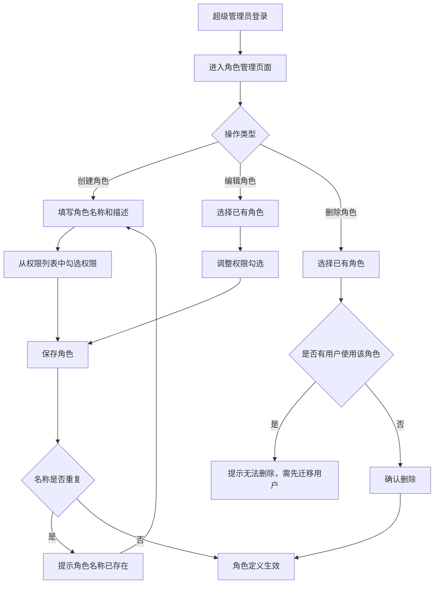
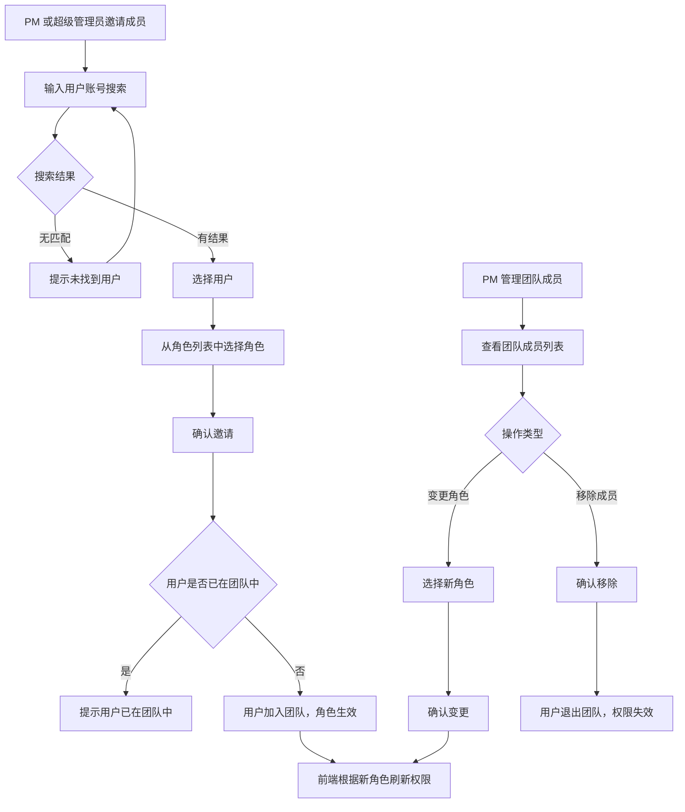
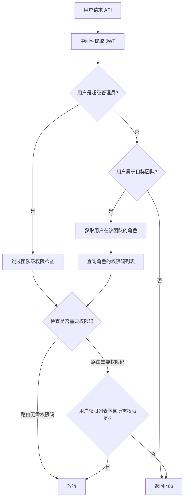

# RBAC 权限体系 — PRD Spec

> PRD Spec: defines WHAT the feature is and why it exists.

## 需求背景

### 为什么做（原因）

当前系统的权限体系存在三个结构性问题：

1. **角色硬编码**：`User` 模型用 `IsSuperAdmin` 和 `CanCreateTeam` 两个布尔标记控制权限，无法扩展。新增任何权限都需要改模型、改中间件、发版。
2. **无权限实体**：操作权限散落在中间件 `RequireRole` / `RequireTeamRole` 和 handler 的 if-else 中，前端对用户能做什么毫无感知，无法按权限渲染 UI。
3. **权限与团队脱节**：PM 身份通过 `team_members.is_pm` 标记，权限检查依赖角色名字符串而非权限能力，无法灵活组合权限。

这导致：管理员无法在线调整权限策略，前端按钮/菜单无法按用户能力动态展示，新增功能时权限代码到处散落。

### 要做什么（对象）

引入标准 RBAC（Role-Based Access Control）权限体系，将权限从硬编码布尔标记迁移到基于权限码的灵活角色系统。权限码由代码定义（resource:action 格式），角色在线可配，角色在邀请用户进入团队时绑定。

### 用户是谁（人员）

| 角色 | 说明 | 核心诉求 |
|------|------|---------|
| 超级管理员 | 系统全局唯一最高权限角色，独立于团队 | 管理角色定义、用户权限，全局监控 |
| PM（团队负责人） | 团队内拥有管理权限的角色 | 管理团队、分配工作、查看团队整体进度 |
| 团队成员 | 团队内拥有基础操作权限的角色 | 提交事项、更新进度、查看团队数据 |

## 需求目标

| 目标 | 量化指标 | 说明 |
|------|----------|------|
| 权限可在线调整 | 角色创建/编辑后 ≤ 1 秒内生效，前端下次请求即可感知 | 新增功能权限只需开发者添加权限码，管理员在线勾选即可，无需改代码 |
| 前端权限感知 | 前端按权限动态显示/隐藏 UI 元素，覆盖率 100% | 登录后获取权限列表，按钮/菜单/操作入口按权限渲染 |
| 数据迁移无损 | 迁移后 100% 用户权限行为与迁移前一致，零手动补录 | 迁移脚本在事务中执行，提供回滚方案 |
| 权限检查统一 | 后端中间件基于权限码而非角色名校验 | 消除散落在各处的 if-else 权限检查 |

## Scope

### In Scope

- [x] 权限模型设计（resource:action 权限码，代码定义，角色-权限绑定存数据库）
- [x] 角色管理（superadmin 创建/编辑/删除角色，为角色分配权限码）
- [x] 团队级角色绑定（邀请用户进入团队时指定角色）
- [x] 超级管理员全局角色（独立于团队，系统级管理能力）
- [x] 权限校验中间件改造（基于权限码而非角色名）
- [x] 前端权限渲染（按钮/菜单按权限显示/隐藏）
- [x] 前端角色管理页面（superadmin 专用）
- [x] JWT claims 精简（仅含 user_id、username、iat，不携带权限信息）
- [x] 数据迁移（从 IsSuperAdmin/CanCreateTeam/is_pm 迁移到 RBAC）
- [x] 预置默认角色（superadmin、pm、member）

### Out of Scope

- 用户自助注册 / 改密码 / 个人信息编辑
- 审计日志（权限变更记录，后续版本）
- 组织/部门层级结构
- 权限继承或角色层级
- 跨团队角色同步
- 自定义权限码（管理员不能创建新权限码，只能从系统定义的权限列表中勾选）

## 流程说明

### 业务流程说明

系统引入两层角色模型：全局超级管理员和团队级角色。

**超级管理员流程**：超级管理员独立于团队，负责系统级管理。可创建/编辑/删除角色定义，为角色分配权限码，查看所有团队数据。

**团队角色流程**：PM 或超级管理员邀请用户进入团队时，从系统定义的角色中选择一个角色赋予该用户。用户在不同团队可拥有不同角色。用户在团队中的可见数据范围由团队成员身份自然界定——只能看到所属团队的数据，权限码控制在团队内能执行的操作。

**权限检查流程**：后端中间件基于权限码（如 `team:create`）而非角色名进行访问控制。前端根据权限列表动态渲染 UI。

### 角色管理流程图

### 团队角色分配流程图

### 权限检查流程图

## 功能描述

### 5.1 角色管理（超级管理员）

**数据来源**：系统数据库中的角色表。

**显示范围**：所有系统定义的角色。

**数据权限**：仅超级管理员可访问。

**页面类型**：列表页 + 表单页

**列表字段**：

| 字段名称 | 类型 | 说明 |
|---------|------|------|
| 角色名称 | string | 角色的显示名称 |
| 描述 | string | 角色的功能描述 |
| 权限数量 | number | 该角色绑定的权限码数量 |
| 使用人数 | number | 使用该角色的团队成员数量 |
| 是否预置 | boolean | 系统预置角色不可删除 |
| 创建时间 | datetime | 角色创建时间 |

**排序方式**：默认按创建时间升序。

**翻页设置**：每页 20 条，支持翻页。

**搜索条件**：

| 序号 | 搜索项 | 控件类型 | 说明 | 默认提示 |
|------|--------|----------|------|----------|
| 1 | 角色名称 | 输入框 | 模糊匹配 | 搜索角色名称 |
| 2 | 是否预置 | 下拉单选 | 全部 / 预置 / 自定义 | 全部 |

**功能说明**：

| 功能 | 说明 | 可操作角色 |
|------|------|-----------|
| 查看角色列表 | 查看所有系统角色及其权限配置 | 超级管理员 |
| 创建角色 | 填写名称、描述，从权限列表勾选权限 | 超级管理员 |
| 编辑角色 | 修改角色名称、描述、权限勾选 | 超级管理员 |
| 删除角色 | 删除自定义角色（预置角色不可删除，有用户的角色不可删除） | 超级管理员 |
| 查看权限列表 | 查看系统所有可用权限码（只读，按资源分组展示） | 超级管理员 |

**表单字段（创建/编辑角色）**：

| 字段名称 | 控件类型 | 必填 | 规则说明 |
|---------|----------|------|----------|
| 角色名称 | 单行文本 | 是 | 2-50 字符，不可与已有角色重名 |
| 描述 | 多行文本 | 否 | 最多 200 字符 |
| 权限勾选 | 复选框组 | 至少 1 个 | 按资源分组展示权限码，可多选 |

**权限码矩阵（系统定义，按资源分组）**：

| 资源 | 操作 | 权限码 | 说明 |
|------|------|--------|------|
| team | create | `team:create` | 创建团队 |
| team | read | `team:read` | 查看团队信息 |
| team | update | `team:update` | 编辑团队信息 |
| team | delete | `team:delete` | 解散团队 |
| team | invite | `team:invite` | 邀请成员加入 |
| team | remove | `team:remove` | 移除团队成员 |
| team | transfer | `team:transfer` | 转让 PM 身份 |
| main_item | create | `main_item:create` | 创建主事项 |
| main_item | read | `main_item:read` | 查看主事项 |
| main_item | update | `main_item:update` | 编辑主事项 |
| main_item | archive | `main_item:archive` | 归档主事项 |
| sub_item | create | `sub_item:create` | 创建子事项 |
| sub_item | read | `sub_item:read` | 查看子事项 |
| sub_item | update | `sub_item:update` | 编辑子事项 |
| sub_item | assign | `sub_item:assign` | 分配子事项负责人 |
| sub_item | change_status | `sub_item:change_status` | 变更子事项状态 |
| progress | create | `progress:create` | 追加进度记录 |
| progress | read | `progress:read` | 查看进度记录 |
| progress | update | `progress:update` | 修改进度记录 |
| item_pool | submit | `item_pool:submit` | 提交事项到事项池 |
| item_pool | review | `item_pool:review` | 审核/分配/拒绝事项池事项 |
| view | weekly | `view:weekly` | 查看周视图 |
| view | gantt | `view:gantt` | 查看甘特图 |
| view | table | `view:table` | 查看表格视图 |
| report | export | `report:export` | 导出周报 |
| user | read | `user:read` | 查看用户信息 |
| user | update | `user:update` | 编辑用户信息 |
| user | manage_role | `user:manage_role` | 管理用户角色 |

### 5.2 团队成员角色管理

**数据来源**：team_members 表（含角色关联）。

**显示范围**：当前团队的成员列表。

**数据权限**：PM 可管理本团队成员角色，超级管理员可管理所有团队。

**功能说明**：

| 功能 | 说明 | 可操作角色 |
|------|------|-----------|
| 邀请成员 | 搜索用户并邀请，指定角色 | PM / 超级管理员 |
| 变更成员角色 | 修改团队成员的角色 | PM / 超级管理员 |
| 移除成员 | 将成员移出团队 | PM / 超级管理员 |
| 查看成员角色 | 查看团队成员及其角色 | 团队内所有成员 |

**邀请成员表单字段**：

| 字段名称 | 控件类型 | 必填 | 规则说明 |
|---------|----------|------|----------|
| 用户账号 | 搜索框 | 是 | 输入关键字搜索用户 |
| 角色 | 下拉选择 | 是 | 从系统定义的角色列表中选择 |

### 5.3 前端权限渲染

| 功能 | 说明 |
|------|------|
| 权限列表获取 | 登录后从后端获取用户在每个团队的权限码列表 |
| 按钮控制 | 根据权限码显示/隐藏操作按钮（如无 `team:invite` 则隐藏邀请按钮） |
| 菜单控制 | 根据权限码显示/隐藏菜单项（如无 `view:gantt` 则隐藏甘特图入口） |
| 页面控制 | 无权限访问的页面显示 403 提示或重定向 |
| 权限变更刷新 | 角色变更后前端自动刷新权限列表 |

### 5.4 预置角色定义

系统预置三个默认角色，superadmin 角色不可编辑不可删除：

| 角色 | 权限码 | 说明 |
|------|--------|------|
| superadmin | 全部权限码 | 系统全局角色，独立于团队，不可在角色管理中编辑 |
| pm | team:create, team:read, team:update, team:invite, team:remove, team:transfer, main_item:\*, sub_item:\*, progress:\*, item_pool:\*, view:\*, report:\*, user:read | 团队管理权限，可管理团队、事项、进度 |
| member | main_item:read, sub_item:create, sub_item:read, sub_item:update, sub_item:change_status, progress:create, progress:read, item_pool:submit, view:weekly, view:table, report:\* | 基础操作权限，可查看事项、提交进度、使用基本视图 |

### 5.5 数据迁移

| 迁移项 | 源 | 目标 | 规则 |
|--------|----|------|------|
| 超级管理员 | users.is_super_admin = true | users 表全局角色字段 = superadmin | 直接映射 |
| 创建团队权限 | users.can_create_team = true | 角色中包含 team:create 权限码 | 映射到 pm 角色或包含 team:create 的角色 |
| 团队 PM | team_members.is_pm = true | team_members 角色字段 = pm | 直接映射 |
| 团队成员 | team_members.is_pm = false | team_members 角色字段 = member | 直接映射 |
| 布尔字段移除 | users.is_super_admin, users.can_create_team | 删除 | 迁移完成后移除 |

### 5.6 JWT Claims 与权限获取

**JWT Claims（仅含最小标识，不携带权限标记）：**

| 字段 | 类型 | 说明 |
|------|------|------|
| user_id | number | 用户 ID |
| username | string | 用户名称 |
| iat | number | Token 签发时间（Unix 时间戳） |

> **安全设计**：JWT 中不包含 `is_superadmin` 或权限列表等敏感字段。JWT 仅用于身份识别和非敏感信息展示，避免信息泄露和权限撤销延迟问题。Token 有效期由后端会话管理，不写入 JWT。

**权限获取方式：**

| 场景 | 方式 | 说明 |
|------|------|------|
| 前端渲染 | `GET /api/me/permissions` | 登录后请求，返回 { is_superadmin, team_roles, team_permissions }，前端缓存用于 UI 渲染 |
| 后端权限检查 | 中间件从数据库/缓存实时查询 | 每次请求验证用户实际权限，不信任前端传参 |

### 5.7 关联性需求改动

| 序号 | 涉及项目 | 功能模块 | 关联改动点 | 更改后逻辑说明 |
|------|----------|----------|------------|----------------|
| 1 | pm-work-tracker | 团队管理 | 邀请成员流程 | 增加角色选择步骤 |
| 2 | pm-work-tracker | 团队管理 | 移除成员流程 | 清除角色绑定 |
| 3 | pm-work-tracker | 认证中间件 | RequireRole / RequireTeamRole | 替换为 RequirePermission(permission_code) |
| 4 | pm-work-tracker | 前端导航 | 菜单/按钮渲染 | 从 `/api/me/permissions` 获取权限码，按权限渲染 |
| 5 | pm-work-tracker | 用户管理 | 超级管理员功能 | 从布尔标记改为全局角色判断 |

## 其他说明

### 性能需求

- 权限检查响应时间：< 10ms（中间件级别，使用缓存）
- 角色管理页面加载：< 2 秒
- 权限 API 响应时间：< 200ms（`/api/me/permissions`）
- 兼容性：支持主流现代浏览器（Chrome、Edge、Safari 最新两个版本）

### 数据需求

- 角色定义持久化到数据库
- 用户-角色绑定持久化到 team_members 表
- 预置角色通过数据库种子数据初始化
- 迁移脚本在事务中执行，提供回滚方案

### 安全性需求

- 后端中间件是权限安全的最终防线，前端隐藏仅为 UX 优化
- 权限码由代码定义，不可通过 API 创建新的权限码
- 角色管理接口仅超级管理员可访问
- JWT 不携带权限标记（无 is_superadmin、无权限列表），仅用于身份识别，防止信息泄露和权限撤销延迟
- 后端权限检查从数据库/缓存实时查询，不依赖 JWT 中的字段
- 权限变更即时生效（不依赖 token 过期周期）

---

## 质量检查

- [x] 需求标题是否概括准确
- [x] 需求背景是否包含原因、对象、人员三要素
- [x] 需求目标是否量化
- [x] 流程说明是否完整
- [x] 业务流程图是否包含（Mermaid 格式）
- [x] 列表页描述是否完整
- [x] 按钮描述是否完整
- [x] 表单描述是否完整
- [x] 关联性需求是否全面分析
- [x] 非功能性需求（性能/数据/安全）是否考虑
- [x] 所有表格是否填写完整
