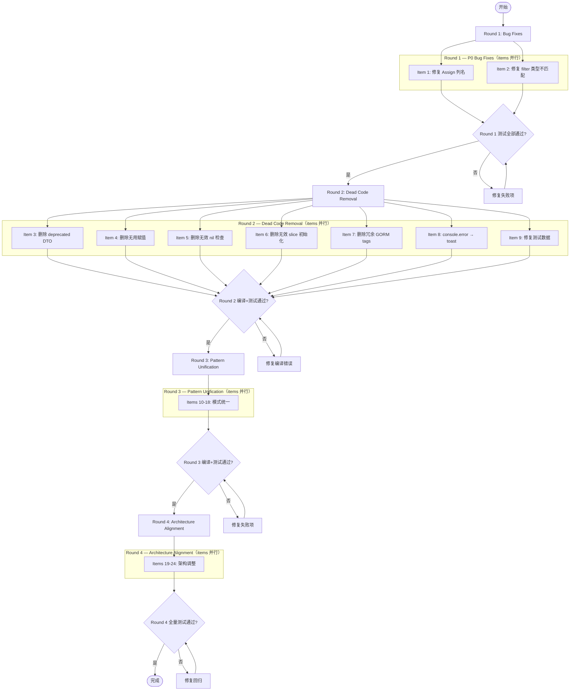

# Schema Alignment Post-Refactoring Cleanup — PRD Spec

> PRD Spec: defines WHAT the cleanup is and why it exists.

## 需求背景

### 为什么做（原因）

`jlc-schema-alignment` 分支（30+ commits）完成了从 numeric ID 到 `bizKey` 的迁移、列名重命名、ID 类型从 `int64` 到 `string` 的转换。迁移完成后功能基本正常，但留下了 2 个静默 bug、约 15 个代码规范问题、约 8 个架构不一致问题。这些遗留问题导致：

- 两个用户可见功能失效（指派子项、按人筛选）
- 开发者每次改代码必须心算哪一层用哪种 ID 类型、哪些 `String()` 包装是必要的
- 新人 onboarding 时遇到两套冲突的模式

### 要做什么（对象）

按 4 轮依赖顺序逐个修复 24 个已识别的问题，每个问题独立提交、独立测试。

### 用户是谁（人员）

- **PM / 业务用户**：受 P0 bug 影响，指派功能和按人筛选功能失效
- **后端开发者**：受 deprecated 代码、重复模式、不一致接口影响
- **前端开发者**：受类型不一致、冗余转换、命名不匹配影响

## 需求目标

| 目标 | 量化指标 | 说明 |
|------|----------|------|
| 修复 P0 bug | 2 个 bug 修复 | 指派子项、按人筛选恢复可用 |
| 消除废弃代码 | 删除 4 个 deprecated DTO、1 个 unused scope、3 处 dead code | 减少认知负担 |
| 统一代码模式 | 合并 2 个重复接口、1 个重复分页、1 个重复 userToDTO、5 个重复状态记录调用点 | 同一功能只有一套实现 |
| 对齐类型系统 | 前端 `teamPermissions` 从 `Record<number,>` 改为 `Record<string,>`，删除 22 处冗余 `String()` 包装 | 类型贯穿一致 |
| 对齐表名规范 | `roles` → `pmw_roles`，`role_permissions` → `pmw_role_permissions` | 所有表统一 `pmw_` 前缀 |
| 对齐 soft-delete | `NotDeleted` scope 在所有软删除仓库中一致使用 | 不再混用 inline 和 scope |

## Scope

### In Scope

- [x] Round 1 — P0 Bug Fixes (items 1-2)
- [x] Round 2 — Dead Code Removal (items 3-9)
- [x] Round 3 — Pattern Unification (items 10-18)
- [x] Round 4 — Architecture Alignment (items 19-24)
- [x] 每个 fix 独立提交
- [x] 每个 fix 完成后运行相关测试

### Out of Scope

- 性能优化（N+1 查询、内存过滤）—— 由 `code-quality-cleanup` 提案覆盖
- 大文件拆分（ItemViewPage、MainItemDetailPage）
- 前端对话框组件合并（item-view/ 和 main-item-detail/ 的重复组件）
- 新功能或行为变更

## 流程说明

### 业务流程说明

工作按 4 轮顺序执行，每轮内的 item 无相互依赖可并行，但轮之间有依赖关系：

1. **Round 1** 修 bug → Round 2 的死代码可能引用 bug 涉及的代码路径
2. **Round 2** 清理死代码 → Round 3 的模式统一在更干净的代码基础上进行
3. **Round 3** 统一模式 → Round 4 的架构调整在模式一致后更容易审查
4. **Round 4** 架构调整 → 最后执行，可批量回退

每个 item 的执行流程：修改代码 → 运行相关测试 → 确认通过 → 提交。

### 业务流程图

## 功能描述

### Round 1: P0 Bug Fixes

| 序号 | 问题 | 修复内容 | 影响范围 | 验证标准 |
|------|------|----------|----------|----------|
| 1 | `SubItem.Assign()` 使用 `assignee_id` 列名 | 改为 `assignee_key` | `sub_item_service.go` | `grep -rn "assignee_id" backend/internal/service/sub_item_service.go` 返回零结果；`go test ./internal/service/ -run TestSubItem` 通过 |
| 2 | `assignee_key` 过滤器将 string bizKey 直接与 int64 列比较 | 在 `filter_helpers.go` 中用 `pkg.ParseID` 转换为 int64 | `filter_helpers.go` | 按人筛选 API 返回正确子集（非全部、非空）；`go test ./internal/handler/ -run TestFilter` 通过 |

### Round 2: Dead Code Removal

| 序号 | 目标 | 文件 | 验证标准 |
|------|------|------|----------|
| 3 | 删除 4 个 deprecated DTO | `item_dto.go` | `grep -rn "Deprecated" backend/internal/dto/item_dto.go` 返回零结果；`go build ./...` 编译通过 |
| 4 | 删除 `_ = team.PmKey` 无用赋值 | `team_service.go` | `grep -n '_ = team.PmKey' backend/internal/service/team_service.go` 返回零结果；`go vet ./internal/service/` 无警告 |
| 5 | 删除 panic-on-nil 后的无效 nil 检查 | `item_pool_handler.go`, `progress_handler.go` | 移除 `if err != nil { return }` 块后 `go build ./...` 编译通过；`go test ./internal/handler/` 通过 |
| 6 | 删除无效 nil-slice 初始化 | `team_service.go` | `grep -n '= \[\]string{}' backend/internal/service/team_service.go` 中目标行不再存在；`go test ./internal/service/ -run TestTeam` 通过 |
| 7 | 删除冗余 `column:` GORM tags | `role_repo.go` | `grep -n 'column:' backend/internal/repository/gorm/role_repo.go` 返回零结果；`go test ./internal/repository/gorm/ -run TestRole` 通过 |
| 8 | 将 `client.ts` 的 console.error 替换为 toast | `client.ts` | `grep -n 'console.error' frontend/src/api/client.ts` 返回零结果；`npx vitest run` 通过 |
| 9 | 修复测试数据中 `Role.id: 1` | `types/index.test.ts` | 测试数据中 Role.id 为 string 类型（如 `"role-1"`）；`npx vitest run types/index.test.ts` 通过 |

### Round 3: Pattern Unification

| 序号 | 目标 | 合并来源 | 验证标准 |
|------|------|----------|----------|
| 10 | 合并 `TransactionDB` / `dbTransactor` 为一个接口 | `team_service.go`, `item_pool_service.go` | `grep -rn "dbTransactor" backend/` 返回零结果；`go build ./...` 和 `go test ./internal/service/` 通过 |
| 11 | 替换手动分页为 `dto.ApplyPaginationDefaults` | `admin_handler.go`, `view_handler.go` | `grep -rn "手动分页\|offset.*page.*pageSize" backend/internal/handler/admin_handler.go backend/internal/handler/view_handler.go` 无手动分页逻辑；`go test ./internal/handler/` 通过 |
| 12 | 提取共享 `resolveBizKey` helper | 7 个 handler 中的重复 resolve/parse 函数 | `grep -rn "resolveBizKey\|resolveBizKey" backend/internal/handler/` 仅在共享 helper 文件中存在；`go test ./internal/handler/` 通过 |
| 13 | `teamToDTO` 返回 typed struct 而非 `gin.H` | `team_handler.go` | `grep -n "gin.H" backend/internal/handler/team_handler.go` 返回零结果；`go test ./internal/handler/ -run TestTeam` 通过 |
| 14 | 提取共享 `userToDTO` 基础转换 | `auth_handler.go`, `admin_service.go` | `userToDTO` 仅在共享文件中定义一次；`go test ./internal/handler/ ./internal/service/` 通过 |
| 15 | 提取状态记录 helper | 5 个重复调用点 | 状态记录调用点使用共享 helper；`go test ./internal/...` 通过 |
| 16 | 删除 22 处冗余 `String()` 包装 | 前端 8 个文件 | `grep -rn '\.String()' frontend/src/` 仅保留真正必要的调用（如 enum 转换）；`npx vitest run` 通过 |
| 17 | `PermissionData.teamPermissions` 改为 `Record<string,>` | `types/index.ts`, `usePermission.ts`, `PermissionGuard.tsx` | `grep -n "Record<number" frontend/src/types/index.ts` 返回零结果；`npx tsc --noEmit` 无类型错误 |
| 18 | 表单字段 `assigneeId` → `assigneeKey` | 前端所有 dialog 组件 | `grep -rn "assigneeId" frontend/src/` 返回零结果；`npx vitest run` 通过 |

### Round 4: Architecture Alignment

| 序号 | 目标 | 影响范围 | 验证标准 |
|------|------|----------|----------|
| 19 | `roles` → `pmw_roles`，`role_permissions` → `pmw_role_permissions` | `role.go`, 两个 schema 文件, test 文件 | `go test ./internal/model/ -run TestRole` 通过；SQLite 和 MySQL schema 文件中均包含 `pmw_roles` 和 `pmw_role_permissions` |
| 20 | `ViewService` 合并为单一构造函数 | `view_service.go` | 构造函数签名统一，无重复初始化逻辑；`go test ./internal/service/ -run TestView` 通过 |
| 21 | 合并 single/batch VO 转换函数 | `item_pool_handler.go`, `progress_handler.go` | 单条和批量转换调用同一函数；`go test ./internal/handler/` 通过 |
| 22 | `NotDeleted` scope 在所有仓库中一致使用 | `team_repo.go`, `role_repo.go`, `scopes.go` | `grep -rn "deleted_flag.*=.*0" backend/internal/repository/` 返回零结果（全部使用 `NotDeleted` scope）；`go test ./internal/repository/gorm/` 通过 |
| 23 | `TableRow.mainItemId` 从 `number \| null` 改为 `string \| null` | `types/index.ts` | `grep -n "mainItemId.*number" frontend/src/types/index.ts` 返回零结果；`npx tsc --noEmit` 无类型错误 |
| 24 | 提取共享 `formatDate` 工具函数 | 3 个 team 页面 | `formatDate` 仅在共享 utils 中定义一次；`npx vitest run` 通过 |

## 关联性需求改动

| 序号 | 涉及项目 | 功能模块 | 关联改动点 | 更改后逻辑说明 |
|------|----------|----------|------------|----------------|
| 1 | 后端 | filter | `filter_helpers.go` 的 `applyItemFilter` | string bizKey 在查询前转换为 int64 |
| 2 | 后端 | soft-delete | `team_repo.go`, `role_repo.go` | inline `deleted_flag = 0` 替换为 `NotDeleted` scope |
| 3 | 后端 | RBAC | `model/role.go` | 表名添加 `pmw_` 前缀 |
| 4 | 前端 | 权限系统 | `PermissionData`, `usePermission`, `PermissionGuard` | team key 从 number 改为 string |
| 5 | 前端 | 表单 | 所有 dialog 的 form state | `assigneeId` 字段名改为 `assigneeKey` |

## 其他说明

### 质量保障

- 每个 item 的验证标准见功能描述表格中的"验证标准"列（grep 验证、编译通过、测试通过）
- Round 4 完成后运行全量测试（`go test ./...` + `npx vitest run`）
- TypeScript 编译器作为前端类型安全的兜底（`npx tsc --noEmit`）

### 风险缓解

| 风险 | 缓解措施 |
|------|----------|
| `PermissionData` 键类型变更破坏运行时查找 | Grep 所有 `teamPermissions[` 和 `hasPermission(` 调用点，逐一更新 |
| `String()` 移除在 `useItemViewPage.ts:118` 改变过滤语义 | 验证 filter dropdown 不会 emit `"null"` 值 |
| 24 commits 的长分支产生 merge conflicts | 频繁 rebase `main`；每个 commit 涉及不同文件，冲突面小 |

---

## 质量检查

- [x] 需求标题是否概括准确
- [x] 需求背景是否包含原因、对象、人员三要素
- [x] 需求目标是否量化
- [x] 流程说明是否完整
- [x] 业务流程图是否包含（Mermaid 格式）
- [x] 功能描述是否完整（4 轮 24 个 item 均有表格）
- [x] 关联性需求是否全面分析
- [x] 非功能性需求（质量保障/风险缓解）是否考虑
- [x] 是否可执行、可验收
