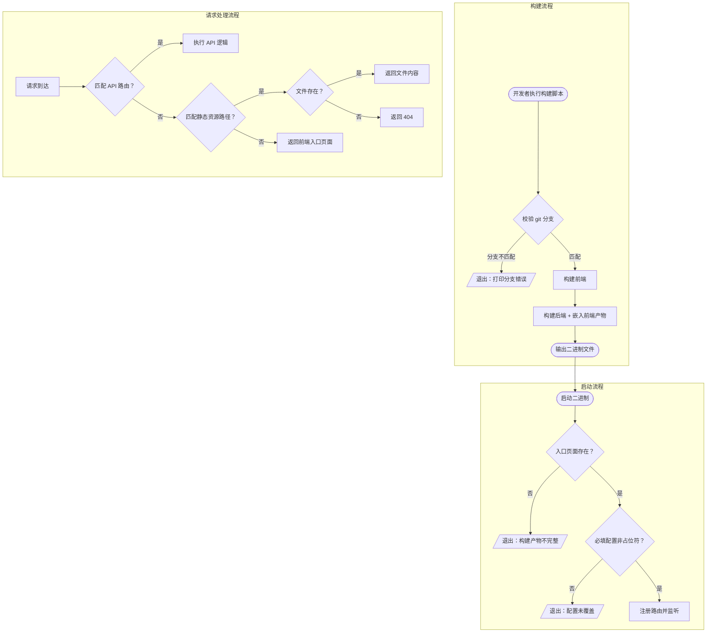

# 前后端单体构建 — PRD Spec

> PRD Spec: defines WHAT the feature is and why it exists.

## 需求背景

### 为什么做（原因）

项目前后端代码分离运行，缺少统一的构建产物：
- 后端和前端分别启动，无法作为一个整体交付
- 没有一键构建脚本，构建流程依赖人工记忆步骤
- 项目进入功能验收阶段，开发者需要一个可快速部署的自测环境

### 要做什么（对象）

提供一个构建流程，将前端构建产物打包进后端二进制，产出一个可独立运行的单体应用。该二进制同时提供 API 接口和前端页面，无需额外安装静态文件服务器。

### 用户是谁（人员）

开发者 — 用于功能开发完成后的自测验证。

## 需求目标

| 目标 | 量化指标 | 说明 |
|------|----------|------|
| 构建一键化 | 一条命令完成构建 | 输入环境参数，输出可运行二进制 |
| 运行零外部依赖 | 仅需操作系统内核 | 无需安装 Web 服务器、运行时环境 |
| 版本强一致性 | 编译时锁定前后端版本 | 不存在前后端版本不匹配的情况 |
| 本地开发不受影响 | 现有开发流程零改动 | 构建能力与本地开发完全解耦 |

## Scope

### In Scope

- 构建脚本：接受环境参数（dev/prod），校验分支，构建前端，构建后端，输出二进制
- 二进制静态文件服务：`/` 返回前端入口页面，`/assets/*` 返回带 hash 的静态资源
- SPA 路由兜底：非 API、非静态资源的路径返回前端入口页面，由前端路由接管
- 缓存头策略：入口页面不缓存，带 hash 的静态资源长期缓存
- 启动校验：检测构建产物完整性（入口页面存在性）和必填配置有效性（非占位符）
- 环境配置文件模板：包含占位符的配置文件提交到 git，敏感字段部署时通过环境变量覆盖
- `.gitignore` 排除本地配置文件
- BASE_PATH 配置：前后端均从配置文件读取，控制所有路由的统一前缀，用于多服务共享域名时的路径区分

### Out of Scope

- CI/CD 流水线
- 本地开发流程改动
- 服务器进程管理
- 多环境部署流程（dev/prod 环境的具体部署步骤）
- 结构化日志框架引入

## 流程说明

### 业务流程说明

**构建流程：** 开发者执行构建脚本 → 脚本校验 git 分支 → 构建前端 → 构建后端（嵌入前端产物）→ 输出二进制。

**运行流程：** 启动二进制 → 校验嵌入的前端产物完整性 → 校验配置有效性 → 注册路由（API → 静态资源 → SPA 兜底）→ 开始监听。

**请求处理流程：** 请求到达 → 匹配 API 路由？→ 是：走 API 逻辑。否 → 匹配静态资源路径？→ 是：查找文件，找到返回，未找到返回 404。否 → 返回前端入口页面（SPA 兜底）。

### 业务流程图

## 功能描述

### 5.1 构建脚本

| 属性 | 说明 |
|------|------|
| 输入参数 | 环境标识（dev / prod） |
| 分支校验 | dev 环境要求 dev 分支，prod 环境要求 main 分支，不匹配则退出并报错 |
| 构建步骤 | 安装前端依赖 → 构建前端 → 构建后端 |
| 输出产物 | 单个二进制文件 |
| 错误处理 | 任何步骤失败则停止，打印错误信息，非零退出码 |

### 5.2 BASE_PATH 与路径设计

**BASE_PATH** 从配置文件读取，前后端共用。本地开发默认为空，生产环境设为具体前缀（如 `/pm`）用于多服务共享域名时的路径区分。

**设计原则：** 去掉 `/api` 前缀，用版本前缀 `/v1` 区分 API 路由与前端路由，避免路径层级重复。

**路径结构：**

| 环境 | BASE_PATH | API 示例 | 前端路由示例 | 静态资源示例 |
|------|-----------|----------|-------------|-------------|
| 本地 | `""` | `/v1/teams/1/main-items` | `/teams/1/items` | `/assets/app.abc.js` |
| 生产 | `"/pm"` | `/pm/v1/teams/1/main-items` | `/pm/teams/1/items` | `/pm/assets/app.abc.js` |

**路由规则（按优先级，BASE_PATH 已省略）：**

| 优先级 | 路径模式 | 行为 | 缓存策略 |
|--------|----------|------|----------|
| 1 | `BASE_PATH/v1/*` | API 逻辑（原 `/api/v1/*` 改为 `{BASE_PATH}/v1/*`） | 沿用现有策略 |
| 2 | `BASE_PATH/assets/*` | 从嵌入产物查找文件，找到则返回，未找到返回 404 JSON | `Cache-Control: max-age=31536000, immutable` |
| 3 | `BASE_PATH/` | 返回前端入口页面 | `Cache-Control: no-cache` |
| 4 | 其他 BASE_PATH 下路径 | SPA 兜底，返回前端入口页面 | `Cache-Control: no-cache` |

**前后端联动：**
- 后端：从配置文件读取 BASE_PATH，作为 Gin RouterGroup 前缀注册所有路由
- 前端构建时：将 BASE_PATH 注入 Vite `base` 配置和前端 Router `basename`
- 前端运行时：API client 自动拼接 BASE_PATH 前缀

**启动校验：**

| 校验项 | 条件 | 失败行为 |
|--------|------|----------|
| 构建产物完整性 | 入口页面存在于嵌入产物中 | 退出码 1，打印错误提示构建命令是否成功 |
| 配置有效性 | 必填字段（DB 密码、JWT secret）非空且非占位符 | 退出码 1，打印哪个字段未配置 |

**错误响应：**

| 场景 | HTTP 状态码 | 响应体 |
|------|------------|--------|
| 静态资源不存在 | 404 | `{"error":"not found"}` |
| 前端路由路径 | 200 | 前端入口页面内容 |
| API 路径不变 | 沿用现有 | 沿用现有 |

### 5.3 关联性需求改动

| 序号 | 涉及模块 | 关联改动点 | 更改后逻辑说明 |
|------|----------|------------|----------------|
| 1 | 路由配置 | 新增静态文件和 SPA 兜底路由 | 在现有 API 路由之后注册，不影响 API 路由匹配 |
| 2 | 配置管理 | 新增环境配置文件模板 | 敏感字段留占位符，部署时环境变量覆盖 |
| 3 | 版本控制 | `.gitignore` 新增本地配置文件 | 防止敏感配置被提交 |

## 其他说明

### 性能需求
- 静态文件响应时间：< 50ms（本地网络）
- 二进制体积增量：1-5 MB（前端产物）
- 构建耗时：约 2 分钟

### 安全性需求
- 敏感配置（DB 密码、JWT secret）不提交到 git，通过环境变量注入
- 配置模板中敏感字段使用占位符标记
- 启动时校验敏感字段未被留为占位符

---
