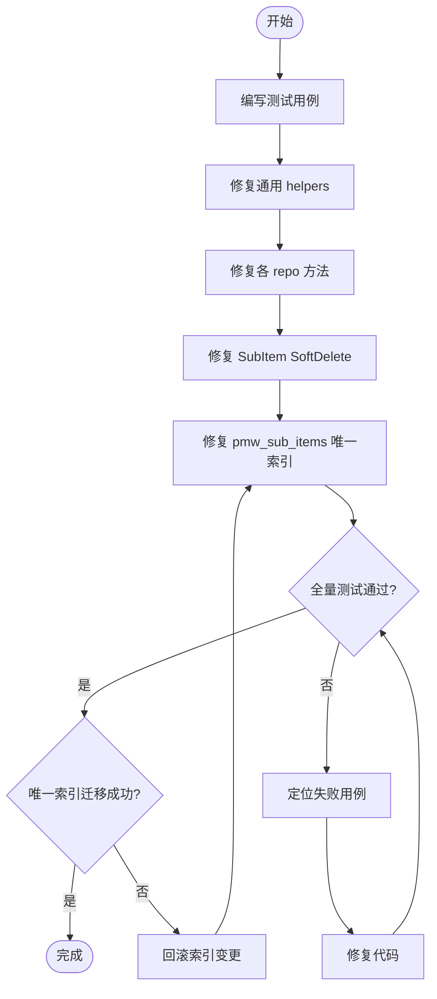

# Soft-Delete Consistency Fix — PRD Spec

> PRD Spec: defines WHAT the fix is and why it exists.

## 需求背景

### 为什么做（原因）

系统实现了软删除机制（`deleted_flag`/`deleted_time`），但大多数数据访问层方法缺少 `NotDeleted` 过滤条件，导致已删除的数据仍出现在 API 响应中。用户报告了以下具体问题：

1. 删除角色后，角色仍出现在列表中；点击时报"角色不存在"
2. 子项软删除实现有误——使用了 GORM 内置 `db.Delete()` 而非手动设置 `deleted_flag`，导致软删除不生效
3. 子项唯一索引 `uk_sub_items_main_code` 未包含软删除字段，阻止删除后重建同名子项

### 要做什么（对象）

为所有使用 `BaseModel`（含 `deleted_flag`）的实体的数据访问方法，统一添加 `NotDeleted` 查询条件。修复子项软删除实现，并调整唯一索引以兼容软删除。

### 用户是谁（人员）

- **系统管理员**：管理角色和团队成员，依赖角色列表和权限分配
- **项目经理（PM）**：管理工作项和子项，使用删除功能清理数据
- **开发人员**：未来为 User/MainItem/ItemPool 添加删除功能时，依赖正确的通用查询基础设施

## 需求目标

| 目标 | 量化指标 | 说明 |
|------|----------|------|
| 消除幽灵数据 | 7 个 repo 文件、~25 个查询方法全部添加 NotDeleted | 已删除数据不再出现在任何 API 响应 |
| 修复子项软删除 | SoftDelete 正确设置 deleted_flag=1 | 子项删除后从列表消失，且可重建同名子项 |
| 防御性覆盖 | FindByID/FindByIDs 泛型 helpers 拆分为 softDeletable/nonSoftDeletable 两套约束，覆盖 9 种模型类型 | 未来新增删除功能时无需修改查询层 |
| 测试覆盖 | 每个受影响方法至少 1 个测试用例验证软删除过滤 | 防止回归 |

## Scope

### In Scope

- [x] 通用 helpers（`FindByID[T]`/`FindByIDs[T]`）添加 NotDeleted
- [x] User repo — 5 个方法
- [x] Team repo — 8 个方法
- [x] MainItem repo — 6 个方法
- [x] SubItem repo — 修复 SoftDelete + 4 个查询方法
- [x] ItemPool repo — 2 个方法
- [x] Role repo — 3 个 join 查询方法
- [x] Schema — `pmw_sub_items` 唯一索引加 `deleted_flag, deleted_time`
- [x] 先写测试用例，再修复代码

### Out of Scope

- GORM model tag 对齐（AutoMigrate 不修改现有索引，P2 级别）
- 为 User/MainItem/ItemPool 新增删除功能（未来需求）
- 前端改动（后端修复后 API 响应自动正确，无需前端配合）
- 已在 v0.3.0 修复的 Role repo List/FindByName/Schema（角色唯一索引已完成）

## 流程说明

### 业务流程说明

本修复不引入新的业务流程。核心流程是：

1. **测试先行**：为每个受影响的 repo 方法编写测试，验证软删除记录被过滤
2. **修复通用层**：拆分泛型约束（softDeletable / nonSoftDeletable），让 `FindByID[T]` 和 `FindByIDs[T]` 自动过滤
3. **修复各 repo**：逐个为 repo 方法添加 `NotDeleted` scope
4. **修复 SubItem SoftDelete**：替换 `db.Delete()` 为手动 `Updates`
5. **修复 Schema**：调整 `pmw_sub_items` 唯一索引
6. **全量回归测试**

### 业务流程图

### 数据流说明

本修复为后端内部改动，不涉及跨系统数据流。核心数据流：API 请求 → Handler → Service → Repo（此处添加 NotDeleted 过滤）→ GORM → SQL（WHERE deleted_flag = 0）→ 数据库。

## 功能描述

### NotDeleted Scope 定义

两个 scope 函数是本次修复的核心构建块：

| Scope | 签名 | 生成的 SQL 条件 | 适用场景 |
|-------|------|-----------------|----------|
| `NotDeleted` | `func(db *gorm.DB) *gorm.DB` | `WHERE deleted_flag = 0` | 单表查询 |
| `NotDeletedTable(table)` | `func(table string) func(db *gorm.DB) *gorm.DB` | `WHERE {table}.deleted_flag = 0` | 多表 JOIN 查询，避免 deleted_flag 列歧义 |

**验证规则**：
- `deleted_flag` 列必须存在于目标表中（类型: `int`，值域: `0` 或 `1`）
- 对不含 `deleted_flag` 的表（如 `pmw_progress_records`、`pmw_status_history`、`pmw_team_members`）应用 `NotDeleted` 会导致 SQL 错误（列不存在）
- `NotDeletedTable` 的 `table` 参数必须为有效的表名字符串（如 `"pmw_team_members"`），空字符串会导致 SQL 语法错误

---

### 模块 1: 通用 Helpers（`pkg/repo/helpers.go`）

**目标**：拆分 `identifiable` 约束为 `softDeletable` 和 `nonSoftDeletable`，让泛型 helpers 自动区分是否需要添加 NotDeleted。

| 方法 | 参数 | 返回值 | 当前行为 | 修复后行为 | 错误条件 |
|------|------|--------|----------|------------|----------|
| `FindByID[T]` | `db *gorm.DB, ctx context.Context, id uint` | `(*T, error)` | `db.First(&item, id)` — 不过滤 deleted_flag | softDeletable 类型: `db.Scopes(NotDeleted).First(&item, id)`；nonSoftDeletable: 不变 | 记录不存在或已软删除 → `ErrNotFound`；id=0 → GORM 空结果 |
| `FindByIDs[T]` | `db *gorm.DB, ctx context.Context, ids []uint` | `(map[uint]*T, error)` | `db.Where("id IN ?", ids).Find(...)` — 不过滤 | softDeletable 类型: 添加 `.Scopes(NotDeleted)`；nonSoftDeletable: 不变 | ids 为空 → 返回空 map，不执行查询 |

**类型分类**：
- `softDeletable`: `User`, `Team`, `MainItem`, `SubItem`, `ItemPool`, `Role` — 含 `deleted_flag` 字段
- `nonSoftDeletable`: `ProgressRecord`, `StatusHistory`, `TeamMember` — 不含 `deleted_flag` 字段

---

### 模块 2: User Repo（`user_repo.go`）

| 方法 | 参数 | 返回值 | 当前行为 | 修复后行为 | 错误条件 |
|------|------|--------|----------|------------|----------|
| `FindByBizKey` | `ctx, bizKey int64` | `(*model.User, error)` | `db.Where("biz_key = ?", bizKey).First(...)` | 添加 `.Scopes(NotDeleted)` | bizKey 不存在或已删除 → `ErrNotFound` |
| `FindByUsername` | `ctx, username string` | `(*model.User, error)` | `db.Where("username = ?", username).First(...)` | 添加 `.Scopes(NotDeleted)` | username 不存在或已删除 → `ErrNotFound` |
| `List` | `ctx` | `([]*model.User, error)` | `db.Find(&users)` | 添加 `.Scopes(NotDeleted)` | 无记录 → 返回空切片，不报错 |
| `ListFiltered` | `ctx, search string, offset, limit int` | `([]*model.User, int64, error)` | `db.Where(LIKE ...)` 不过滤 | 添加 `.Scopes(NotDeleted)` | 无匹配 → 返回空切片 + total=0 |
| `SearchAvailable` | `ctx, teamID uint, search string, limit int` | `([]*model.User, error)` | `db.Where("id NOT IN (subquery)")` 不过滤 | 添加 `.Scopes(NotDeleted)` | 无匹配 → 返回空切片 |

---

### 模块 3: Team Repo（`team_repo.go`）

| 方法 | 参数 | 返回值 | 当前行为 | 修复后行为 | 使用的 Scope | 错误条件 |
|------|------|--------|----------|------------|-------------|----------|
| `List` | `ctx` | `([]*model.Team, error)` | `db.Find(&teams)` | 添加 `.Scopes(NotDeleted)` | `NotDeleted` | 无记录 → 空切片 |
| `ListFiltered` | `ctx, search string, offset, limit int` | `([]*model.Team, int64, error)` | `db.Where(LIKE ...)` 不过滤 | 添加 `.Scopes(NotDeleted)` | `NotDeleted` | 无匹配 → 空切片 + total=0 |
| `FindByBizKey` | `ctx, bizKey int64` | `(*model.Team, error)` | `db.Where("biz_key = ?", bizKey)` 不过滤 | 添加 `.Scopes(NotDeleted)` | `NotDeleted` | bizKey 不存在或已删除 → 原始 GORM 错误 |
| `ListMembers` | `ctx, teamID uint` | `([]*dto.TeamMemberDTO, error)` | JOIN pmw_users + pmw_roles + pmw_teams 不过滤 | 添加 `.Scopes(NotDeletedTable("pmw_users"))` 过滤已删除用户 | `NotDeletedTable("pmw_users")` | teamID 无成员 → 空切片 |
| `FindMember` | `ctx, teamID, userID uint` | `(*model.TeamMember, error)` | `db.Where("team_key=? AND user_key=?")` 不过滤 | 无变更 — TeamMember 无 deleted_flag | 无 | 找不到 → `ErrNotFound` |
| `CountMembers` | `ctx, teamID uint` | `(int64, error)` | `db.Table("pmw_team_members").Where(...)` 不过滤 | 无变更 — TeamMember 无 deleted_flag | 无 | 返回 0 表示无成员 |
| `FindPMMembers` | `ctx, teamIDs []uint` | `(map[uint]string, error)` | JOIN pmw_users + pmw_roles 不过滤 | 添加 `.Scopes(NotDeletedTable("pmw_users"))` | `NotDeletedTable("pmw_users")` | teamIDs 为空 → 返回空 map |
| `FindTeamsByUserIDs` | `ctx, userIDs []uint` | `(map[uint][]dto.TeamSummary, error)` | JOIN 查询不过滤 | 添加 `.Scopes(NotDeletedTable("pmw_teams"))` | `NotDeletedTable("pmw_teams")` | userIDs 为空 → 返回空 map |

---

### 模块 4: MainItem Repo（`main_item_repo.go`）

| 方法 | 参数 | 返回值 | 当前行为 | 修复后行为 | 错误条件 |
|------|------|--------|----------|------------|----------|
| `FindByBizKey` | `ctx, bizKey int64` | `(*model.MainItem, error)` | `db.Where("biz_key = ?", bizKey).First(...)` 不过滤 | 添加 `.Scopes(NotDeleted)` | bizKey 不存在或已删除 → 原始 GORM 错误 |
| `List` | `ctx, teamID uint, filter MainItemFilter, page Pagination` | `(*PageResult[MainItem], error)` | `db.Where("team_key = ?", teamID)` 不过滤 | 添加 `.Scopes(NotDeleted)` | 无匹配 → 空切片 + total=0 |
| `CountByTeam` | `ctx, teamID uint` | `(int64, error)` | `db.Where("team_key = ?", teamID).Count(...)` 不过滤 | 添加 `.Scopes(NotDeleted)` | 返回 0 表示无记录 |
| `ListNonArchivedByTeam` | `ctx, teamID uint` | `([]model.MainItem, error)` | `db.Where("team_key=? AND archived_at IS NULL")` 不过滤 | 添加 `.Scopes(NotDeleted)` | 无匹配 → 空切片 |
| `FindByBizKeys` | `ctx, bizKeys []int64` | `(map[int64]*model.MainItem, error)` | `db.Where("biz_key IN ?", bizKeys)` 不过滤 | 添加 `.Scopes(NotDeleted)` | bizKeys 为空 → 空 map；软删除记录不出现在结果中 |
| `ListByTeamAndStatus` | `ctx, teamID uint, status string` | `([]model.MainItem, error)` | `db.Where("team_key=? AND item_status=?")` 不过滤 | 添加 `.Scopes(NotDeleted)` | 无匹配 → 空切片 |

---

### 模块 5: SubItem Repo（`sub_item_repo.go`）

| 方法 | 参数 | 返回值 | 当前行为 | 修复后行为 | 错误条件 |
|------|------|--------|----------|------------|----------|
| `SoftDelete` | `ctx, id uint` | `error` | `db.Delete(&model.SubItem{}, id)` — GORM 内置删除，不设置 deleted_flag | 改用 `db.Model(&model.SubItem{}).Where("id = ?", id).Updates(map[string]any{"deleted_flag": 1, "deleted_time": time.Now()})` | id 不存在 → Updates 影响行数 0，不报错（当前行为保留） |
| `FindByBizKey` | `ctx, bizKey int64` | `(*model.SubItem, error)` | `db.Where("biz_key = ?", bizKey).First(...)` 不过滤 | 添加 `.Scopes(NotDeleted)` | bizKey 不存在或已删除 → 原始 GORM 错误 |
| `List` | `ctx, teamID, mainItemID uint, filter SubItemFilter, page Pagination` | `(*PageResult[SubItem], error)` | `db.Where("team_key = ?", teamID)` 不过滤 | 添加 `.Scopes(NotDeleted)` | 无匹配 → 空切片 + total=0 |
| `ListByMainItem` | `ctx, mainItemID uint` | `([]*model.SubItem, error)` | `db.Where("main_item_key = ?", mainItemID)` 不过滤 | 添加 `.Scopes(NotDeleted)` | 无匹配 → 空切片 |
| `ListByTeam` | `ctx, teamID uint` | `([]model.SubItem, error)` | `db.Where("team_key = ?", teamID)` 不过滤 | 添加 `.Scopes(NotDeleted)` | 无匹配 → 空切片 |

---

### 模块 6: ItemPool Repo（`item_pool_repo.go`）

| 方法 | 参数 | 返回值 | 当前行为 | 修复后行为 | 错误条件 |
|------|------|--------|----------|------------|----------|
| `FindByBizKey` | `ctx, bizKey int64` | `(*model.ItemPool, error)` | `db.Where("biz_key = ?", bizKey).First(...)` 不过滤 | 添加 `.Scopes(NotDeleted)` | bizKey 不存在或已删除 → 原始 GORM 错误 |
| `List` | `ctx, teamID uint, filter ItemPoolFilter, page Pagination` | `(*PageResult[ItemPool], error)` | `db.Where("team_key = ?", teamID)` 不过滤 | 添加 `.Scopes(NotDeleted)` | 无匹配 → 空切片 + total=0 |

---

### 模块 7: Role Repo（`role_repo.go`）— JOIN 查询方法

| 方法 | 参数 | 返回值 | 当前行为 | 修复后行为 | 使用的 Scope | 错误条件 |
|------|------|--------|----------|------------|-------------|----------|
| `HasPermission` | `ctx, userID uint, code string` | `(bool, error)` | JOIN pmw_role_permissions，不过滤已删除成员 | 添加 `.Scopes(NotDeletedTable("pmw_team_members"))` | `NotDeletedTable("pmw_team_members")` | 数据库错误 → 返回 false + error；code 为空字符串 → SQL 参数合法但匹配 0 行 |
| `GetUserTeamPermissions` | `ctx, userID uint` | `(map[uint][]string, error)` | JOIN pmw_role_permissions，不过滤已删除成员 | 添加 `.Scopes(NotDeletedTable("pmw_team_members"))` | `NotDeletedTable("pmw_team_members")` | userID 无团队 → 返回空 map；数据库错误 → nil + error |
| `CountMembersByRoleID` | `ctx, roleID uint` | `(int64, error)` | `db.Model(&TeamMember{}).Where("role_key = ?", roleID)` 不过滤 | 添加 `.Scopes(NotDeletedTable("pmw_team_members"))` | `NotDeletedTable("pmw_team_members")` | roleID 无成员 → 返回 0；数据库错误 → error |

---

### 模块 8: Schema — 唯一索引变更

| 对象 | 当前定义 | 修复后定义 | 验证规则 |
|------|----------|------------|----------|
| `pmw_sub_items.uk_sub_items_main_code` | `UNIQUE(main_item_key, item_code)` | `UNIQUE(main_item_key, item_code, deleted_flag, deleted_time)` | 允许同一 `(main_item_key, item_code)` 存在多条记录，只要 `deleted_flag` 不同（即一条活跃 + 多条软删除）。`deleted_flag` 值域: 0 或 1。`deleted_time` 在 `deleted_flag=0` 时为 NULL |

## 其他说明

### 数据需求

- 数据迁移：需要手动执行 `ALTER TABLE` 修改 `pmw_sub_items` 唯一索引：
  1. `DROP INDEX uk_sub_items_main_code ON pmw_sub_items`
  2. `CREATE UNIQUE INDEX uk_sub_items_main_code ON pmw_sub_items (main_item_key, item_code, deleted_flag, deleted_time)`
- 如果数据库中存在已软删除的子项数据，需确认 `deleted_flag` 值是否正确（应为 1）

### 安全性需求

- 本修复提升安全性：已删除的角色不再出现在权限检查中，防止权限泄露
