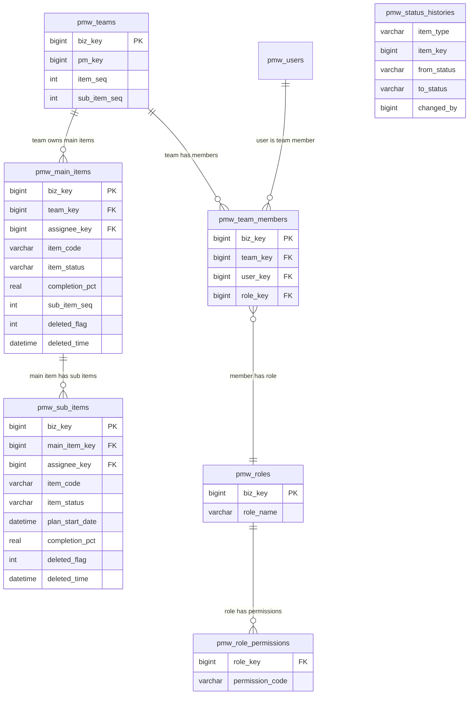

# ER Diagram: System UX Optimization Batch

No schema changes. All tables are existing — this document maps the entities relevant to the 16 UX optimization items.

## Entity Relationships

## Entity Details

### pmw_main_items (existing, no changes)

| Column | Type | Constraints | Description |
|--------|------|-------------|-------------|
| biz_key | BIGINT | PK, NOT NULL | 业务唯一键 (snowflake) |
| team_key | BIGINT | NOT NULL | 所属团队 biz_key |
| item_code | VARCHAR(12) | NOT NULL | 事项编号，团队内唯一 |
| assignee_key | BIGINT | nullable | 负责人 biz_key |
| item_status | VARCHAR(20) | NOT NULL DEFAULT '待开始' | 事项状态 |
| completion_pct | REAL | NOT NULL DEFAULT 0.00 | 完成度 0.00~100.00 |
| sub_item_seq | INT | NOT NULL DEFAULT 0 | 子事项序号计数器 |
| plan_start_date | DATETIME | nullable | 计划开始日期 |
| expected_end_date | DATETIME | nullable | 预计结束日期 |
| deleted_flag | INT | NOT NULL DEFAULT 0 | 软删标志 |
| deleted_time | DATETIME | NOT NULL DEFAULT '1970-01-01...' | 软删时间 |

### pmw_sub_items (existing, no changes)

| Column | Type | Constraints | Description |
|--------|------|-------------|-------------|
| biz_key | BIGINT | PK, NOT NULL | 业务唯一键 |
| main_item_key | BIGINT | NOT NULL | 所属主事项 biz_key |
| item_code | VARCHAR(15) | NOT NULL | 子事项编号 |
| assignee_key | BIGINT | nullable | 负责人 biz_key |
| item_status | VARCHAR(20) | NOT NULL DEFAULT '待开始' | 子事项状态 |
| plan_start_date | DATETIME | nullable | 计划开始日期 |
| completion_pct | REAL | NOT NULL DEFAULT 0.00 | 完成度 |
| deleted_flag | INT | NOT NULL DEFAULT 0 | 软删标志 |
| deleted_time | DATETIME | NOT NULL DEFAULT '1970-01-01...' | 软删时间 |

### pmw_team_members (existing, no changes)

| Column | Type | Constraints | Description |
|--------|------|-------------|-------------|
| biz_key | BIGINT | PK, NOT NULL | 业务唯一键 |
| team_key | BIGINT | NOT NULL | 所属团队 biz_key |
| user_key | BIGINT | NOT NULL | 成员用户 biz_key |
| role_key | BIGINT | nullable | 角色 biz_key，NULL=未分配 |

### pmw_role_permissions (existing, seed data only)

| Column | Type | Constraints | Description |
|--------|------|-------------|-------------|
| role_key | BIGINT | NOT NULL | 角色 biz_key |
| permission_code | VARCHAR(50) | NOT NULL | 权限码 |

**Seed additions**: `main_item:delete`, `sub_item:delete` added to pm role.

### pmw_status_histories (existing, no changes)

| Column | Type | Constraints | Description |
|--------|------|-------------|-------------|
| item_type | VARCHAR(20) | NOT NULL | main_item / sub_item |
| item_key | BIGINT | NOT NULL | 事项 biz_key |
| from_status | VARCHAR(20) | NOT NULL | 变更前状态 |
| to_status | VARCHAR(20) | NOT NULL | 变更后状态 |
| changed_by | BIGINT | NOT NULL | 操作人 biz_key |

## Index Design

No new indexes. Existing indexes cover all access patterns:

| Table | Index | Usage in this feature |
|-------|-------|-----------------------|
| pmw_sub_items | `idx_sub_items_main_item_key` | Cascade delete, move reassignment |
| pmw_sub_items | `uk_sub_items_main_code` | Move: unique code constraint prevents duplicates |
| pmw_main_items | `idx_main_items_team_status` | Status filter, terminal sort |
| pmw_team_members | `uk_team_user_deleted` | Team membership lookup (#15) |
| pmw_status_histories | `idx_status_histories_item` | Weekly activity detection (#16) |

## Relationships

| From | To | Cardinality | Business Meaning |
|------|----|-------------|------------------|
| pmw_teams | pmw_main_items | one-to-many | 团队拥有多个主事项 |
| pmw_main_items | pmw_sub_items | one-to-many | 主事项拥有多个子事项（级联软删除） |
| pmw_users | pmw_team_members | one-to-many | 用户属于多个团队 |
| pmw_teams | pmw_team_members | one-to-many | 团队包含多个成员 |
| pmw_roles | pmw_team_members | one-to-many | 角色分配给多个成员 |
| pmw_roles | pmw_role_permissions | one-to-many | 角色拥有多个权限码 |

## Change Impact Analysis

No table modifications. Seed data only:

| Target | Change Type | Detail |
|--------|-------------|--------|
| pmw_role_permissions | INSERT | Add `main_item:delete`, `sub_item:delete` to pm preset role |
