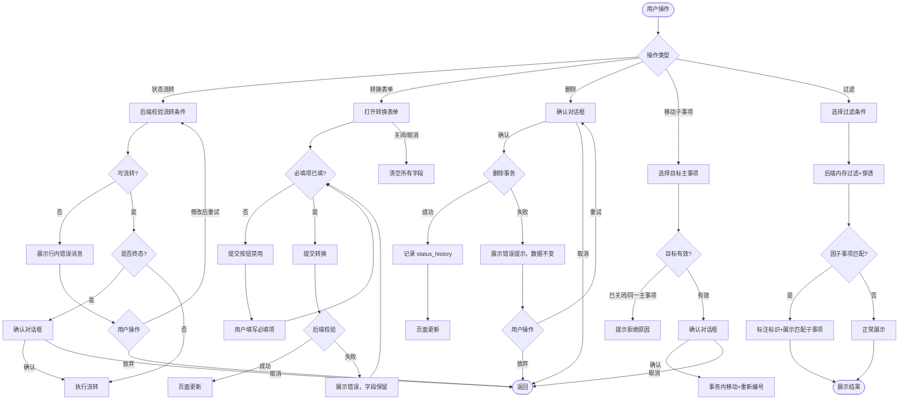

# System UX Optimization Batch — PRD Spec

> PRD Spec: defines WHAT the feature is and why it exists.

## Background

### Why (Reason)

PM Work Tracker 存在两类影响日常使用的问题：

1. **阻断性 Bug**：member 角色用户登录后获取不到任何权限，完全无法使用系统（#8）
2. **体验缺陷**：涵盖状态流转提示、表单交互、删除、过滤、排序等 15 项功能缺陷和交互问题（#1-#7, #9-#16），直接影响 PM 和团队成员的日常操作效率

### What (Target)

分两阶段实施 16 项 UX 优化：

- **阶段一（10 项）**：修复权限 bug，完善状态流转提示，补全表单校验和交互细节，统一排序和清空行为，修复团队选择器权限过滤和每周进展页面过滤
- **阶段二（6 项）**：新增子事项移动、过滤穿透、清单终态排序、进度页面状态过滤功能，修复甘特图时间起点和 macOS 滚动条问题

### Who (Users)

| 角色 | 描述 | 受影响项 |
|------|------|---------|
| PM 用户（5名） | 项目管理者，日常使用事项创建、状态流转、删除、过滤等功能 | #1-#7, #9-#16 |
| Member 用户（3名） | 团队成员，使用事项查看和待办提交功能 | #8, #15 |
| macOS 用户（3人） | 使用 macOS 系统的 PM/Member 用户 | #14 |

## Goals

| Goal | Metric | Notes |
|------|--------|-------|
| member 角色用户可正常使用系统 | 3 名 member 用户登录后可看到权限范围内的菜单和功能 | 阻断性问题 |
| 减少状态流转失败后的猜测时间 | 从每次 30 秒（PM 团队反馈估算）降至 0 秒（直接展示原因消息） | #1 |
| 减少表单提交失败率 | 转换表单提交失败率从约 30%（PM 团队反馈估算）降至 <5% | #7 |
| 减少手动绕路操作 | 每周约 15 次手动绕路操作（PM 团队反馈估算）降至 0 | #3, #5, #6, #9 |
| 提升过滤效率 | 多状态筛选和穿透过滤支持，预估覆盖 40% 的过滤需求（基于 PM 团队日常使用场景分析） | #10 |
| 减少页面干扰信息 | 终态事项排序到最后/隐藏无活跃事项，预估减少约 60% 视觉干扰（基于 PM 团队反馈估算） | #11, #12, #16 |

## Scope

### In Scope

**阶段一（10 项）：**
- [ ] #1: 状态流转失败时展示后端返回的错误消息（替代 tooltip）
- [ ] #2: 子事项编辑表单添加开始时间字段
- [ ] #3: PM 可软删除主事项（级联子事项）和子事项，需确认对话框；新增 main_item:delete、sub_item:delete 权限码；删除时在 status_history 表中记录删除事件
- [ ] #4: 待办→子事项表单描述字段添加置灰样式
- [ ] #5: 主事项详情页子事项列表倒序排列
- [ ] #6: 所有新增/转换表单关闭时清空字段
- [ ] #7: 转换表单负责人和优先级必填校验
- [ ] #8: 修复 member 角色用户登录后获取不到权限的 bug
- [ ] #15: 团队下拉选择器仅展示当前用户有权限的团队
- [ ] #16: 每周进展页面隐藏终态且本周/上周无活跃事项的主事项

**阶段二（6 项）：**
- [ ] #9: 子事项移动到其他主事项（重新编号，保留状态和负责人）
- [ ] #10: 状态过滤器改为多选 + 负责人过滤穿透子事项（卡片视图和表格视图统一支持）
- [ ] #11: 事项清单页面终态主事项排序到最后
- [ ] #12: 整体进度页面支持按状态过滤，默认仅展示进行中状态，终态主事项排在最后
- [ ] #13: 甘特图时间轴起点根据实际数据自动计算
- [ ] #14: 修复 macOS 下甘特图水平滚动条不显示问题

### Out of Scope

- 硬删除（永久清除数据）
- 已删除事项的恢复功能（软删除数据仅可通过数据库直接操作恢复，不在本次 UI 范围内提供恢复入口）
- 独立的删除审计 UI 或通知推送
- 批量操作（批量删除、批量移动）
- 子事项移动历史记录
- 卡片视图的拖拽排序
- 新增权限码之外的其他 seed 数据更新（由 RBAC 提案覆盖）

## Flow Description

### Business Flow Description

#### 状态流转（#1）

1. 用户点击状态流转按钮
2. 后端校验流转条件，若不可流转返回具体原因
3. 前端展示行内错误消息（Alert 组件），消息内容来自后端
4. 若为终态流转，弹出确认对话框

#### 删除事项（#3）

1. PM 用户在主事项或子事项界面点击删除按钮
2. 弹出确认对话框，主事项删除提示"将同时删除 N 个子事项"
3. 确认后在单个事务中软删除主事项及其子事项
4. 在 status_history 表中记录删除事件

#### 转换表单（#4, #6, #7）

1. 用户打开待办→子事项转换表单
2. 开始时间默认当天，描述字段置灰不可编辑
3. 用户填写必填字段（负责人、优先级），未填时提交按钮禁用
4. 提交成功后，所有字段自动清空
5. 若提交失败（后端校验不通过），字段内容保留，展示错误消息供用户修正后重试
6. 用户手动关闭/取消表单时，所有字段清空

#### 移动子事项（#9）

1. 用户在子事项详情选择"移动到其他主事项"
2. 选择目标主事项（已关闭状态的目标禁止选择，同一主事项禁止选择）
3. 确认后子事项通过目标父项的 NextSubCode 获得新编号
4. 状态和负责人保持不变，在事务中执行

#### 过滤穿透（#10）

1. 用户在事项清单页面选择状态多选或负责人过滤
2. 系统展示匹配的主事项 + 因子事项匹配而连带展示的主事项
3. 因子事项匹配的主事项标注"因子事项匹配"标识，仅展示匹配的子事项
4. 未选择任何过滤器时展示全部事项

#### Member 权限修复验证流程（#8）

1. 修复后端权限中间件：当 RoleKey 为 nil 时正确查询 member 角色默认权限集
2. member 角色用户登录系统
3. 前端获取菜单列表，返回该用户权限范围内的菜单项（至少包含 item_pool:submit、main_item:list）
4. 用户可正常进入待办事项提交页面和事项查看页面，无空白菜单或权限拒绝

### Business Flow Diagram

## Functional Specs

### 终态定义

**终态（Terminal Status）**：状态值为 `已关闭` 或 `已完成` 的主事项视为终态。终态主事项在事项清单页面排序到最后，在整体进度页面可被状态过滤器过滤，在每周进展页面当本周/上周无活跃事项时隐藏。非终态状态包括：`待处理`、`进行中`、`已暂停` 等。

> UI 功能规格详见 [prd-ui-functions.md](./prd-ui-functions.md)。

### Related Changes

| # | Module | Change Point | Updated Logic |
|---|--------|-------------|---------------|
| 1 | 后端权限中间件 | team_scope permCodes 赋值 | 修复 RoleKey 为 nil 时权限查询返回空集 |
| 2 | 后端 RBAC seed | 新增权限码 | main_item:delete, sub_item:delete |
| 3 | 后端 ViewService | 内存过滤逻辑增强 | 支持穿透子事项匹配 |
| 4 | 前端表单组件 | 表单重置逻辑 | 关闭时清空字段，提取共享 hook |

## Other Notes

### Empty State Handling

所有过滤和搜索场景均需处理零结果情况：
- 当过滤条件应用后无匹配结果时，展示空状态提示文案："没有符合条件的事项"
- 空状态提示区域内提供"清除过滤条件"操作按钮，点击后重置所有过滤器并展示全部事项
- 适用范围：事项清单页面（卡片视图、表格视图）、整体进度页面、每周进展页面

### Performance Requirements
- 过滤穿透查询响应时间 ≤ 500ms（基准：1000 主事项 + 5000 子事项）
- 当前不分页（全量返回），若未来引入分页需重新评估穿透逻辑

### Data Requirements
- 删除需新增权限码 seed 数据（约 4 行变更）
- 级联删除须在单个事务内执行：先批量软删除子事项，再软删除主事项
- 子事项移动须在单个事务内执行编号重生成

### Security Requirements
- 删除操作需二次确认
- 删除按钮仅 PM 角色可见
- 团队选择器仅展示用户有权限的团队

### Concurrency Requirements
- 子事项移动：后端在事务内执行移动和编号重生成，依赖数据库行锁保证原子性。若两个用户同时移动同一子事项，后提交的请求因目标主事项的子事项数据已变更，重新计算编号不会冲突（NextSubCode 每次递增）
- 主事项删除：若一个用户正在删除主事项，另一用户正在从该主事项移动子事项，移动操作将因源主事项已软删除而失败（返回"源主事项不存在"错误），前端展示对应错误消息
- 状态流转：基于乐观锁机制，若状态在用户操作期间已被他人变更，后端返回冲突错误，前端展示"该事项状态已被他人更新，请刷新后重试"

---

## Quality Checklist

- [x] Is the requirement title accurate and descriptive
- [x] Does the background include all three elements: reason, target, users
- [x] Are the goals quantified
- [x] Is the flow description complete
- [x] Does the business flow diagram exist (Mermaid format)
- [x] Is prd-ui-functions.md referenced and UI specs complete
- [x] Are related changes thoroughly analyzed
- [x] Are non-functional requirements considered (performance / data / monitoring / security)
- [x] Are all tables filled completely
- [x] Is there any ambiguous or vague wording
- [x] Is the spec actionable and verifiable
