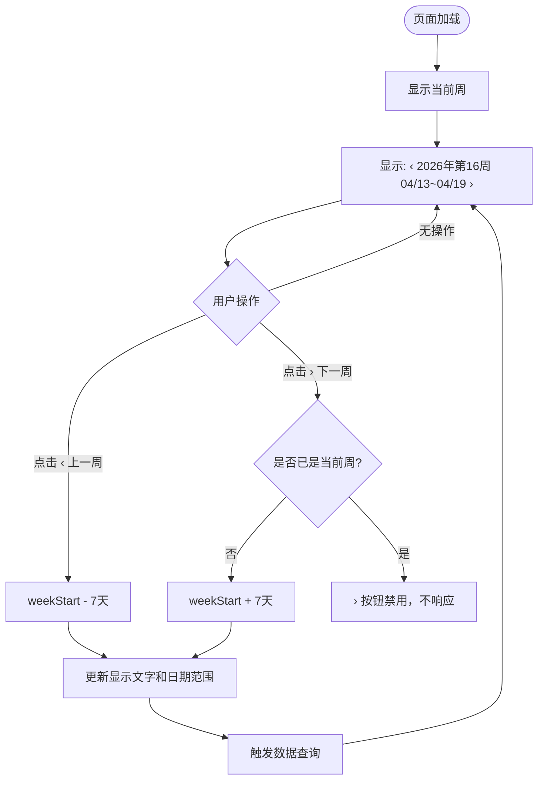

# UI/UX 统一与优化 — PRD Spec

> PRD Spec: defines WHAT the feature is and why it exists.

## 需求背景

### 为什么做（原因）

随着功能迭代，各页面在独立开发过程中积累了多处 UI 不一致问题：表格行内操作按钮风格与页面头部按钮不统一、左侧导航菜单分组混乱、原生周次选择器在 Safari 上完全不可用、可跳转链接与普通文字视觉区分不明显。这些问题影响用户操作效率，并对 Mac/Safari 用户造成功能性阻断。

### 要做什么（对象）

对前端多个页面进行 UI 统一改造，具体包括：导航菜单重排、表格操作按钮加图标、封装跨浏览器兼容的周次选择器组件、统一详情页信息布局、统一链接高亮样式、调整"追加进度"按钮位置、在每周进展页展示子事项完成度数字、统一按钮文案。

### 用户是谁（人员）

- **PM（项目经理）**：主要使用者，负责查看每周进展、导出周报、管理事项
- **团队成员**：查看和更新自己负责的子事项进度
- **管理员**：使用用户管理、角色管理、团队管理功能

## 需求目标

| 目标 | 量化指标 | 说明 |
|------|----------|------|
| 修复 Safari 兼容性 | Safari 用户可 100% 正常使用周次选择功能 | 当前 Safari 下 `type="week"` 输入框不渲染 |
| 提升周次切换效率 | 切换上一周/下一周操作步骤从 3 步降至 1 步 | 当前需手动修改输入框值 |
| 统一视觉风格 | 所有表格行内操作按钮均为图标+文字风格 | 涉及 4 个页面共 9 个操作按钮 |
| 提升导航可发现性 | 菜单按业务/管理分组，减少用户寻找菜单的时间 | 当前管理类菜单散落在业务菜单中 |

## Scope

### In Scope

- [ ] 左侧导航菜单重排与分组
- [ ] 表格行内操作按钮统一为「图标 + 文字」风格（4 个页面）
- [ ] 封装 `WeekPicker` 共享组件（Safari 兼容 + 上一周/下一周切换）
- [ ] WeeklyViewPage 和 ReportPage 替换为 WeekPicker 组件
- [ ] 主事项详情页与子事项详情页基本信息布局统一
- [ ] 全站可跳转文字链接统一高亮样式
- [ ] 子事项详情页「追加进度」按钮移至进度记录卡片右上角
- [ ] 每周进展页子事项行展示完成度百分比数字
- [ ] 事项清单页「创建主事项」按钮更名为「新增主事项」

### Out of Scope

- 甘特图页面日期选择器（`type="date"`，Safari 原生支持）
- 整体设计系统重构或主题变更
- 移动端适配
- 新增业务功能或数据逻辑变更

## 流程说明

### 业务流程说明

本需求为纯前端 UI 改造，不涉及后端接口变更。各改造点相互独立，可并行实施。核心新增交互为 WeekPicker 组件的周次切换流程。

**WeekPicker 交互流程：**
1. 页面初始化时，WeekPicker 默认显示当前周（不超过本周）
2. 用户点击「‹」切换到上一周，组件更新显示并触发数据刷新
3. 用户点击「›」切换到下一周；若已是当前周，「›」按钮禁用
4. 组件显示格式：`‹ 2026年第16周  04/13 ~ 04/19  ›`

### 业务流程图



### 数据流说明

本需求不涉及多系统数据流，所有改动均为前端展示层调整。

## 功能描述

### F1 导航菜单重排

**改动说明**：调整左侧 Sidebar 菜单的排列顺序，增加业务组与管理组的视觉分隔。

**目标顺序**：

| 分组 | 菜单项 | 路由 | 权限 |
|------|--------|------|------|
| 业务组 | 事项清单 | `/items` | 无 |
| 业务组 | 待办事项 | `/item-pool` | 无 |
| 业务组 | 每周进展 | `/weekly` | 无 |
| 业务组 | 整体进度 | `/gantt` | `view:gantt` |
| 业务组 | 周报导出 | `/report` | 无 |
| 管理组（分隔线） | 团队管理 | `/teams` | 无 |
| 管理组 | 用户管理 | `/users` | `user:read` |
| 管理组 | 角色管理 | `/roles` | `user:manage_role` |

**分隔线规则**：管理组第一项（团队管理）上方显示分隔线，与业务组区分。

---

### F2 表格操作按钮统一

**改动说明**：为以下页面的表格行内操作按钮添加对应图标，保持现有 `variant="ghost" size="sm"` 样式不变。

| 页面 | 按钮文字 | 图标（lucide-react） |
|------|----------|---------------------|
| 用户管理 | 编辑 | `Pencil` |
| 用户管理 | 修改状态 | `ToggleLeft` / `ToggleRight`（根据当前状态） |
| 角色管理 | 编辑 | `Pencil` |
| 角色管理 | 删除 | `Trash2` |
| 团队详情 | 设为PM | `Crown` |
| 团队详情 | 移除 | `UserMinus` |
| 团队详情 | 变更（角色） | `RefreshCw` |
| 待办事项 | 转为主事项 | `ArrowUpCircle` |
| 待办事项 | 转为子事项 | `ArrowDownCircle` |
| 待办事项 | 拒绝 | `XCircle` |

**图标规格**：`w-3.5 h-3.5`，与按钮文字间距 `gap-1.5`。

---

### F3 WeekPicker 组件

**组件位置**：`src/components/shared/WeekPicker.tsx`

**显示格式**：单行紧凑布局
```
‹   2026年第16周  04/13 ~ 04/19   ›
```

**Props 接口**：

| Prop | 类型 | 必填 | 说明 |
|------|------|------|------|
| `weekStart` | `string` | 是 | 当前周起始日期，格式 `YYYY-MM-DD`（周一） |
| `onChange` | `(weekStart: string) => void` | 是 | 切换周次时的回调 |
| `maxWeek` | `string` | 否 | 最大可选周起始日期，默认为当前周 |

**状态规则**：

| 状态 | 条件 | 表现 |
|------|------|------|
| 正常 | 非最大周 | 两侧箭头均可点击 |
| 已到最大周 | `weekStart >= maxWeek` | 「›」按钮禁用（`opacity-40 cursor-not-allowed`） |

**周次计算**：复用现有 `WeeklyViewPage` 中的 `getWeekNumber`、`toLocalDateString` 逻辑，提取为 `src/utils/weekUtils.ts` 工具函数，供 WeekPicker 和两个页面共用。

**兼容性**：不使用 `<input type="week">`，完全基于 JS 日期计算，支持 Safari、Chrome、Firefox。

---

### F4 详情页信息布局统一

**改动说明**：子事项详情页（`SubItemDetailPage`）基本信息卡片与主事项详情页（`MainItemDetailPage`）采用相同的 label+value 展示规范。

**统一规范**：
- 外层使用 `<Card>` 包裹，`<CardContent>` 内用 `grid grid-cols-2 gap-4`（或 `grid-cols-4` 视字段数量）
- 每个字段：上方 `<div className="text-xs text-tertiary mb-1">` 显示标签，下方显示值
- 子事项详情页当前为 4 列 grid，保持 4 列但统一标签/值的字体和间距规范

---

### F5 可跳转文字链接高亮

**改动说明**：全站所有 `<Link>` 和可点击跳转的文字统一使用以下样式，与普通文字明显区分。

**统一样式**：`text-primary-600 hover:text-primary-700 hover:underline`

**涉及位置**（非完整列表，实现时需全面排查）：

| 页面 | 链接文字 | 当前样式 |
|------|----------|----------|
| 事项清单 | 主事项标题 | `text-primary hover:text-primary-600`（无下划线） |
| 主事项详情 | 子事项标题 | `text-primary hover:text-primary-600` |
| 子事项详情 | 所属主事项标题 | `text-primary hover:text-primary-600` |
| 每周进展 | 主事项标题、子事项标题 | `text-text hover:text-primary-600` |
| 待办事项 | 已分配主事项链接 | `text-primary-600 hover:text-primary-700` |
| 团队管理 | 团队名称 | `text-primary hover:underline` |
| 表格视图 | 事项标题 | `font-medium text-primary hover:text-primary-600` |

---

### F6 「追加进度」按钮位置调整

**改动说明**：将子事项详情页（`SubItemDetailPage`）的「追加进度」按钮从页面标题栏右侧移至「进度记录」卡片的 `CardHeader` 右侧。

**改动前**：
```
[子事项标题]                    [追加进度 按钮]   ← 标题栏
...
[进度记录 卡片]
  CardHeader: 进度记录
  CardContent: 时间线
```

**改动后**：
```
[子事项标题]                                      ← 标题栏（无按钮）
...
[进度记录 卡片]
  CardHeader: 进度记录          [追加进度 按钮]   ← 卡片右上角
  CardContent: 时间线
```

**权限**：`PermissionGuard code="progress:update"` 包裹保持不变，仅移动位置。

---

### F7 每周进展子事项进度显示

**改动说明**：`WeeklyViewPage` 的 `SubItemRow` 组件在子事项标题行展示当前完成度百分比数字。

**显示位置**：标题文字之后，负责人之前，格式为 `65%`，样式 `text-[11px] font-semibold text-secondary`。

**数据来源**：`SubItemSnapshot.completion` 字段（已有）。

**显示规则**：
- 始终显示，不论是否有进度变化
- 若 `completion === 100`，显示为绿色（`text-success-text`）

---

### F8 按钮文案统一

**改动说明**：事项清单页（`ItemViewPage`）的「创建主事项」按钮更名为「新增主事项」，与其他页面「新增」风格保持一致。

## 其他说明

### 性能需求
- 响应时间：WeekPicker 切换周次后数据刷新时间与现有一致（无新增接口）
- 兼容性：支持 Safari 15+、Chrome 100+、Firefox 100+

### 数据需求
- 数据埋点：无
- 数据初始化：无
- 数据迁移：无

### 监控需求
- 无新增监控需求

### 安全性需求
- 无新增安全需求，权限控制逻辑不变

---

## 质量检查

- [x] 需求标题是否概括准确
- [x] 需求背景是否包含原因、对象、人员三要素
- [x] 需求目标是否量化
- [x] 流程说明是否完整
- [x] 业务流程图是否包含（Mermaid 格式）
- [x] 按钮描述是否完整（权限/状态/校验/数据逻辑）
- [x] 关联性需求是否全面分析
- [x] 非功能性需求（性能/数据/监控/安全）是否考虑
- [x] 所有表格是否填写完整
- [x] 是否有歧义或模糊表述
- [x] 是否可执行、可验收
