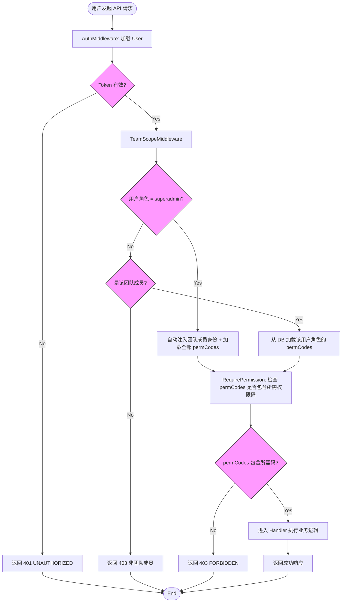

# 统一权限码校验，移除 bypass 模式 — PRD Spec

> PRD Spec: defines WHAT the feature is and why it exists.

## Background

### Why (Reason)

RBAC 权限系统已上线，但存在两层 bypass 逻辑绕过权限码校验：
1. **SuperAdmin bypass**：`User.IsSuperAdmin` 布尔字段使 `RequirePermission` 中间件直接短路，跳过所有权限码检查。SuperAdmin 角色在 DB 中无任何权限码记录。
2. **Handler-level bypass**：`isPMOrSuperAdmin()` 函数在 sub_item_handler 和 progress_handler 中，根据 SuperAdmin 标志或 `sub_item:assign` 权限码决定是否跳过 assignee 所有权检查。这导致自定义角色（如 ext-member）即使拥有 `sub_item:update` 也可能被 403 拒绝。

team_handler 中还有 5 处通过 `IsSuperAdmin` 标志获取团队 PM BizKey 来绕过 PM 身份校验的逻辑。

### What (Target)

移除 handler-level bypass 逻辑，统一前后端权限码校验：
- 保留 `User.IsSuperAdmin` 字段（仅用于判断是否加载全部权限码）
- superadmin 用户加载全部 29 个权限码，所有校验统一走 permCodes 路径
- 移除 `RequirePermission` 中间件的 SuperAdmin 短路（tier-1）
- 移除 handler-level bypass（`isPMOrSuperAdmin`、assignee 检查、PM BizKey 替换）
- 服务层 PM 身份校验改为权限码校验
- 前端同步移除 `isSuperAdmin` 引用，统一使用 `hasPermission()`

### Who (Users)

| 用户角色 | 影响 |
|---------|------|
| SuperAdmin | 无功能性变化，仍可执行所有操作（通过全部 29 个权限码统一校验） |
| PM | 无变化 |
| 自定义角色用户（如 ext-member） | **核心受益方** -- 拥有的权限码不再被 bypass 逻辑阻塞 |
| Member | 无变化 |

## Goals

| Goal | Metric | Notes |
|------|--------|-------|
| 自定义角色权限码生效 | 自定义角色拥有 `sub_item:update` 后编辑子事项成功率 100%（当前 0%） | 核心修复目标 |
| 消除 handler-level bypass | `isPMOrSuperAdmin` 引用数降为 0；前端 `isSuperAdmin` 引用数降为 0 | handler + 前端 |
| SuperAdmin 功能无损 | SuperAdmin 角色可执行全部 22 项操作（AC 3a/3b/3c），与移除前一致 | 回归验证 |

## Scope

### In Scope

- [x] 移除 `RequirePermission` 中间件的 SuperAdmin tier-1 短路
- [x] `TeamScopeMiddleware` SuperAdmin 改为注入全部 29 个权限码（而非空码）
- [x] superadmin 预设角色 seed 全部 29 个权限码
- [x] 移除 `isPMOrSuperAdmin()` 函数及所有调用点（sub_item_handler、progress_handler）
- [x] 移除 sub_item_handler 中的 assignee 所有权检查
- [x] 替换 team_handler 中 5 处 "SuperAdmin 充当 PM" 逻辑为权限码驱动
- [x] 服务层（team_service 等）将 PM 身份校验改为权限码校验
- [x] 移除 VO/DTO 中的 `IsSuperAdmin` 字段（响应体不再暴露）
- [x] `GetUserPermissions` 为 SuperAdmin 返回全部 29 个权限码
- [x] 前端：从 types、auth store、PermissionGuard、页面组件中移除 `isSuperAdmin`，改用权限码
- [x] 更新 `docs/conventions/permission-codes.md` 中的 SuperAdmin Bypass Rule 章节

### Intentionally Kept (Not Changed)

- [ ] `User.IsSuperAdmin` 模型字段和 `is_super_admin` DB 列保留（仅用于加载全部权限码）
- [ ] `AuthMiddleware` 的 `isSuperAdmin` context 注入保留（TeamScopeMiddleware 据此加载全部权限码）
- [ ] `config/seed.go` 中 `IsSuperAdmin: true` 保留
- [ ] `TeamScopeMiddleware` SuperAdmin 跳过团队成员检查（改为注入全部 29 码而非空码）

### Out of Scope

- 新增权限码（当前 29 个够用）
- 角色管理 UI 的变更
- 数据范围（data scope）的变更（all_teams / own_teams / self_only 不变）
- member 角色权限调整
- `todos.txt` #65（member 角色获取权限问题）

## Flow Description

### Business Flow Description

#### 当前流程（有 bypass）

1. 用户发起请求 → AuthMiddleware 加载 User，设置 `isSuperAdmin` 到 context
2. TeamScopeMiddleware 检查：若 SuperAdmin → 注入空 permCodes，跳过团队成员检查
3. RequirePermission 检查：若 SuperAdmin → 直接 `c.Next()`，跳过权限码检查
4. Handler 中：`isPMOrSuperAdmin()` 检查 SuperAdmin 标志或 `sub_item:assign` → 决定是否跳过 assignee 检查
5. team_handler 中：SuperAdmin 获取团队 PM BizKey 绕过 PM 身份校验

自定义角色（ext-member）在步骤 4 被 403 拒绝：拥有 `sub_item:update` 但没有 `sub_item:assign`，且不是 assignee。

#### 目标流程（统一权限码校验）

1. 用户发起请求 → AuthMiddleware 加载 User（`IsSuperAdmin` 字段保留，设入 context）
2. TeamScopeMiddleware 检查：SuperAdmin → 注入全部 29 个权限码（跳过团队成员检查）；普通成员 → 加载角色权限码
3. RequirePermission 检查：所有用户统一走 permCodes 线性扫描（无 tier-1 短路）
4. Handler 中：不再有 `isPMOrSuperAdmin()` 调用，不再有 assignee 检查
5. team_handler 中：不再有 "充当 PM" 逻辑，服务层不再做 PM 身份校验
6. `/me/permissions` 端点：SuperAdmin 返回全部 29 个权限码（前端统一使用 `hasPermission()`）

自定义角色（ext-member）在步骤 3 通过 `sub_item:update` 检查，步骤 4 不再有额外检查，请求成功。

### Business Flow Diagram

## Functional Specs

### 5.1 Seed & Data Changes

| # | 变更项 | 详情 |
|---|--------|------|
| 1 | superadmin 角色 seed 全部 29 个权限码 | `seedPresetRoles` 改为 `seedRole(tx, "superadmin", ..., permissions.AllCodeStrings())`。`seedRole` 是 additive 的，下次启动自动插入 |
| 2 | `GetUserPermissions` SuperAdmin 路径 | SuperAdmin 用户请求 `/me/permissions` 时返回全部 29 个权限码给所有团队，前端统一使用 `hasPermission()` |

### 5.2 Backend Middleware Changes

| # | 文件 | 变更 |
|---|------|------|
| 1 | `middleware/permission.go` | `RequirePermission` 移除 SuperAdmin tier-1 短路：删除 `if IsSuperAdmin(c) { c.Next(); return }` |
| 2 | `middleware/team_scope.go` | SuperAdmin 改为注入全部 29 个权限码：`c.Set("permCodes", permissions.AllCodeStrings())` 代替 `c.Set("permCodes", []string{})` |

### 5.3 Backend Handler Changes

| # | 文件 | 变更 |
|---|------|------|
| 1 | `handler/sub_item_handler.go` | 删除 `isPMOrSuperAdmin()` 函数；Update 和 ChangeStatus handler 中移除 assignee 所有权检查 |
| 2 | `handler/progress_handler.go` | `pmFlag` 改为从 `sub_item:assign` permCode 获取（重命名 `isPM` → `skipRegressionCheck`）；移除 `isPMOrSuperAdmin()` 调用 |
| 3 | `handler/team_handler.go` L99 | Update: 移除 `IsSuperAdmin` 判断，改为依赖 `team:update` 权限码 |
| 4 | `handler/team_handler.go` L128 | Disband: 同上，依赖 `team:delete` 权限码 |
| 5 | `handler/team_handler.go` L194 | RemoveMember: 移除 `IsSuperAdmin` 判断，依赖 `team:remove` 权限码 |
| 6 | `handler/team_handler.go` L233 | UpdateMemberRole: 同上 |
| 7 | `handler/team_handler.go` L276 | TransferPM: 移除 `IsSuperAdmin` 判断，依赖 `team:transfer` 权限码 |
| 8 | `handler/team_handler.go` L56 | List: `isSuperAdmin` 参数移除，改为通过权限码判断是否可见所有团队 |

### 5.4 Backend Service Changes

| # | 文件 | 变更 |
|---|------|------|
| 1 | `service/team_service.go` | `ListTeams` 移除 `isSuperAdmin` 参数；移除 `team.PmKey != pmBizKey` 检查，简化方法签名 |
| 2 | `service/role_service.go` | `UserPermissions` 移除 `IsSuperAdmin` 字段；`GetUserPermissions` 为 SuperAdmin 返回全部权限码 |

### 5.5 Backend VO/DTO Changes

| # | 文件 | 变更 |
|---|------|------|
| 1 | `vo/user_vo.go` | 移除 `IsSuperAdmin` 字段 |
| 2 | `dto/auth.go` | 移除 `IsSuperAdmin` 字段 |
| 3 | `service/role_service.go` (UserInfo) | 移除 `IsSuperAdmin` 字段 |

### 5.6 Frontend Changes

| # | 文件/模块 | 变更 |
|---|-----------|------|
| 1 | `types/index.ts` | 移除 `isSuperAdmin` 字段 |
| 2 | `store/auth.ts` | 移除 `isSuperAdmin` 状态和相关逻辑 |
| 3 | `components/PermissionGuard` | 无直接 `isSuperAdmin` 引用，但依赖 store 的 `hasPermission` 统一移除 bypass 后自动生效 |
| 4 | 页面及测试文件（22 个文件，详见 design Frontend File Enumeration） | 移除所有 `isSuperAdmin` 引用，改用 `hasPermission()` |
| 5 | `mocks/handlers.ts` | 移除 `isSuperAdmin` mock 数据 |

### 5.7 Related Changes

| # | Project | Module | Change Point | Updated Logic |
|---|---------|--------|-------------|---------------|
| 1 | backend | `migration/rbac.go` | seedPresetRoles | superadmin 角色写入全部 29 个权限码 |
| 2 | docs | `conventions/permission-codes.md` | SuperAdmin Bypass Rule 章节 | 更新描述：handler-level 和 middleware-level bypass 均已移除，SuperAdmin 通过加载全部 29 个权限码统一校验 |

## Other Notes

### Performance Requirements

- 权限码检查仍为 permCodes 切片线性扫描（当前方案，29 个码足够小），无需变更
- SuperAdmin 持有全部 29 码，线性扫描开销可忽略

### Data Requirements

- **Seed 数据更新**：superadmin 角色的权限码通过 `seedPresetRoles` 在启动时写入（additive）
- **无 DB schema 变更**：`is_super_admin` 列保留

### Failure Scenarios

| 场景 | 影响 | 应对策略 |
|------|------|----------|
| `seedPresetRoles` 启动失败 | superadmin 角色无权限码，前端 `hasPermission()` 返回 false，UI 元素隐藏 | `seedRole` 是 additive 且幂等的，重启即可修复。不影响后端操作（middleware bypass 保留） |
| 前端发送多余 `isSuperAdmin` 参数 | 后端 DTO 不再包含该字段 | 后端忽略未知 JSON 字段，无影响 |

### Monitoring Requirements

- **Rollout 期间 403 率基线监控**：部署后 1 小时内，对比同一时间窗口的 403 响应数量与部署前 7 天平均值。若 403 率增长超过 20%，触发回滚评估
- 监控指标来源：现有 API 日志中的 HTTP 状态码统计，无需新增埋点

### Security Requirements

- handler-level bypass 移除后，所有 handler 不再有 SuperAdmin 特殊路径
- middleware-level bypass 同步移除：`RequirePermission` 无 SuperAdmin 短路，SuperAdmin 通过全部 29 码走 permCodes 检查通过
- `IsSuperAdmin` 不再通过 API 响应暴露，前端无感知
- `IsSuperAdmin` 仅用于 TeamScopeMiddleware 决定是否注入全部权限码，以及 `GetUserPermissions` 返回全部权限码
- superadmin 角色的权限码为 seed 数据，不可通过 API 修改（is_preset = true）

---

## Quality Checklist

- [x] Is the requirement title accurate and descriptive
- [x] Does the background include all three elements: reason, target, users
- [x] Are the goals quantified
- [x] Is the flow description complete
- [x] Does the business flow diagram exist (Mermaid format)
- [x] Is the list page description complete — N/A (no list page changes)
- [x] Are button actions described completely — N/A (no new buttons)
- [x] Are form descriptions complete — N/A (no new forms)
- [x] Are related changes thoroughly analyzed
- [x] Are non-functional requirements considered (performance / data / monitoring / security)
- [x] Are all tables filled completely
- [x] Is there any ambiguous or vague wording
- [x] Is the spec actionable and verifiable
