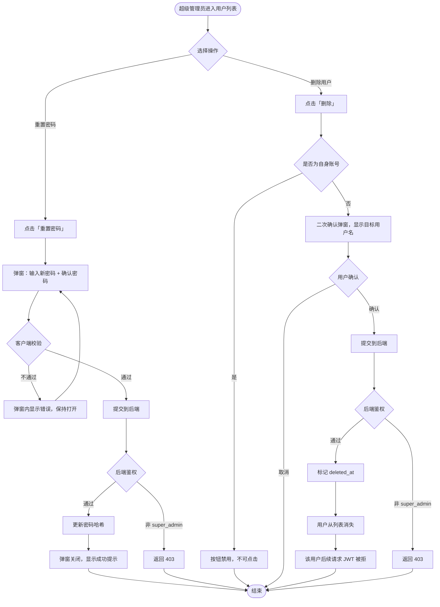

# 用户管理增强：重置密码 & 删除用户 — PRD Spec

## 需求背景

### 为什么做（原因）

当前用户管理模块仅支持禁用/启用用户，无法重置密码或从界面移除用户。管理员遇到密码问题时只能删除并重建账号（每次耗时 15–30 分钟），离职账号只能长期以禁用状态堆积在列表中。截至 2026-04-27，已有 2 个僵尸禁用账号、1 次删除重建记录，按当前频率估算年度额外运维成本约 1–4 小时。

### 要做什么（对象）

1. **重置密码**：超级管理员可为任意用户直接设置新密码，立即生效。
2. **软删除用户**：超级管理员可将用户标记为已删除，用户从列表消失、无法登录，历史数据保留。

### 用户是谁（人员）

- **超级管理员**：唯一操作主体，拥有重置密码和删除用户的权限。
- **普通用户**：操作对象，无感知（被重置密码后下次登录使用新密码）。

## 需求目标

| 目标 | 量化指标 | 说明 |
|------|----------|------|
| 消除密码重置的删除重建绕路 | 操作耗时从 15–30 分钟降至 < 1 分钟 | 管理员直接在 UI 完成，无需数据迁移 |
| 清理僵尸禁用账号 | 用户列表中禁用账号数量可降至 0 | 软删除后账号从列表消失 |
| 不引入新的安全漏洞 | 重置密码和删除 API 均有鉴权测试覆盖 | 仅 super_admin 可调用 |

## Scope

### In Scope
- [x] 超级管理员重置任意用户密码（弹窗输入新密码 + 确认）
- [x] 软删除用户（列表过滤、登录拦截、JWT 失效）
- [x] 前端用户列表新增「重置密码」「删除」操作入口（仅超级管理员可见）
- [x] 删除操作二次确认弹窗（显示目标用户名）
- [x] 创建用户成功后的结果弹窗新增「复制账号与密码」按钮

### Out of Scope
- 用户自助修改密码
- 忘记密码邮件流程
- 硬删除 / 数据清理工具
- 批量删除
- 删除操作审计日志

## 流程说明

### 业务流程说明

**重置密码流程**：超级管理员在用户列表找到目标用户 → 点击「重置密码」→ 弹窗输入新密码和确认密码 → 客户端校验两次输入一致且满足强度规则 → 提交 → 后端更新密码哈希 → 弹窗关闭，显示成功提示。若密码不符合规则，弹窗内显示错误提示，保持弹窗打开。

**软删除流程**：超级管理员在用户列表找到目标用户 → 点击「删除」→ 二次确认弹窗显示目标用户名 → 确认 → 后端标记 deleted_at → 用户从列表消失 → 该用户下次请求时 JWT 被拒绝。不可对自身账号执行删除。

### 业务流程图



## 功能描述

### 5.1 用户列表页（关联改动）

**数据来源**：后端用户管理接口，过滤 deleted_at IS NOT NULL 的记录。

**显示范围**：仅显示未软删除的用户（deleted_at 为空）。

**数据权限**：仅超级管理员可访问用户管理页。

**排序方式**：创建时间倒序。

**翻页设置**：默认每页 20 条。

**页面类型**：列表页

**示例数据**：

| 用户名 | 显示名 | 邮箱 | 状态 | 所属团队 | 创建时间 | 操作 |
|--------|--------|------|------|----------|----------|------|
| alice | Alice Wang | alice@co.com | 启用 | 产品团队 | 2026-01-15 | 编辑 / 重置密码 / 删除 |
| bob | Bob Li | bob@co.com | 禁用 | — | 2026-02-20 | 编辑 / 重置密码 / 删除 |
| carol | Carol Zhang | carol@co.com | 启用 | 研发团队 | 2026-04-10 | 编辑 / 重置密码 / 删除（自身账号禁用） |

**列表字段**：

| 字段名称 | 类型 | 说明 |
|---------|------|------|
| 用户名 | string | 登录名 |
| 显示名 | string | 展示名称 |
| 邮箱 | string | 可为空 |
| 状态 | string | 后端返回 `enabled` / `disabled`，前端映射为「启用」/「禁用」显示 |
| 所属团队 | string | 可为空 |
| 创建时间 | datetime | 用户创建时间，格式 YYYY-MM-DD，用于排序 |
| 操作 | — | 编辑、重置密码、删除 |

**搜索条件**：

| 序号 | 搜索项 | 控件类型 | 说明 | 默认提示 |
|------|--------|----------|------|----------|
| 1 | 关键词 | 输入框 | 匹配用户名或显示名 | 搜索用户名/显示名 |

### 5.2 按钮操作

**权限控制**：「重置密码」「删除」按钮仅对 isSuperAdmin=true 的登录用户可见。

**状态条件**：

| 状态 | 条件 | 样式 |
|------|------|------|
| 禁用 | 目标用户为当前登录用户（删除按钮） | 灰色不可点击，Tooltip 提示"不可删除自身账号" |
| 启用 | 其他所有情况 | 正常可点击 |

**校验规则**：

| 序号 | 按钮名称 | 校验条件 | 错误提示 | 提示方式及位置 |
|------|----------|----------|----------|----------------|
| 1 | 重置密码（提交） | 新密码与确认密码一致 | 两次输入的密码不一致 | 确认密码字段下方红色文字 |
| 2 | 重置密码（提交） | 密码满足强度规则（≥8位，含字母和数字） | 密码需至少8位，包含字母和数字 | 新密码字段下方红色文字 |

**数据处理逻辑**：

| 序号 | 按钮名称 | 提交后的数据处理详细描述 |
|------|----------|------------------------|
| 1 | 重置密码 | 调用 PATCH /api/v1/admin/users/:bizKey/password，传入新密码；成功后关闭弹窗，显示 Toast "密码已重置" |
| 2 | 删除用户 | 调用 DELETE /api/v1/admin/users/:bizKey；成功后从列表移除该行，显示 Toast "用户已删除" |

### 5.3 重置密码弹窗表单

**表单字段**：

| 字段名称 | 控件类型 | 必填 | 字符长度 | 规则说明 |
|---------|----------|------|----------|----------|
| 新密码 | 密码输入框 | 是 | 8–64 | 至少8位，含字母和数字 |
| 确认密码 | 密码输入框 | 是 | 8–64 | 必须与新密码一致 |

**校验规则**：

| 序号 | 校验条件 | 触发节点 | 提示语 | 提示方式及位置 |
|------|----------|----------|--------|----------------|
| 1 | 新密码不为空 | 提交 | 请输入新密码 | 字段下方红色文字 |
| 2 | 密码强度（≥8位，含字母和数字） | 失焦/提交 | 密码需至少8位，包含字母和数字 | 字段下方红色文字 |
| 3 | 确认密码与新密码一致 | 失焦/提交 | 两次输入的密码不一致 | 确认密码字段下方红色文字 |

### 5.4 创建用户成功结果弹窗（关联改动）

创建用户成功后，后端返回自动生成的初始密码（`initialPassword`）。当前结果弹窗仅展示账号信息，需新增「复制账号与密码」按钮，方便管理员将凭据转交给新用户。

**复制内容格式**：
```
账号：{username}
密码：{initialPassword}
```

**按钮行为**：
- 点击后调用 Clipboard API 写入上述文本
- 复制成功：按钮文字短暂变为"已复制"（约 2 秒后恢复）
- 复制失败（浏览器不支持或权限拒绝）：显示 Toast 错误提示

### 5.5 关联性需求改动

| 序号 | 涉及项目 | 功能模块 | 关联改动点 | 更改后逻辑说明 |
|------|----------|----------|------------|----------------|
| 1 | 后端 | 登录鉴权 | 登录接口 & JWT 中间件 | 增加软删除状态校验：deleted_at 不为空时拒绝登录并使 JWT 失效 |
| 2 | 后端 | 用户列表查询 | ListUsers | 过滤 deleted_at IS NOT NULL 的记录 |

## 其他说明

### 性能需求
- 响应时间：重置密码和删除操作 < 500ms（P99）
- 并发量：与现有用户管理接口一致，无额外要求
- 兼容性：支持现有桌面浏览器（Chrome、Safari、Edge 最新版）

### 数据需求
- 数据迁移：无需迁移，新增 deleted_at 字段（可为空）
- 数据初始化：现有用户 deleted_at 默认为 NULL

### 安全性需求
- 接口限制：重置密码和删除接口均需校验调用方 isSuperAdmin=true，否则返回 403
- 传输加密：密码通过 HTTPS 传输，后端存储 bcrypt 哈希，不记录明文

---

## 质量检查

- [x] 需求标题是否概括准确
- [x] 需求背景是否包含原因、对象、人员三要素
- [x] 需求目标是否量化
- [x] 流程说明是否完整
- [x] 业务流程图是否包含（Mermaid 格式）
- [x] 列表页描述是否完整
- [x] 按钮描述是否完整
- [x] 表单描述是否完整
- [x] 关联性需求是否全面分析
- [x] 非功能性需求是否考虑
- [x] 所有表格是否填写完整
- [x] 是否可执行、可验收
