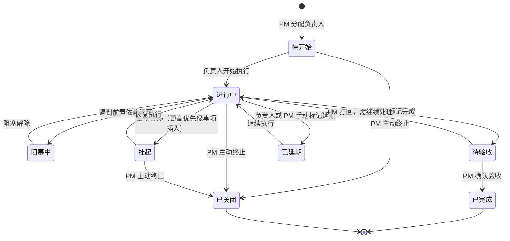
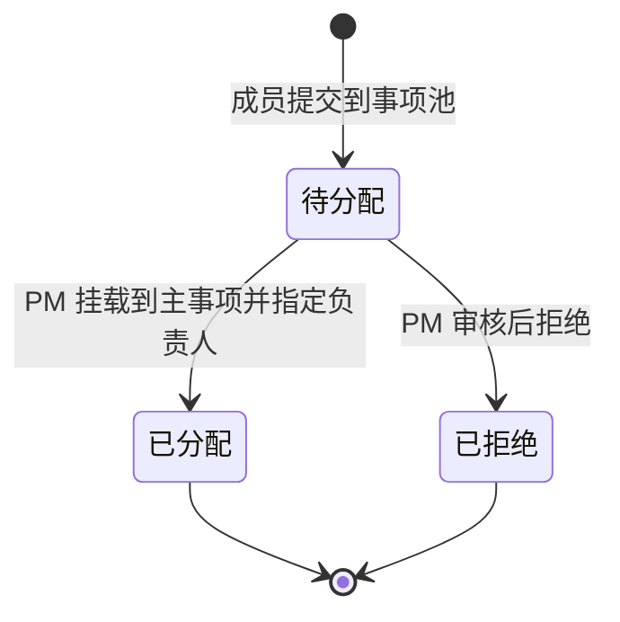

# Proposal: PM 工作事项追踪系统

## 背景与问题

项目经理在日常工作中需要承接上级分配的工作事项，并将其拆解为可执行的子事项分配给团队成员。当前缺乏统一的工具来：

- 结构化登记和管理两级事项（主事项 → 子事项）
- 按周追踪"计划做什么"与"实际做了什么"的差异
- 记录超出百分比的丰富进度信息（成果、卡点、经验）
- 快速将子事项进度汇总为主事项整体进度
- 生成周报文档

## 目标用户

| 角色 | 使用场景 |
|------|---------|
| 超级管理员 | 管理所有团队与用户，全局查看所有团队事项，授予/撤销用户的"创建团队"权限 |
| 项目经理（PM） | 创建并管理本团队，登记主事项、分配事项池中的事项、拆解子事项、查看整体进度、导出报告 |
| 团队成员 | 向事项池提交事项、在主事项下新增子事项、更新进度、填写成果与卡点 |

## 核心概念

### 团队管理

系统以**团队**为核心隔离单元，所有事项、事项池、报告均归属于特定团队，跨团队不可见。

| 角色 | 说明 |
|------|------|
| 超级管理员 | 系统唯一最高权限角色，全局可见所有团队数据，可授予/撤销用户的"创建团队"权限 |
| PM（团队负责人） | 创建团队后自动成为该团队 PM，可邀请成员、管理事项、转让 PM 身份 |
| 团队成员 | 在所属团队内操作事项，可同时加入多个团队并在不同团队中担任不同角色 |

**团队规则：**
- 有权限的用户可创建团队，自动成为该团队 PM
- PM 可将 PM 身份转让给团队内其他成员
- 用户可加入多个团队，在不同团队中角色独立
- 超级管理员可查看和操作所有团队数据

### 事项层级

```
事项池（任何成员可提交）
    ↓ PM 审核分配
主事项（来自上级 或 从事项池分配）
└── 子事项（PM 拆解 或 成员自行添加）= 计划单元
    └── 进度记录列表（追加式，保留完整历史）= 实际
        ├── [时间 更新人] 完成度 / 成果 / 卡点 / 经验
        ├── [时间 更新人] 完成度 / 成果 / 卡点 / 经验
        └── ...
```

### 事项池

事项池是团队的"待处理收集箱"：
- 任何团队成员均可提交事项到池中，描述背景和预期产出
- PM 定期审阅事项池，决定是否纳入、挂载到哪个主事项、指定负责人
- 未分配的事项在池中保持待分配状态

### 事项基础字段

每个事项（主事项或子事项）包含：

| 字段 | 说明 |
|------|------|
| 编号 | 不超过 10 个字符，系统自动生成 |
| 标题 | 简要描述 |
| 优先级 | P1 / P2 / P3 |
| 提出人 | 谁发起了这个事项 |
| 负责人 | 谁来执行 |
| 开始时间 | 实际开始执行的时间 |
| 预期完成时间 | 计划截止日期 |
| 实际完成时间 | 完成后填写 |
| 状态 | 见下方状态定义 |

### 事项状态

主事项与子事项共用以下状态：

| 状态 | 含义 |
|------|------|
| 待开始 | 已分配，尚未启动 |
| 进行中 | 正在执行 |
| 阻塞中 | 前置依赖未完成，无法推进 |
| 挂起 | 有更高优先级事项需处理，主动暂停 |
| 待验收 | 已完成，等待确认 |
| 已完成 | 执行完毕，结果已确认 |
| 已关闭 | 不再需要，主动终止（非完成原因） |
| 已延期 | 超过预期完成时间未完成，由负责人或 PM 手动标记 |

事项池中的事项使用独立状态：

| 状态 | 含义 |
|------|------|
| 待分配 | 已提交到事项池，等待 PM 审核分配 |
| 已分配 | PM 已将其挂载到主事项，移出事项池 |
| 已拒绝 | PM 审核后决定不纳入 |

**主事项 / 子事项状态流转：**



> 超过预期完成时间的事项，系统在视觉上高亮提示（如红色标注），但不自动变更状态，由负责人或 PM 手动标记为「已延期」。

**事项池状态流转：**



**重点事项规则**（优先级为 P1 的事项）：
- PM 每日跟进一次进度
- 延期风险立即升级处理
- 周会和周报中作为必报项
- 延期两次以上自动升级为重点事项

### 进度模型

进度是一个**追加式列表**，每次更新作为一条新记录追加，完整保留历史轨迹：

| 字段 | 说明 |
|------|------|
| 完成度 | 0-100% 数值（本次更新后的整体进度） |
| 成果 | 本次完成了什么，产出是什么 |
| 卡点 | 遇到的阻碍、风险、依赖问题 |
| 经验 | 可复用的方法、教训、改进建议 |
| 创建时间 | 自动记录 |
| 创建人 | 谁提交了本次更新 |

示例：一个子事项的进度历史

```
[2026-04-14 李四] 完成度 20% | 成果：完成环境搭建 | 卡点：外部接口文档未到位
[2026-04-16 李四] 完成度 50% | 成果：完成核心逻辑开发 | 卡点：无
[2026-04-18 李四] 完成度 100% | 成果：联调通过，报告已上传 Wiki | 经验：提前对齐接口格式可节省联调时间
```

### 周追踪

子事项本身即为计划单元，PM 周一分配子事项时，标题与描述即代表本周计划。成员在周内追加进度记录，进度记录即为本周实际。

**计划 vs 实际的对比逻辑：**
- 计划 = 子事项标题 + 描述（PM 分配时确定，不重复填写）
- 实际 = 进度记录列表（成员追加，保留完整历史）
- 周视图按周聚合"本周分配或有更新"的子事项，直接呈现计划与实际的对比

**主事项周对比：**
- 主事项维度展示本周与上周各自完成/推进的子事项，PM 通过对比快速感知进度节奏与变化
- 本周新完成、本周有进度更新、上周完成但本周无变化的子事项，分组呈现

**跨周未完成的处理：**
- 进度记录自然跨周累积，无需额外字段
- 周视图按"本周有进度更新"过滤，跨周事项在每周均可见其最新状态

## 方案方向

**事项驱动 + 周视图**

以"主事项 → 子事项"为核心数据结构，叠加周维度视图：

1. **事项视图**：按主事项组织，展示所有子事项及其汇总进度
2. **周视图**：按周聚合本周分配或有进度更新的子事项，以子事项标题（计划）+ 进度记录（实际）并列呈现；主事项维度支持本周 vs 上周对比，快速感知进度节奏与变化
3. **甘特图视图**：默认展示主事项时间轴，点击主事项展开后，子事项平铺在甘特图中各占一行，与主事项并列展示时间分布；直观呈现整体进度与时间分布
4. **事项池**：独立收集区，成员提交 → PM 审核分配
5. **汇总逻辑**：主事项进度 = 子事项完成度的加权平均，同时聚合所有子事项的成果/卡点

## 第一版范围

### 纳入（In Scope）

- 团队管理：创建团队、邀请成员、设置角色、解散团队
- PM 角色转让：PM 可将团队负责人身份移交给其他成员
- 超级管理员：全局查看所有团队数据，授予/撤销用户的"创建团队"权限
- 数据隔离：事项、事项池、报告以团队为边界，跨团队不可见
- 主事项的创建、编辑、归档
- 子事项的创建（PM 拆解 或 成员自行添加）、编辑（标题、描述、预期完成时间等）、分配、状态管理
- 事项池：成员提交事项 → PM 审核分配到主事项
- 子事项进度更新（追加式列表：完成度 + 成果 + 卡点 + 经验，保留完整历史）
- 周视图：按周聚合子事项（计划）与进度记录（实际），支持跨周事项持续追踪
- 主事项进度自动汇总（来自子事项）
- 甘特图视图（主事项时间轴，可展开子事项平铺展示）
- 表格视图（事项以表格形式展示，支持导出）
- 多用户登录与鉴权（超级管理员 / PM / 团队成员角色，基于角色的权限控制）
- 报告导出（周报，支持导出为文档格式）

### 排除（Out of Scope）

- 通知与提醒（后续版本）
- 与钉钉、飞书、微信等外部工具集成（后续版本）
- 资源负载、关键路径等高级项目管理功能
- 文件附件管理
- 组织/部门层级（团队之上的层级结构）
- 跨团队事项共享或引用
- 团队间数据对比分析

## 关键用户流程

### 流程 0：超级管理员管理团队与用户

1. 超级管理员登录，进入管理后台
2. 查看所有团队列表及各团队事项概览
3. 授予指定用户"创建团队"权限，或撤销该权限
4. 必要时介入任意团队的事项管理

### 流程 0.1：用户创建团队

1. 有权限的用户点击"创建团队"，填写团队名称和描述
2. 创建后自动成为该团队 PM
3. PM 邀请成员加入团队，指定成员角色
4. 成员接受邀请后可在该团队内操作事项

### 流程 0.2：PM 转让团队负责人

1. PM 进入团队设置，选择"转让 PM"
2. 从团队成员中选择新 PM
3. 确认后原 PM 降为普通成员，新 PM 获得团队管理权限

### 流程 1：成员提交事项到事项池

1. 成员发现需要处理的事项，填写标题、背景、预期产出
2. 提交到事项池，状态为"待分配"
3. PM 收到后审阅，决定挂载到哪个主事项并指定负责人

### 流程 2：PM 登记并拆解事项

1. PM 创建主事项（来自上级指派），填写名称、来源、截止日期
2. 在主事项下创建子事项，或将事项池中的事项分配进来
3. 指定子事项负责人，子事项标题与描述即为本周计划

### 流程 3：成员添加子事项

1. 成员在某个主事项下发现需要补充的子事项
2. 直接在主事项下新增子事项，填写描述和预期完成时间
3. PM 可见并可调整负责人或优先级

### 流程 4：成员更新子事项进度

1. 成员登录，看到自己负责的子事项列表
2. 打开子事项，追加进度记录：填写完成度、成果、卡点、经验
3. 主事项进度实时汇总更新

### 流程 5：PM 查看甘特图

1. 切换到甘特图视图，默认展示所有主事项的时间轴，每个主事项占一行
2. 点击某个主事项，其下子事项平铺展开，每个子事项各占一行，紧跟在主事项下方
3. 通过颜色或进度条直观判断整体健康度

### 流程 6：PM 导出周报

1. 选择报告类型（周报）
2. 选择时间范围（周）
3. 系统自动聚合：主事项进度 + 各子事项成果/卡点摘要
4. 导出为可分享的文档

## 非功能性约束

- 支持 Web 浏览器访问（PC 端优先）
- 多人同时操作不冲突
- 报告导出响应时间 < 5 秒

## 开放问题

1. 子事项的"完成度"是成员自评还是 PM 审核确认？
2. 报告导出格式优先级：Word、PDF、还是 Markdown/HTML？
3. 团队规模预期多大？（影响权限模型复杂度）

## 下一步

提案确认后，进入 `/write-prd` 阶段，细化用户故事和验收标准。
