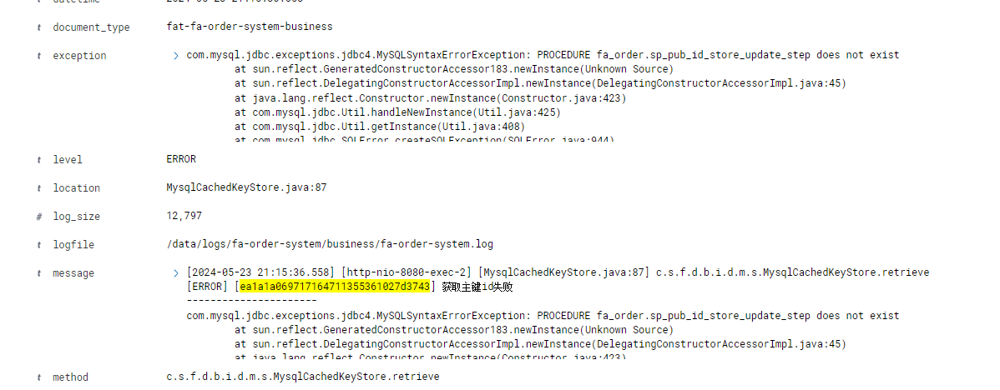
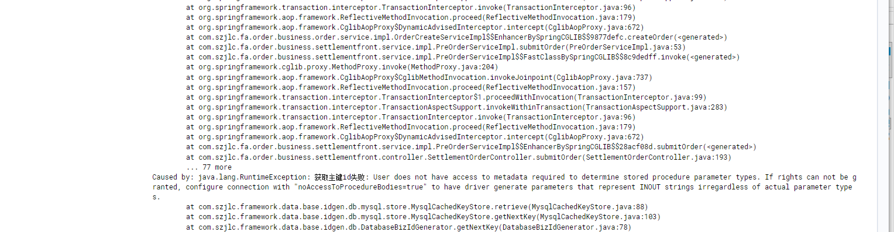

# 《嘉立创集团数据库开发规范》JLCZD-03-016【传阅】

| 序号 | 修订记录                                            | 修订人 | 修订日期   |
|------|-----------------------------------------------------|--------|------------|
| 1    | 对初版规范进行条款补充和详细释义，并逐条款举出正反例 | 陈龙   | 2024-05-20 |

1. # 序言

本文档旨在为所有参与MySQL数据库开发活动的开发人员提供一套统一的规范和指导原则。通过遵循这些规范，我们可以确保数据库开发工作的一致性、可维护性和安全性，从而提高整个团队的工作效率和项目的成功率。

MySQL数据库作为嘉立创产品和项目的核心组成部分，承载着重要的业务数据和逻辑。因此，良好的数据库设计和开发实践对于项目的成功至关重要。本规范文档的目的是为开发人员提供清晰的指导，帮助他们设计、实现和维护高质量的数据库系统。

在编写本文档时，我们考虑了数据库开发过程中的各个方面，包括数据库设计、命名规范、数据类型选择、索引设计、安全性和性能优化等。我们强调了一些必须遵循的强制规范，同时也提供了一些建议性的最佳实践，以帮助开发人员更好地理解和应用规范。

我们鼓励所有开发人员认真阅读并遵守本规范文档中的条款，以确保我们的数据库系统在设计、实现和维护过程中始终保持高质量和一致性。同时，我们也欢迎开发人员提出任何建议或改进建议，以不断完善和更新本规范文档，使其与项目的实际需求和最佳实践保持一致。

数据库开发规范文档是一个持续演进的文档，我们期待所有开发人员积极参与其中，共同致力于构建健壮、高效的数据库系统，为项目的成功做出贡献。

2. # 名词解释

| 名词     | 分类 | 描述                                                         |
|----------|------|--------------------------------------------------------------|
| 规约等级 | 强制 | 在编码和设计过程中，必须遵守的规约                            |
|          | 建议 | 在编码和设计过程中，建议以此规约进行处理                      |
|          | 参考 | 不同的场景，不一定是合适的处理方案，但是可以作为最佳实践的参考 |
| 示例     | 正例 | 符合规约的编码和设计                                         |
|          | 反例 | 不符合符合规约的编码和设计                                   |


3. # 设计规范

##### **[** 强制**]数据库名称规范**

**【说明】**：命名规范smt_xxx，pcb_xxx，cnc_xxx，pbt_xxx，overseas_xxx，overseas_fa_xxx，fa_xxx，forface_xxx等，做到依照库名识别业务，32字符以内（公共组按照产品线命名）

**【正例】** ：

```sql
CREATE DATABASE pcb_order_service DEFAULT CHARSET utf8mb4 COLLATE utf8mb4_unicode_ci;
```
 
**【反例】** ：

```sql
CREATE DATABASE order_service DEFAULT CHARSET utf8mb4 COLLATE utf8mb4_unicode_ci;
```
 


##### **[** 强制**]金额字段规范**

**【说明】**：金额和工艺面积等参数需使用DECIMAL(20,6)，非单价类型的使用DECIMAL(20,2)，拒绝使用FLOAT和DOUBLE，确保数据一致性，减少精度转换

**【正例】** ：

```sql
total_fee DECIMAL(20,6) UNSIGNED NOT NULL DEFAULT 0.000000 COMMENT '总费用'
```
 
**【反例】** ：

```sql
total_fee DECIMAL(12,4) NOT NULL DEFAULT 0.0000 COMMENT '总费用'
```
 


##### **[** 强制**]表注释规范**

**【说明】**：建表必须要有COMMENT，COMMENT内容应该精简明了、见名知义，枚举类表字段注释需要将所有枚举含义进行注释

修改或增加字段的状态描述，必须要及时同步更新注释（备注格式统一）

**【正例】** ：

```sql
CREATE TABLE pcb_order_cost_info (
...
`sync_status` TINYINT(3) UNSIGNED NOT NULL DEFAULT '0' COMMENT '同步状态：0-未开始,1-同步中,2-同步成功,3-失败',
...
) DEFAULT CHARSET=utf8mb4 COLLATE=utf8mb4_unicode_ci COMMENT='订单费用信息表';
```
 
**【反例】** ：

```sql
CREATE TABLE pcb_order_cost_info (
...
`sync_status` TINYINT(3) UNSIGNED NOT NULL DEFAULT '0' COMMENT '同步状态 ',
...
) DEFAULT CHARSET=utf8mb4 COLLATE=utf8mb4_unicode_ci;
```
 


##### **[** 强制**]建表字符集规范**

**【说明】**：建表必须显示指定 DEFAULT CHARSET utf8mb4 COLLATE utf8mb4_unicode_ci ，以保证各表字符集和排序规则的一致性。如果不显式指定，则可能由于各云厂商之间的配置差异导致各服务之间排序规则甚至是字符集的不一致，导致关联查询、数据比对等场景的性能降低甚至报错中断。

**【正例】** ：

```sql
CREATE TABLE pcb_order_cost_info (
...
) DEFAULT CHARSET=utf8mb4 COLLATE=utf8mb4_unicode_ci COMMENT='订单费用信息表';
```
 
**【反例】** ：

```sql
CREATE TABLE pcb_order_cost_info (
...
) COMMENT='订单费用信息表';

关联列排序规则不一致
错误代码： 1267
Illegal mix of collations (utf8mb4_unicode_ci,IMPLICIT) and (utf8mb4_general_ci,IMPLICIT) for operation '='
```
 


##### **[** 强制**]视图规范**

**【说明】**：禁止使用视图，视图无太多实际意义， 且会增加SQL语句的复杂度，降低执行效率，极大提高系统的迭代效率和维护成本。

**【正例】** ：

无

**【反例】** ：

```plain
create view view_sbtest1  as 
select a,b,c from sbtest1 
union all 
select a,b,c from sbtest2 
union all 
select a,b,c from sbtest3 
union all 
select a,b,c from sbtest4;

通过主键id查看视图,耗时1分钟以上
select a,b,c from view_sbtest1 where id=1;
以上视图执行计划，会先对表进行全扫描，最后才会在视图上过滤条件，不会条件下推（等等类似场景最新版本才解决部分性能问题）
```
 


##### **[** 强制**]外键规范**

**【说明】**：禁止使用外键，外键在dml时候需要额外维护引用完整性，在高并发场景下严重影响系统性能，业务层实现比外键更灵活，数据迁移同步等维护成本复杂

**【正例】** ：

无

**【反例】** ：

不建议创建


##### **[** 强制**]时间字段规范**

**【说明】**：时间列（datetime类型）分2种情况，业务属性（允许null，但是需要默认值代替null），非业务属性（not null）,unix的时间起始值是1970-01-01 08:00:00，时区统一使用东八区

**【正例】** ：

```sql
CREATE TABLE pcb_order_cost_info (
    ...
    create_time DATETIME  not null default current_timestamp,
    db_update_time datetime not null default current_timestamp on update current_timestamp,
    order_senting_time datetime DEFAULT '9999-12-31 00:00:00',
    order_start_time datetime DEFAULT '1970-01-01 08:00:00',
    ...
) DEFAULT CHARSET=utf8mb4 COLLATE=utf8mb4_unicode_ci COMMENT='订单费用信息表';
```
 
**【反例】** ：

```sql
CREATE TABLE pcb_order_cost_info (
    ...
    create_time DATETIME,
    db_update_time datetime,
    create_time DATETIME NOT NULL DEFAULT '1960-01-01 00:00:00',
    ...
) DEFAULT CHARSET=utf8mb4 COLLATE=utf8mb4_unicode_ci COMMENT='订单费用信息表'
```
 


##### **[** 强制**]枚举类型规范**

**【说明】**：禁止使用enum，set枚举值写死，变更需要对整表重建,维护成本高。推荐使用`tinyint`或`smallint;`

**【正例】** ：

```sql
CREATE TABLE pcb_order_cost_info (
    ...
    data_type INT NOT NULL DEFAULT 1 COMMENT '数据类型,1-增加,2-减免',
    ...
) DEFAULT CHARSET=utf8mb4 COLLATE=utf8mb4_unicode_ci COMMENT='订单费用信息表';
```
 
**【反例】** ：

```sql
CREATE TABLE pcb_order_cost_info (
    ...
    data_type ENUM('增加', '减免') NOT NULL DEFAULT '增加' COMMENT '数据类型',
    ...
) DEFAULT CHARSET=utf8mb4 COLLATE=utf8mb4_unicode_ci COMMENT='订单费用信息表';
```
 


##### **[** 强制**]text/blob字段拆解独立表存储**

**【说明】**：强制业务表blob和text一般存储大文本或者图片或文件等，会导致数据行变得非常大，影响存储空间的使用效率，导致单数据页（16kb）存储的行数减少，增加磁盘io操作次数，在查询时候也需要分配更多内存，应该合理设计进行分离存储

**【正例】** ：

```plain
CREATE TABLE pcb_order_cost_info (
    ...
    order_id bigint not null comment '订单id',
    order_json text  COMMENT '订单备注',
    ...
) DEFAULT CHARSET=utf8mb4 COLLATE=utf8mb4_unicode_ci COMMENT='订单备注表';

通过订单id进行关联查询,不影响主表的性能和存储
```
 


**【反例】** ：

```plain
CREATE TABLE tabname (
    ...
    order_id bigint not null comment '订单id',
    ...
    order_json text  COMMENT '订单备注',
    ...
) DEFAULT CHARSET=utf8mb4 COLLATE=utf8mb4_unicode_ci COMMENT='订单详情表';
```
 


##### **[** 强制**]禁止存储过程、触发器使用规范**

**【说明】**：除主键的存储过程外，禁止添加其它存储过程和触发器，迁移性差、调试困难、维护复杂

**【正例】** ：

无

**【反例】** ：

目前使用主键存储过程，就存在2个问题点：



1. 字符集排序兼容问题，会导致调用主键存储过程失败


2. 版本兼容问题，数据库版本从5.7升级8.0之后jdbc没有升级，导致存储过程调用失败




##### **[** 强制**]禁止使用MySQL关键字和保留字**

**【说明】**：禁止使用 MySQL关键字和保留字作为表名和字段名，一些常用的关键字和保留字被用作字段名称，可能会引起混淆，导致 SQL 查询语句中的语法错误或冲突。另外，字段名称与 SQL 关键字相同，并且没有正确转义或处理用户输入，可能会导致 SQL 注入攻击。

MySQL 8.0关键字和保留字官方列表： [https://dev.mysql.com/doc/refman/8.0/en/keywords.html](https://dev.mysql.com/doc/refman/8.0/en/keywords.html)

**【正例】** ：

```sql
CREATE TABLE pcb_order_cost_info (
    ...
    enable_status INT NOT NULL DEFAULT 1 COMMENT '同步状态：1-启用,2-弃用,3-失败',
    ...
) DEFAULT CHARSET=utf8mb4 COLLATE=utf8mb4_unicode_ci COMMENT='订单费用信息表';
```
 
**【反例】** ：

```sql
CREATE TABLE pcb_order_cost_info (
    ...
    status INT NOT NULL DEFAULT 1 COMMENT '数据类型: 1.启用; 2.禁用',
    ...
) DEFAULT CHARSET=utf8mb4 COLLATE=utf8mb4_unicode_ci COMMENT='订单费用信息表';
```
 


##### **[** 强制**]所有业务数据表必须包含通用字段**

**【说明】**：建表必须具备以下字段

```Plain Text
创建时间：create_time datetime not null default current_timestamp，
更新时间：db_update_time datetime not null default current_timestamp on update current_timestamp，
软删：表示软删除状态的关键字: deleted_flag, 业务字段+删除状态字段+删除时间戳字段=唯一键，删除时间默认值1970-01-01 08:00:00
主键：使用自增id
业务唯一键：biz_key要求使用bigint型字段，可以使用雪花算法或其他散列算法生成(如MurmurHash)，要求使用biz_key来进行业务表关联
```
 
**【正例】** ：

无

**【反例】** ：

无


##### **[** 强制**]相同字段规范**

**【说明】**：相同字段在不同的表中，必须保持相同的类型

**【正例】** ：

```Plain Text
CREATE TABLE `smt_footprint_template_record` (
 ...
  `component_thickness` DECIMAL(18,6) DEFAULT '0.000000' COMMENT '元器件边厚度',
  ...)

CREATE TABLE `smt_footprint_template_version_record` (
 ...
  `component_thickness` DECIMAL(18,6) DEFAULT '0.000000' COMMENT '元器件边厚度',
 ...)
```
 


**【反例】** ：

```Plain Text
CREATE TABLE `smt_order_refunded_record` (
 ...
`deal_type` VARCHAR(20) COLLATE utf8mb4_unicode_ci NOT NULL COMMENT '处理方式',
...)

CREATE TABLE `smt_order_supplement_record` (
 ...
  `deal_type` INT(11) NOT NULL COMMENT '处理方式 1:直接补款',
...)
```
 


##### **[** 强制**]字段命名规范**

**【说明】**：对于指定业务含义的字段，字段名称中需要包含对应的关键字

```Plain Text
身份证、电话、邮箱、银行卡号、传真、地址、QQ、IP
        身份证关键字：id_card
        电话关键字：phone
        邮箱关键字：email
        银行卡号关键字：bank_account
        传真关键字：fax
        地址关键字：address
        QQ关键字:qq
        IP关键字：ip
        金额字段关键字：amount
        数量关键字：cnt
        软删除关键字：deleted_flag
        删除时间戳：deleted_time
分类字段定义
布尔值使用   _flag结尾
```
 
**【正例】** ：

```sql
CREATE TABLE customer_info (
    ...
    contact_phone_number VARCHAR(128) NOT NULL DEFAULT '' COMMENT '联系人号码',
    ...
) DEFAULT CHARSET=utf8mb4 COLLATE=utf8mb4_unicode_ci COMMENT='用户信息表';
```
 
**【反例】** ：

```sql
CREATE TABLE customer_info (
    ...
    contact_number VARCHAR(128) NOT NULL DEFAULT '' COMMENT '联系人号码',
    ...
) DEFAULT CHARSET=utf8mb4 COLLATE=utf8mb4_unicode_ci COMMENT='用户信息表';
```
 


##### **[** 强制**]索引命名规范**

**【说明】**：普通索引`idx_`开头，唯一索引以`uk_`开头，以字段名或者缩写为后缀

**【正例】** ：

```sql
ALTER TABLE customer_info ADD INDEX idx_create_time(create_time);
```
 
**【反例】** ：

```sql
ALTER TABLE customer_info ADD INDEX create_time_IDX(create_time);
```
 


##### **[** 强制**]主键规范**

**【说明】**：所有表都必须具备主键索引。缺少主键索引无法保证数据的完整性和查询效率。

**【正例】** ：

```sql
CREATE TABLE pcb_customer_info (
    id BIGINT UNSIGNED NOT NULL AUTO_INCREMENT COMMENT '主键',
    ...
    PRIMARY KEY (id)
) DEFAULT CHARSET=utf8mb4 COLLATE=utf8mb4_unicode_ci COMMENT='用户信息表';
```
 
**【反例】** ：

```sql
CREATE TABLE pcb_customer_info (
    key_id BIGINT UNSIGNED NOT NULL COMMENT '主键',
    ...
) DEFAULT CHARSET=utf8mb4 COLLATE=utf8mb4_unicode_ci COMMENT='用户信息表';
```
 


##### **[** 强制**]预留字段规范**

**【说明】**：禁止在建表时定义预留字段。预留字段的命名无法做到见名知义，在对预留字段类型修改时，会对全表进行锁定，修改字段的成本可能远远大于增加一个字段。

**【正例】** ：

```sql
CREATE TABLE pbt_customer_info (
    id BIGINT UNSIGNED NOT NULL AUTO_INCREMENT COMMENT '主键',
    ...
    PRIMARY KEY (id)
) DEFAULT CHARSET=utf8mb4 COLLATE=utf8mb4_unicode_ci COMMENT='用户信息表';
```
 
**【反例】** ：

```sql
CREATE TABLE pbt_customer_info (
    id BIGINT UNSIGNED NOT NULL COMMENT '主键',
    ...
    reserved_column1 varchar(100) DEFAULT NULL COMMENT '预留字段1',
    reserved_column2 varchar(100) DEFAULT NULL COMMENT '预留字段2',
    PRIMARY KEY (id)
) DEFAULT CHARSET=utf8mb4 COLLATE=utf8mb4_unicode_ci COMMENT='用户信息表';
```
 


##### \[ 建议\]表名称规范

**【说明】**：命名规范smt_order_xxx，做到依照表名可以识别业务线，32字符以内

**【正例】** ：

```sql
CREATE TABLE pcb_order_cost_info
```
 
**【反例】** ：

```sql
CREATE TABLE order_cost_info
```
 


##### \[ 建议\]字符类长度使用规范

**【说明】**：utf8mb4字符集下，字符集以64为界限，尽量控制数值越小越好，varchar字段在排序和创建临时表一类的内存操作时，会使用N的长度申请内存，varchar字符类型在字节长度为1的可以存储0-255个字符，如果默认字符是utf8mb4的时候为4字节编码字符，所以在（255/4=63）varchar(64)之前修改长度不需要额外增加1个字节去存储数据，即建临时表来完成长度扩容

**【正例】** ：

```sql
call_name VARCHAR(32) NOT NULL DEFAULT '' COMMENT '联系人'
```
 
**【反例】** ：

```sql
call_name VARCHAR(3000) NOT NULL DEFAULT '' COMMENT '联系人'
```
 


##### \[ 建议\]NULL值规范

**【说明】**：尽量将所有字段定义为NOT NULL，索引列存储null值需要额外的空间，null也需要进行额外的逻辑判断，且在count等聚合函数也会忽略null，影响统计结果。建议将字段设置为NOT NULL，并使用特殊值、空字符串来代替NULL值作为默认值

**【正例】** ：

```sql
CREATE TABLE pcb_order_cost_info (
    ...
    callback_url VARCHAR(128) NOT NULL DEFAULT '' COMMENT '回调链接',
    ...
) DEFAULT CHARSET=utf8mb4 COLLATE=utf8mb4_unicode_ci COMMENT='订单费用信息表';
```
 
**【反例】** ：

```sql
CREATE TABLE pcb_order_cost_info (
    ...
    callback_url VARCHAR(128) DEFAULT NULL COMMENT '回调链接',
    ...
) DEFAULT CHARSET=utf8mb4 COLLATE=utf8mb4_unicode_ci COMMENT='订单费用信息表';
```
 


##### 

4. # SQL编写规范

##### **[** 强制**]JOIN规范**

**【说明】**：在多表join的SQL里，保证被驱动表的连接列上有索引，这样join执行效率最高，避免出现笛卡尔积，关联表不超5个。超过5个需单独申请讨论

**【正例】** ：

```sql
SELECT ... FROM t1
LEFT JOIN t2
ON t1.a = t2.b    -- b字段有索引
...
```
 
**【反例】** ：

```sql
SELECT ... FROM t1
LEFT JOIN t2
ON t1.a = t2.b    -- b字段无索引
...
```
 


##### **[** 强制**]查询字段规范**

**【说明】**：SELECT语句必须指定具体字段名称，禁止写成`*`。因为`select *`会将不需要读的数据也从MySQL里读出来，造成io，网络，cpu资源额外消耗，且不能利用覆盖索引。且表字段一旦更新，但model层没有来得及更新的话，系统会报错

**【正例】** ：

```sql
SELECT a, b, c FROM t1
```
 
**【反例】** ：

```sql
SELECT * FROM t1
```
 


##### **[** 强制**]SQL查询规范**

**【说明】**：SELECT语句禁止不带任何条件的查询；禁止在WHERE条件的属性上使用函数或者表达式；使用union all代替or；使用where代替having子句

**【正例】** ：

```sql
SELECT uid FROM t_user WHERE day>= unix_timestamp('2017-02-15 00:00:00');
```
 
**【反例】** ：

```sql
SELECT uid FROM t_user WHERE from_unixtime(day)>='2017-02-15';
```
 


##### **[** 建议**]SQL编写优化**

**【说明】**：

1. 利用延迟关联或者子查询优化超多分页场景。MySQL并不是跳过offset行，而是取offset+N行，然后返回放弃前offset行，返回N行，那当offset特别大的时候，效率就非常的低下，要么控制返回的总页数，要么对超过特定阈值的页数进行SQL改写
2. 使用union all代替or，多个条件的or，最多只能使用到一个索引条件
3. 使用where代替having子句，where是在group by之前过滤数据
4. update，delete 语句避免使用 in ,exists等，尽量使用 join，因为MySQL8.0之前delete和update无法使用semi join和materialize 优化子查询，最终是以exists执行，所以外面的表必然会进行全表扫描（强制）

**【正例】** ：

```sql
先快速定位需要获取的id段，然后再关联
 SELECT a.c1,a.c2... FROM t_user a, (select id from t_user where .... LIMIT 100000,20 ) b where a.id=b.id
```
 
```sql
可以用到phone和cellphone索引
select uid,name from t_user WHERE phone='010-88886666' 
union all
select uid,name from t_user WHERE cellphone='13800138000'; 
```
 
```plain
可以先过滤再聚合
select id,count(*) from t_user where age>=30 group by id order by null; 
```
 
```plain
DELETE t1
FROM t1
INNER JOIN t2 ON t1.id = t2.id
WHERE t2.birth_date>='1953-01-01' and t2.birth_date<='1953-03-01';

```
 


**【反例】** ：

```sql
SELECT a.c1,a.c2... FROM t_user a 100000,20;
```
 
```plain
select uid,name from t_user WHERE phone='010-88886666' or cellphone='13800138000'; 
```
 
```plain
select id,count(*) from t_user group by id having age>=30 order by null; 
```
 
```plain
delete from t1  where id in (select id from t2 where birth_date>='1953-01-01' and birth_date<='1953-03-01');
```
 


##### **[** 强制**]HINT使用规范**

**【说明】**：生产环境禁止使用`hint`，如`sql_no_cache`，`force index`，`ignore key`，`straight join`等。因为`hint`是用来强制SQL按照某个执行计划来执行，但随着数据量变化、条件变化会导致执行计划出现偏差，甚至会出现force index的索引不存在直接抛代码异常

**【正例】** ：

```sql
SELECT a,b,c
FROM users
WHERE username = 'desired_username';
```
 
**【反例】** ：

```sql
SELECT a,b,c
FROM users FORCE INDEX (idx_username)
WHERE username = 'desired_username';
```
 


##### **[** 强制**]字段赋值规范**

**【说明】**：在进行查询时禁止进行数据类型的隐式转换，会导致索引失效，使MySQL进行全表扫描，使CPU和IO的压力激增。

**【正例】** ：

```sql
SELECT id,name
FROM pcb_order_users
WHERE name = jlc;    -- name是varchar类型
```
 
**【反例】** ：

```sql
SELECT id,name
FROM pcb_order_users
WHERE name = 'jlc';    -- id为INT类型
```
 


##### **[** 强制**]历史数据修复规范**

**【说明】**：对历史数据进行修复，需要评估受影响的范围，且必须要在测试环境验证ok才可以操作生产，一定需要备份好再进行分批次操作

**【正例】** ：

```plain
create table smt_order_record_bak_20240520 like smt_order_record;
insert into smt_order_record_bak_20240520 select * from smt_order_record where key_id in(col1,col2...2000以内);
update  smt_order_record set col1='jlc' where key_id in(col1,col2...2000以内);
```
 


**【反例】** ：

```plain
update  smt_order_record set col1='jlc' where status = 1;
```
 


5. # 索引规范

##### **[** 建议**]索引查询**

**【说明】**：不建议%在前面和%%，B+树有序特性，无法处理全模糊匹配中间值，全模糊的建议走全文索引或者ES。

**【正例】** ：

```plain
select id,name from smt_order_record where name like '张%';
```
 


**【反例】** ：

```plain
select id,name from smt_order_record where name like '%张%';
select id,name from smt_order_record where name like '%张';
```
 


##### **[** 建议**]索引创建**

**【说明】**：单表的索引控制在5个以内，索引过多对表进行dml的io成本也会增加，因为每次操作都需要维护索引结构，索引过多也会限制优化器的选择，在复杂的SQL中更容易选择错误的索引

         

**【正例】** ：

```plain
  PRIMARY KEY (`component_bind_footprint_key_id`),
  UNIQUE KEY `uk_component_bind_id` (`component_bind_footprint_access_id`),
  KEY `idx_component_code_create_update_time` (`component_code`,`create_time`,`update_time`),
  KEY `idx_footprint_template_key_id` (`footprint_template_key_id`),
  KEY `idx_component_id` (`component_id`)
```
 


**【反例】** ：

```plain
  PRIMARY KEY (`component_bind_footprint_key_id`),
  UNIQUE KEY `uk_component_bind_id` (`component_bind_footprint_access_id`),
  KEY `idx_component_code_create_update_time` (`component_code`,`create_time`,`update_time`),
  KEY `idx_footprint_template_key_id` (`footprint_template_key_id`),
  KEY `idx_component_id` (`component_id`),
  KEY `idx_component_status` (`component_bind_footprint_access_id`,`component_status`),
  KEY `idx_component_id_time` (`component_id`,`create_time`),
  KEY `idx_component_ctime_utime` (`component_id`,`create_time`,`update_time`)
```
 


6. # 数据库变更规范

##### **[** 强制**]删除索引规范**

**【说明】**：禁止直接删除prod环境表上的索引，需要先经过DBA和业务一起评估后，确认没有使用或者冗余索引，方可在业务低峰期间进行删除。

**【正例】** ：

1. 提交删除，业务确认索引条件已经不再使用
2. 测试环境验证
3. DBA进行数据库层确认索引已无调用
4. 低峰期进行删除索引，并观察业务反馈

**【反例】** ：

【严重问题报告】2024-01-05 文件存储删除索引导致服务宕机


##### **[** 强制**]DROP TABLE规范**

**【说明】**：禁止使用drop相关命令，如需drop操作，需要发邮件申请，经过开发经理同意，并抄送运维总监和运维经理，由DBA备份后操作。

**【正例】** ：

1. 提交drop需求，各方确认
2. DBA进行rename表保存1个月
3. DBA对rename的表进行业务低峰期进行drop

**【反例】** ：

直接进行drop table/database的动作，没有经过任何审核或者备份。


##### **[** 强制**]数据删除规范**

**【说明】**：禁止物理删除数据，如物理删除，需要发邮件申请，经过开发经理同意，并抄送运维总监和运维经理，由DBA备份后操作。

**【正例】** ：

1. 数据删除属于高危操作，需要2个人相互确认
2. 数据删除需要先评估方案和影响，确认方案后，需要在业务低峰期间进行
3. 事前需通知到影响部门，事前必须要提前备份，事前需要评估磁盘和其他资源是否足够

**【反例】** ：

【问题报告】2024-04-17外贸数据库故障报告


##### **[** 强制**]DDL变更窗口规范**

**【说明】**：大表的DDL需提前1天给到DBA，并由DBA安排在业务低峰进行操作，严禁业务高峰操作，如紧急需要业务高峰操作，需开发经理以上级别确认。高峰期进行变更带来的锁和性能问题会直接导致生产故障的发生。

**【正例】** ：

无

**【反例】** ：

无


##### **[** 强制**]DDL变更提交规范**

**【说明】**：同一张表的DDL，禁止分成多条SQL提交。避免多次对同一张表进行操作，增加锁表风险和资源占用。这可以减少数据库引擎的开销，从而减少系统负载，提高数据库性能。MySQL 通常会对受影响的表进行锁定，以确保数据的一致性。合并多个变更操作可以减少对表的锁定时间，从而减少阻塞其他对表的操作的时间。

**【正例】** ：

```sql
ALTER TABLE payment_record
ADD COLUMN payment_type TINYINT NOT NULL DEFAULT 1 COMMENT '支付类型: 1.线上; 2.线下',
MODIFY COLUMN payment_status TINYINT NOT NULL DEFAULT 1 COMMENT '支付状态: 1.未支付; 2.已支付';
```
 
**【反例】** ：

```sql
ALTER TABLE payment_record
ADD COLUMN payment_type TINYINT NOT NULL DEFAULT 1 COMMENT '支付类型: 1.线上; 2.线下';

ALTER TABLE payment_record
MODIFY COLUMN payment_status TINYINT NOT NULL DEFAULT 1 COMMENT '支付状态: 1.未支付; 2.已支付';
```
 


##### **[** 强制**]备份表规范**

**【说明】**：备份表的命名 原表名_日期_bak，临时表的命名 原表名_日期_tmp，如无特殊要求，默认1个月清理1次

**【正例】** ：

```sql
CREATE TABLE customer_info_20240520_bak like customer_info;
CREATE TABLE customer_info_20240520_tmp like customer_info;
```
 
**【反例】** ：

```sql
CREATE TABLE customer_info_bak_20240520 like customer_info;
CREATE TABLE customer_info_tmp_20240520 like customer_info;
```
 


##### **[** 强制**]UPDATE规范**

**【说明】**：UPDATE 必须携带 WHERE 条件，且条件中必须包含索引字段，一次更新需在5000条以内。

**【正例】** ：

```sql
UPDATE customer_info SET is_deleted = 1 WHERE customer_code = '678AE1';    -- customer_code为索引字段
```
 
**【反例】** ：

```sql
UPDATE customer_info SET is_deleted = 1 WHERE customer_code = '678AE1';    -- customer_code为非索引字段
```
 


### **[** 强制**]批量操作规范**

**【说明】**：对于需要插入、更新或删除大规模数据的操作，禁止通过一条SQL语句直接执行来完成。（例如批量刷数据的场景，使用一条update更新全表数据）一条SQL语句操作大范围数据会导致数据库执行大量的 IO 操作和锁定，特别是在大表上。这会消耗大量的系统资源和时间，降低数据库的性能，甚至可能导致数据库长时间处于不可用状态。可通过按照主键范围或其他特定条件对SQL进行拆分，变为多个小SQL之后执行。

**【正例】** ：

```sql
UPDATE customer_info SET is_deleted = 1 WHERE customer_code = '678AE1';
UPDATE customer_info SET is_deleted = 1 WHERE customer_code = '678AE2';
UPDATE customer_info SET is_deleted = 1 WHERE customer_code = '678AE3';
UPDATE customer_info SET is_deleted = 1 WHERE customer_code = '678AE4';
UPDATE customer_info SET is_deleted = 1 WHERE customer_code = '678AE5';
...
```
 
**【反例】** ：

```sql
UPDATE customer_info SET is_deleted = 1 
WHERE customer_code in ('678AE1',
'678AE2',
'678AE3',
'678AE4',
'678AE5',
...
);
```
 


### 附：规范建表语句示例

```sql
CREATE TABLE pcb_user_base (   
    `id` bigint(11) NOT NULL AUTO_INCREMENT,   
    `biz_key` bigint NOT NULL COMMENT '用户id',   
    `username` varchar(32) COLLATE utf8mb4_unicode_ci NOT NULL COMMENT '真实姓名',   
    `email` varchar(32) COLLATE utf8mb4_unicode_ci NOT NULL COMMENT '用户邮箱',   
    `user_phone` varchar(32) COLLATE utf8mb4_unicode_ci NOT NULL COMMENT '手机号码',   
    `avatar` int(11) NOT NULL COMMENT '头像',   
    `birthday` date NOT NULL COMMENT '生日',   
    `sex` bit(1) NOT NULL DEFAULT b'0' COMMENT '性别',   
    `short_introduce` varchar(64) COLLATE utf8mb4_unicode_ci DEFAULT NULL COMMENT '一句话介绍自己，最多50个汉字',  
    `user_register_ip` varchar(32) NOT NULL COMMENT '用户注册时的源ip',   
    `create_time` datetime NOT NULL DEFAULT CURRENT_TIMESTAMP ON UPDATE CURRENT_TIMESTAMP  COMMENT '用户记录创建的时间',  
    `db_update_time` datetime NOT NULL DEFAULT CURRENT_TIMESTAMP ON UPDATE CURRENT_TIMESTAMP  COMMENT '用户资料修改的时间',  
    `user_review_status` tinyint NOT NULL COMMENT '审核状态：0-审核中,1-审核通过,2-审核失败,3-未提交审核',   
    PRIMARY KEY (`id`),   
    UNIQUE KEY `uk_biz_key` (`biz_key`),   
    KEY `idx_username`(`username`),   
    KEY `idx_create_time`(`create_time`),  
    KEY `idx_db_update_time`(`db_update_time`)) ENGINE=InnoDB DEFAULT CHARSET=utf8mb4 COLLATE=utf8mb4_unicode_ci COMMENT='PCB用户基本信息表';
```
 


